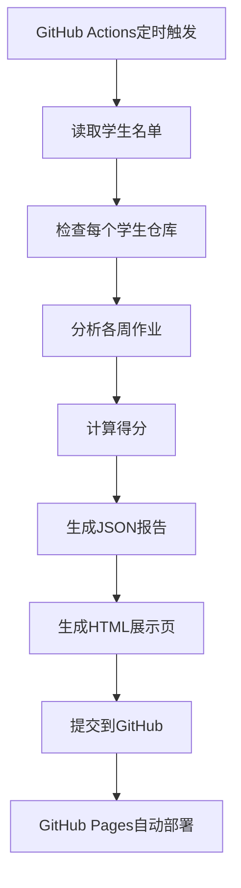

# 🚀 GitHub Actions自动评价系统使用指南

## 快速开始

### 1. 添加学生信息

编辑 `students/roster.json`，添加学生的GitHub仓库URL：

```json
[
  "https://github.com/zhangsan/ai-robot-homework",
  "https://github.com/lisi/ai-robotics-course"
]
```

> 🔒 **隐私保护**：系统仅存储GitHub仓库URL，GitHub ID从URL自动提取。不存储学生姓名、学号等敏感信息。

### 2. 配置GitHub Token（可选）

如果学生仓库是私有的，需要配置Personal Access Token：

1. 访问 GitHub Settings → Developer settings → Personal access tokens
2. 生成新token，勾选 `repo` 权限
3. 在仓库 Settings → Secrets and variables → Actions
4. 添加 secret: `GITHUB_TOKEN` = 你的token

### 3. 触发评价

**自动触发**：
- 每24小时运行一次
- 运行时间：北京时间每天22:00（UTC 14:00）
- 运行时间段：2026年5月18日 ～ 2026年6月22日
- 自动停止：6月22日后将自动停止运行

**手动触发**：
1. 访问 Actions 标签页
2. 选择 "学生作业自动评价" workflow
3. 点击 "Run workflow"

### 4. 查看结果

评价完成后，访问：
```
https://your-username.github.io/your-repo/students/
```

## 评分标准

### 每周作业（100分）

| 项目 | 分数 | 说明 |
|------|------|------|
| 提交week文件夹 | 基础分 | 必须有 |
| README.md存在 | +30分 | 基本文档 |
| README内容详细 | +10分 | 大于500字符 |
| 包含图片 | +20分 | 截图、效果图 |
| 包含代码 | +20分 | .py, .cpp, .launch.py等 |
| 有提交记录 | +10分 | git commit次数 |
| 按时提交 | +10分 | 在截止日期前 |

### 学生仓库结构要求

```
ai-robot-homework/
├── README.md          # 总说明
├── week2/
│   ├── README.md      # ✅ 必须
│   └── screenshots/   # ✅ 推荐
├── week3/
│   ├── README.md      # ✅ 必须
│   ├── code/          # ✅ 有代码时必须
│   └── images/        # ✅ 推荐
├── week4/
│   ├── README.md      # ✅ 必须
│   ├── *.py          # ✅ Python作业
│   └── images/
...
└── week13/
    ├── README.md      # ✅ 必须
    ├── code/
    ├── demo.mp4       # ✅ 期末项目演示视频
    └── docs/
```

## 工作流程



## 文件说明

### 核心文件

| 文件 | 说明 |
|------|------|
| `.github/workflows/evaluate-students.yml` | GitHub Actions工作流配置 |
| `scripts/evaluate_students.py` | 评价核心脚本 |
| `scripts/generate_report.py` | 生成HTML页面脚本 |
| `students/roster.json` | 学生名单 |
| `students/evaluations/latest.json` | 最新评价结果 |
| `students/index.html` | 展示页面 |

### 评价数据格式

`students/evaluations/latest.json` 结构：

```json
{
  "evaluation_date": "2026-05-18T14:30:00",
  "students": [
    {
      "github_id": "zhangsan",
      "repo_url": "https://github.com/zhangsan/ai-robot-homework",
      "repo_exists": true,
      "weeks": {
        "week2": {
          "submitted": true,
          "has_readme": true,
          "has_images": true,
          "has_code": false,
          "commit_count": 3,
          "last_commit_date": "2026-03-14T10:00:00",
          "score": 80,
          "comments": [
            "✅ 提交了week2文件夹",
            "✅ 包含README.md",
            "✅ README内容详细",
            "✅ 包含2张图片",
            "✅ 提交3次",
            "🎉 按时提交"
          ]
        }
      },
      "total_score": 960,
      "average_score": 80.0,
      "evaluation_date": "2026-05-18T14:30:00"
    }
  ]
}
```

## 自定义评分规则

编辑 `scripts/evaluate_students.py` 中的 `analyze_week_submission()` 函数：

```python
def analyze_week_submission(repo, week_id):
    result = {
        'score': 0,
        'comments': []
    }
    
    # 自定义评分逻辑
    if has_readme:
        result['score'] += 30  # 可调整分数
    
    if readme_length > 500:
        result['score'] += 10  # 可调整阈值
    
    # 添加更多评分条件...
    
    return result
```

## 常见问题

### Q: 学生仓库是私有的怎么办？

A: 需要配置GitHub Token：
1. 学生将你的GitHub账号添加为collaborator
2. 或者要求学生使用公开仓库

### Q: 评价没有自动运行？

A: 检查：
1. GitHub Actions是否启用
2. workflow文件语法是否正确
3. 查看Actions日志排查错误

### Q: 展示页面不显示？

A: 检查：
1. GitHub Pages是否启用
2. 源分支是否设置正确（main或gh-pages）
3. 路径是否为 `/students/`

### Q: 如何修改评价频率？

A: 编辑 `.github/workflows/evaluate-students.yml`：

```yaml
on:
  schedule:
    - cron: '0 14 * * *'  # UTC 14:00 = 北京时间 22:00
    # 修改为其他时间，例如：
    # - cron: '0 2 * * *'  # UTC 02:00 = 北京时间 10:00
```

### Q: 能否导出Excel报告？

A: 可以扩展脚本，添加pandas导出：

```python
import pandas as pd

def export_excel(results):
    df = pd.DataFrame(results)
    df.to_excel('students/report.xlsx', index=False)
```

## 展示页面功能

### 特性

- ✅ 实时统计：总人数、已提交、平均分
- ✅ 学生卡片：头像、进度、得分
- ✅ 详情表格：各周得分一览
- ✅ 颜色编码：优秀/良好/及格/未提交
- ✅ 响应式设计：支持手机/平板/电脑
- ✅ 自动排名：按总分排序

### 访问方式

**GitHub Pages（推荐）**：
```
https://your-username.github.io/your-repo/students/
```

**本地预览**：
```bash
cd students
python -m http.server 8000
# 访问 http://localhost:8000
```

## 进阶功能

### 1. 添加邮件通知

在workflow中添加：

```yaml
- name: 发送评价报告
  uses: dawidd6/action-send-mail@v3
  with:
    server_address: smtp.gmail.com
    server_port: 465
    username: ${{ secrets.EMAIL_USERNAME }}
    password: ${{ secrets.EMAIL_PASSWORD }}
    subject: 学生作业评价报告
    to: teacher@example.com
    from: github-actions@example.com
    body: file://students/evaluations/latest.json
```

### 2. Slack/Discord通知

使用对应的GitHub Actions插件推送通知。

### 3. 数据可视化

使用Chart.js或ECharts绘制趋势图：

```javascript
// 得分趋势图
const ctx = document.getElementById('scoreChart');
new Chart(ctx, {
    type: 'line',
    data: {
        labels: ['Week2', 'Week3', ...],
        datasets: [{
            label: '平均分',
            data: [75, 80, 85, ...]
        }]
    }
});
```

## 技术架构

```
┌─────────────────────────────────────────────────────────────┐
│                    GitHub Actions                            │
│  ┌──────────────────────────────────────────────────────┐   │
│  │  1. 定时触发或手动触发                                │   │
│  │  2. 设置Python环境                                   │   │
│  │  3. 安装依赖 (PyGithub, pandas)                    │   │
│  │  4. 运行评价脚本                                     │   │
│  │  5. 生成HTML报告                                    │   │
│  │  6. 提交并推送更新                                   │   │
│  └──────────────────────────────────────────────────────┘   │
└─────────────────────────────────────────────────────────────┘
                          ↓
┌─────────────────────────────────────────────────────────────┐
│                    评价脚本                                  │
│  ┌──────────────────────────────────────────────────────┐   │
│  │  evaluate_students.py                               │   │
│  │  • 读取学生名单                                      │   │
│  │  • 使用GitHub API检查仓库                           │   │
│  │  • 分析各周提交情况                                  │   │
│  │  • 计算得分                                         │   │
│  │  • 生成JSON报告                                     │   │
│  └──────────────────────────────────────────────────────┘   │
└─────────────────────────────────────────────────────────────┘
                          ↓
┌─────────────────────────────────────────────────────────────┐
│                    报告生成                                  │
│  ┌──────────────────────────────────────────────────────┐   │
│  │  generate_report.py                                 │   │
│  │  • 读取评价结果                                      │   │
│  │  • 生成HTML页面                                     │   │
│  │  • 包含统计、卡片、表格                              │   │
│  └──────────────────────────────────────────────────────┘   │
└─────────────────────────────────────────────────────────────┘
                          ↓
┌─────────────────────────────────────────────────────────────┐
│                GitHub Pages自动部署                          │
│              students/index.html                            │
└─────────────────────────────────────────────────────────────┘
```

## 维护建议

1. **定期检查**: 每周检查一次评价结果，确保正常运行
2. **备份数据**: 保留历史评价记录
3. **更新规则**: 根据实际情况调整评分标准
4. **收集反馈**: 询问学生意见，改进展示页面

## 支持

如有问题，请：
- 📧 提交GitHub Issue
- 💬 课程微信群询问
- 📚 参考GitHub Actions文档

---

*自动化评价 · 让教学更高效！*
