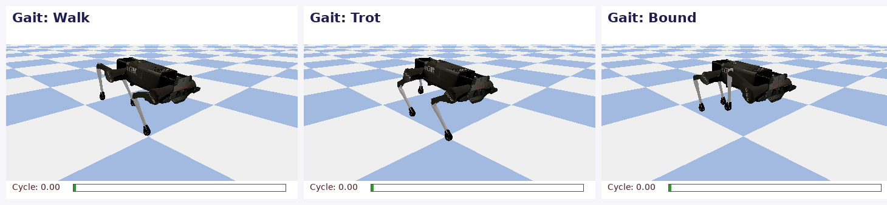
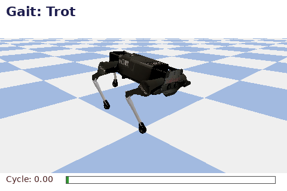
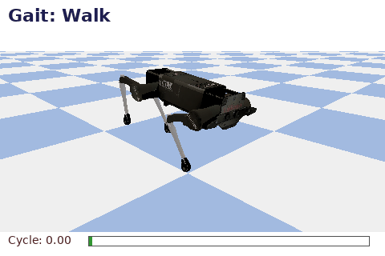
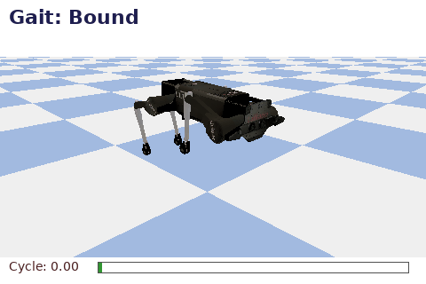
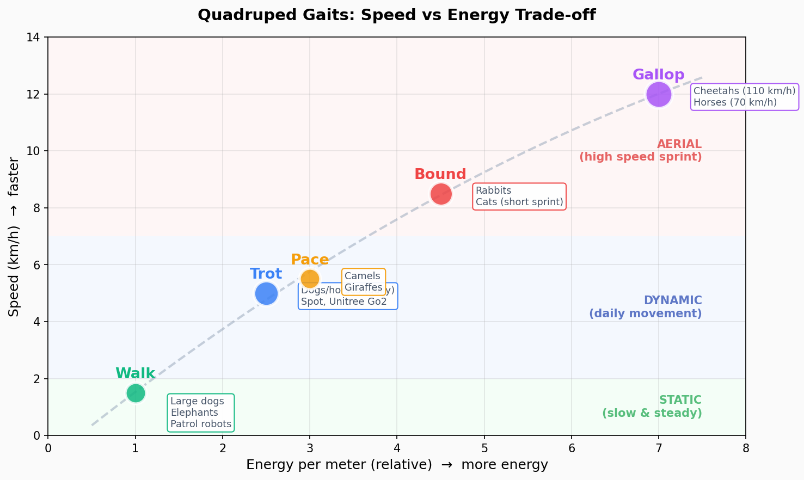
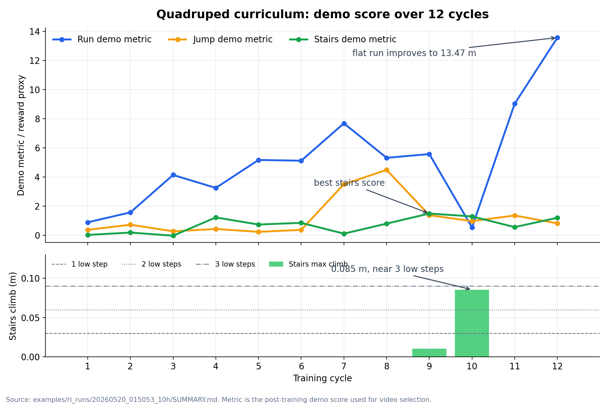
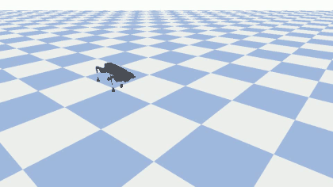
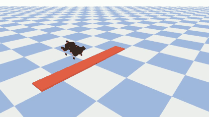
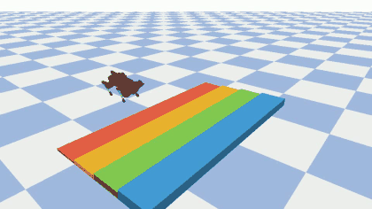

# 第 13 周：四足机器人入门 + 期末项目实施

## 🎬 开场：从央视春晚说起

> 2025 年除夕夜，全国 7 亿观众盯着电视。
> 16 台**宇树 H1 人形机器人** 穿着花棉袄，跟新疆舞蹈演员一起表演陕北秧歌《秧 BOT》。
> 整齐的转身、抛手绢、扭腰胯——
> **这不是 CG，是真实的机器人在跳舞**。

中国第一次在央视舞台上展示了这个能力。第二天，宇树科技的股价飞涨，订单接到手软。
你正在用的这门课，**就是带你走进这个新世界的入场券**。

### 🎥 现场视频

<div style="text-align:center; margin: 20px 0;">

<iframe width="100%" height="450"
        src="https://www.youtube.com/embed/Fw_dSNxhhY4"
        title="Unitree H1 robots dance at CCTV Spring Festival Gala 2025"
        frameborder="0"
        allow="accelerometer; clipboard-write; encrypted-media; gyroscope; picture-in-picture"
        allowfullscreen
        style="max-width:800px; border-radius:12px; box-shadow:0 4px 20px rgba(0,0,0,0.2);">
</iframe>

<p style="color:#666; font-size:0.9em; margin-top:8px;">
🎭 <strong>2025 央视春晚《秧 BOT》</strong> · 16 台宇树 H1 跳陕北秧歌<br>
🇨🇳 国内访问: <a href="https://search.bilibili.com/all?keyword=%E5%AE%87%E6%A0%91%E6%98%A5%E6%99%9A" target="_blank">B 站搜索"宇树春晚"</a> ·
🌍 海外访问: <a href="https://www.youtube.com/results?search_query=Unitree+H1+CCTV+Spring+Festival+Gala+2025" target="_blank">YouTube 搜索</a>
</p>

</div>

> 💡 **思考题（开场 3 分钟）**：
>
> 看完视频，你觉得这些机器人是怎么做到「16 台同步跳舞」的？
> - 它们是预先编程好动作的？还是实时控制的？
> - 万一摔倒了会怎么样？
> - 如果你来当导演，你会让它们做什么动作？

### 🌟 这节课你将学到

20 年前（2005 年）**波士顿动力 BigDog** 被踹不倒的视频震惊世界。
20 年后（2025 年）**宇树春晚机器人**让全国看到中国制造的实力。
**这之间发生了什么？** 让我们一起回顾这个领域的 60 年演进。

并且，最重要的：你的笔记本就能让一只机器狗在屏幕上跑起来。

---

## 13.1 四足机器人 — 为什么人类痴迷于让机器人长腿？

### 🚗 轮子 vs 🦵 腿：谁更厉害？

人类发明轮子已经 5500 年了。一个轮子能以 200km/h 飞奔，那为啥还要造长腿的机器人？

答案藏在**地形**里：

```
        🏙️ 平整地面             🪜 楼梯                ⛰️ 山地、瓦砾
       ┌──────────┐         ┌──────────┐         ┌──────────┐
轮子   │   ✅      │         │   ❌      │         │   ❌      │
       │ 200km/h   │         │ 卡住      │         │ 翻车      │
       └──────────┘         └──────────┘         └──────────┘
腿     ┌──────────┐         ┌──────────┐         ┌──────────┐
       │   🐢      │         │   ✅      │         │   ✅      │
       │ 慢但稳    │         │ 一步一阶  │         │ 抬腿越过  │
       └──────────┘         └──────────┘         └──────────┘
```

**地球表面 70% 的地方人和动物能去，但轮子去不了**。所以救灾、巡检、月球探索、火灾搜救……这些场景，腿才是王。

### 🐕 为什么是 4 条腿？

| 腿数 | 优势 | 劣势 | 代表 |
|------|------|------|------|
| 2 条腿 🚶 | 灵活、可空出手做事 | 平衡极难，控制最复杂 | Atlas、Optimus、宇树 H1 |
| 4 条腿 🐕 | **平衡相对简单，越障强** | 不会"用手" | Spot、Unitree Go2、ANYmal |
| 6 条腿 🐜 | 极其稳定，可以失去 1-2 条腿继续走 | 体积大、能耗高 | RHex、HEX |

> 💡 **4 条腿是工程上的「甜点」**：稳定性、灵活性、成本的最佳平衡。
> 大自然让狗、马、猫主宰陆地，是有道理的。

### 🌍 四足机器人在现实中的应用

```
🏭 工业巡检：壳牌石化、国家电网用 Spot 替代人去高危区域
🚨 灾难救援：日本福岛核电站派四足进辐射区
🎖️ 军事侦察：DARPA 资助波士顿动力 20+ 年
📦 物流运输：Spot Enterprise 在亚马逊仓库巡逻
🎬 影视拍摄：《银翼杀手 2049》《黑镜》中的机器狗都是真机器人
🏥 医疗陪护：ANYmal 在医院送药、量血压
🏠 家庭服务：未来的"机器狗"宠物（已经在路上）
```

---

## 13.2 四足机器人结构剖析

### 🦴 让我们打开一只机器狗看看

```
俯视图（从上往下看）：

         ┌──── 机身 Body ────┐
         │     [大脑+电池]   │
         │                   │
    LF ──┤                   ├── RF
    🦵  │                    │  🦵
         │                   │
         │                   │
    LH ──┤                   ├── RH
    🦵  │                    │  🦵
         └───────────────────┘

  LF = Left Front  (前左)
  RF = Right Front (前右)
  LH = Left Hind   (后左)
  RH = Right Hind  (后右)
```

### 🦵 每条腿的内部解剖

```
         机身
          │
          ├─── 髋关节 Hip ──→ 让腿左右摆动（外展/内收）
          │   [电机 1]
          │
       ┌──┴──┐
       │     │ ←── 大腿 Thigh
       │     │
       │     ├─── 大腿关节 ──→ 让大腿前后摆动
       │     │   [电机 2]
       │     │
       │  ┌──┴──┐
       │  │     │ ←── 小腿 Calf
       │  │     │
       │  │     ├─── 小腿关节 ──→ 让小腿弯曲
       │  │     │   [电机 3]
       │  │     │
       │  │     ●  ← 足端（接触地面）
```

**关键数字**：
- **每条腿 3 个关节** → 3 个电机
- **4 条腿 × 3 关节 = 12 个自由度（DoF）**
- **控制频率**：500-1000 Hz（远超人类反应速度）
- **关键传感器**：IMU（姿态）+ 关节编码器 + 足底接触

### 💰 商业产品价格对比

| 品牌 | 型号 | 价格 | 谁用得起？ |
|------|------|------|-----------|
| Boston Dynamics | Spot | $75,000+ | 大公司、政府 |
| Boston Dynamics | Atlas | 不卖 | 神秘 |
| Unitree | **Go2 EDU** | **¥10,000** | **大学生也买得起！** |
| Unitree | B2 | ¥150,000 | 工业巡检 |
| Unitree | H1（人形）| ¥600,000 | 研究院 |
| XGO | XGO-Mini | ¥3,500 | 桌面玩具 / 儿童编程 |
| DEEP Robotics 云深处 | X20 | ¥80,000 | 工业 |

> 🎯 **2020 年至今，四足机器人价格下降了 95%**。
> 这就是为什么现在每个机器人课程都要讲它。

---

## 13.3 步态控制 60 年演进史 🎬

> 这是这门课最值得一听的故事。看完之后，你会明白为什么今天的机器狗能跑能跳。

### 📜 第一幕：1960s-1980s 「机械玩具时代」

**关键词：纯机械、固定步态、走不快也走不远**

最早的"步行机器人"其实是机械玩具。1968 年，General Electric 造了一个 1.4 吨的 4 足载人机器人 **Walking Truck**，让人坐进去用操纵杆控制 4 条腿。它走得像在散步——**每条腿都靠操作员手动控制液压油泵**。

```
1968 年的 GE Walking Truck：

     ┌──────┐
     │ 人   │ ← 操作员
     │ 🧑   │   左右手脚同时控制 4 条腿
     │      │   需要"4 维操作"
     └─┬──┬─┘
       │  │
      🦵 🦵
```

> 💡 **结论**：人脑根本同时控制不了 4 条腿。**必须自动化**！

### 🧬 第二幕：1980s-1990s 「中央模式发生器（CPG）时代」

**关键词：模仿生物神经，自激振荡**

生物学家发现：**狗走路时大脑根本没在算步态**！背部脊髓里有一组神经元在**自激振荡**，就像 4 个连着的钟摆，自动产生 4 条腿的协调节奏。

这就是 **CPG（Central Pattern Generator，中央模式发生器）**。

```
CPG 工作原理（极简版）：

       ┌──> 神经元 LF ──> 控制前左腿
       │       ↕
   [振荡器]  耦合       ┌──> 控制前右腿
       │       ↕    ──> 神经元 RF
       │               ↕
       │             耦合
       │               ↕
       └──> 神经元 RH ──> 控制后右腿
                         ↕
                       神经元 LH ──> 控制后左腿

特点：
✓ 4 个振荡器互相耦合，自动产生协调步态
✓ 不需要"想"，纯节奏
✗ 不能应对突发情况（如踩到香蕉皮）
```

**代表机器人**：MIT 的 **TROT**（1988）、Honda 的早期实验。

### ⚖️ 第三幕：1990s-2000s 「ZMP 时代」

**关键词：零力矩点，数学保证不倒**

CPG 走平地还行，一上坡就跌跤。日本人发明了 **ZMP（Zero Moment Point，零力矩点）** 控制理论。

**核心思想**：机器人不会摔倒的充分条件是——「**地面反作用力的合力作用点（ZMP）始终在足底支撑多边形内**」。

```
什么是 ZMP？想象你站着不动：

        🧑 你的身体
        │
        ├─── 重心 (G)
        │
        ▼
        ZMP 必须落在脚底范围内 ←── 这样才不会倒

      ┌─────┐
      │  ●  │ ← 这一点就是 ZMP
      └─────┘ ← 脚底支撑多边形

四足机器人也一样：
       ●LF      ●RF
         \    /
          \  /
           ZMP 必须在这个四边形内
          /  \
         /    \
       ●LH      ●RH
```

> 📚 这个理论让 Honda 造出了 **ASIMO**（2000 年），人形机器人首次走出实验室。
> 四足领域的代表是日本筑波大学的 **TITAN** 系列、Sony 的 **AIBO**（1999 年的家用机器狗，全球卖了 25 万只）。

**缺点**：ZMP 要求机器人"小心翼翼地走"，速度慢、动态性差。无法跑起来。

### 🏃 第四幕：2005-2015 「BigDog 革命 — MPC + 全身控制（WBC）时代」

**关键词：踹不倒、能跑能跳、模型预测控制**

2005 年，Boston Dynamics 发布震撼世界的 **BigDog** 视频：工程师在冰面上**狠狠踹了机器狗一脚**，BigDog 跌跌撞撞调整了几步，**没倒**。

这背后是 **Model Predictive Control（MPC，模型预测控制）** + **Whole-Body Control（WBC，全身控制）** 的胜利。

```
MPC 思想（简化版）：

  现在状态 ──┐
            │
            ▼
       ┌─────────┐
       │ 模型预测 │  在脑子里模拟未来 0.5 秒会发生什么
       │ "如果我  │  尝试 100 种不同的"如果……"
       │  这样动" │  选最稳的那个
       └────┬────┘
            │
            ▼
       发出关节指令
            │
            ▼
       0.01 秒后，重新预测
            │
            ▼
            ……（每秒做 100-1000 次）
```

**典型代表**：
- 🐶 Boston Dynamics **BigDog**（2005）、**LS3**（2012）
- 🐎 MIT **Cheetah 1/2/3**（2013-2017）— 跑出 6.4 m/s，能跳过 18 cm 障碍物
- 🇨🇭 ETH **ANYmal**（2016）— 商业化版本，电站巡检

> 💡 **这个时代的核心人物**：Marc Raibert（波士顿动力创始人），他 1986 年的博士论文奠定了腿足机器人控制的数学基础。
> 课后强烈推荐看：[Marc Raibert 的 TED 演讲](https://www.ted.com/talks/marc_raibert_meet_spot_the_robot_dog_that_can_run_hop_and_open_doors)

### 🧠 第五幕：2018-2022 「深度强化学习（DRL）时代」

**关键词：神经网络、Sim-to-Real、不需要写控制器了**

2019 年 1 月，ETH 苏黎世发表了一篇论文 **Learning Agile and Dynamic Motor Skills for Legged Robots**（《让腿足机器人学习敏捷动作》），震撼了整个领域。

**关键洞察**：与其手写一个复杂的 MPC 控制器（要十几个工程师写好几年），**不如让神经网络自己学**！

```
强化学习 = 让机器人在仿真里摔几百万次

        🤖 试一下
          ↓
       摔倒了 ❌ → 扣分（reward -1）
          ↓
       重置 → 换种走法
          ↓
       走得更远了 ✅ → 加分（reward +10）
          ↓
        重复 1 亿次……
          ↓
       🎓 神经网络自动学会怎么走

   在 GPU 仿真里：1 小时 = 10 年实际训练时间
```

**关键技术突破**：
- **大规模并行仿真**：NVIDIA Isaac Gym 同时跑 4096 个机器人在练习
- **Domain Randomization**：随机化仿真参数（摩擦、质量、传感器噪声），让仿真策略能直接搬到真机
- **Teacher-Student 蒸馏**：先用全状态信息训练老师，再让学生只用真实传感器复现

```
仿真 → 真机的"反差萌"：

仿真世界                  真实世界
┌──────────┐            ┌──────────┐
│ 完美物理 │            │ 电机有延迟│
│ 无噪声   │   ≠ ❌    │ 地面打滑  │
│ 精确数据 │            │ IMU 抖动 │
└──────────┘            └──────────┘
              ↓
   传统办法：让神经网络在仿真训练 → 真机直接挂掉

              ↓
   现代办法：Domain Randomization
   在仿真中：
     摩擦系数随机：0.3 ~ 1.5
     电机延迟随机：5ms ~ 30ms
     IMU 噪声随机
   → 训练出"百毒不侵"的神经网络
   → 直接搬到真机也能跑！🎉
```

**代表作品**：
- 🐕 ETH **ANYmal-C** 在山地越野（2020）
- 🤖 OpenAI 用 RL 让 ANYmal 学会跳跃（2021）
- 🐕 **Unitree A1 / Go1** —— 全部用 RL 训练的步态
- 🏃 **Cassie**（双足）首次完成 5 km 跑步（2022）

### 🌌 第六幕：2023 至今 「具身智能与端到端」

**关键词：大模型、自然语言、视觉-动作端到端**

2023 年开始，机器人控制进入「**具身智能（Embodied AI）**」时代：

- **Google RT-2**（2023）：把视觉语言大模型直接当机器人大脑，用户说"把可乐递给我"它就去拿
- **Figure 01 + OpenAI**（2024）：人形机器人能听懂自然语言对话
- **Unitree H1 + 大模型**（2024）：跳舞、做家务全靠 VLA（Vision-Language-Action）模型
- **Physical Intelligence π0**（2024）：基础模型时代，一个模型控制所有机器人

```
具身智能时代的"控制栈"：

   📷 摄像头           🎙️ 语音
        \              /
         \            /
      ┌───▼──────────▼───┐
      │   VLA 大模型     │ ← 端到端神经网络
      │  (Vision-       │   一个模型搞定看、听、动
      │   Language-     │
      │   Action)       │
      └────────┬────────┘
               │
        关节角度（12 DoF）
               │
               ▼
       🤖 四足机器人

不再需要手写：步态生成、IK、控制器
神经网络全包了！
```

> 🤯 **2026 年的现状**：当年波士顿动力工程师写 6 个月才能调出来的步态，今天 ETH 的学生在 NVIDIA Isaac Lab 里训练 8 小时就能复现。

### 🎬 海外同行的最新作品

<div style="margin: 20px 0;">
<iframe width="100%" height="380"
        src="https://www.youtube.com/embed/-9EM5_VFlt8"
        title="Boston Dynamics Atlas"
        frameborder="0"
        allow="encrypted-media; picture-in-picture"
        allowfullscreen
        style="border-radius:8px; box-shadow:0 4px 14px rgba(0,0,0,0.15);"></iframe>
<p style="text-align:center; color:#666; font-size:0.9em; margin-top:8px;">
🤸 <strong>Boston Dynamics Atlas</strong> · 跑酷与体操（2024）·
<a href="https://www.youtube.com/watch?v=-9EM5_VFlt8" target="_blank">YouTube 原链接</a>
</p>
</div>

<div style="margin: 20px 0;">
<iframe width="100%" height="380"
        src="https://www.youtube.com/embed/Sq1QZB5baNw"
        title="Figure 01"
        frameborder="0"
        allow="encrypted-media; picture-in-picture"
        allowfullscreen
        style="border-radius:8px; box-shadow:0 4px 14px rgba(0,0,0,0.15);"></iframe>
<p style="text-align:center; color:#666; font-size:0.9em; margin-top:8px;">
🤝 <strong>Figure 01 + OpenAI</strong> · 大模型驱动的人形机器人对话与做家务 ·
<a href="https://www.youtube.com/watch?v=Sq1QZB5baNw" target="_blank">YouTube 原链接</a>
</p>
</div>

> 📺 **国内访问 YouTube 困难？** 这些视频在 B 站都有官方/搬运版本：
> [搜 Boston Dynamics Atlas](https://search.bilibili.com/all?keyword=Boston+Dynamics+Atlas) ·
> [搜 Figure 01](https://search.bilibili.com/all?keyword=Figure+01)

### 📊 演进时间轴一图流

```
1968                1990s              2005             2019               2023→
 │                    │                  │                │                  │
 │                    │                  │                │                  │
 ▼                    ▼                  ▼                ▼                  ▼
机械液压           ZMP 控制          MPC + WBC      深度强化学习    具身智能/大模型
GE Walking         AIBO/ASIMO        BigDog/Spot      ANYmal/Go1       RT-2/π0
🐢 慢吞吞          🐩 小心翼翼        🏃 能踹不倒      💪 越野自如      🧠 听话能想

需要 4 个人开 1 台   日本人定义稳定性   美军砸钱研究    AI 时代来临     一个模型管所有
```

---

## 13.4 让我们看懂机器狗怎么"走路" — 步态详解

### 🤖 PyBullet 仿真实拍：三种步态对比

> ⬇️ 下面是用 **PyBullet 物理仿真**生成的真实步态动画（Laikago/Unitree 早期型号）。
> 同样的代码框架，期末项目 P10 你可以亲手让它跑起来。

<div style="text-align:center; margin: 20px 0;">

<p style="color:#666; font-size:0.9em; margin-top:8px;">
左：Walk（缓慢稳）· 中：Trot（小跑）· 右：Bound（兔跳）· 用 PyBullet 仿真渲染
</p>
</div>

#### 单独看 Trot 步态

<div style="text-align:center; margin: 20px 0;">

<p style="color:#666; font-size:0.9em; margin-top:8px;">
🏃 <strong>Trot</strong>：对角腿同时抬起 / 同时落下（最常见的日常步态）
</p>
</div>

#### 慢速 Walk vs 兔跳 Bound

**Walk：慢速、稳定、三足支撑**

<div style="text-align:center; margin: 20px 0;">

<p style="font-size:0.9em; color:#666; margin-top:8px;">
🚶 <strong>Walk</strong>：4 拍轮流，通常有 3 条腿保持着地，速度慢但稳定性最好。
</p>
</div>

**Bound：高速、跳跃、前后腿成组**

<div style="text-align:center; margin: 20px 0;">

<p style="font-size:0.9em; color:#666; margin-top:8px;">
🐰 <strong>Bound</strong>：前腿成组、后腿成组，适合高速跳跃式前进。
</p>
</div>

> 👀 **观察提示**：
> - 注意 LF（左前）和 RH（右后）是**同时**抬起的
> - RF（右前）和 LH（左后）是另一对"搭档"
> - 整个机身因为对角对称，所以**几乎不会左右晃**

---

### 🎼 5 种步态的"节拍图"

下面这张图清晰地展示了 **5 种步态中 4 条腿什么时候在地上、什么时候在空中**：

<div style="text-align:center; margin: 20px 0;">

<p style="font-size:0.9em; color:#666; margin-top:8px;">
横轴是时间（周期数），每行是一条腿。色块 = 着地相 (stance)，空白 = 摆动相 (swing)
</p>
</div>

**重点观察**：
- 🟢 **Walk** 每个时刻都有 3 条腿着地 → 像乌龟一样稳，但慢
- 🔵 **Trot** 对角腿（LF↔RH、RF↔LH）同步 → 狗的日常步态
- 🟠 **Pace** 同侧腿（LF↔LH、RF↔RH）同步 → 骆驼特征
- 🔴 **Bound** 前腿对、后腿对各自同步 → 兔子跳
- 🟣 **Gallop** 4 条腿轮流，节奏不对称 → 猎豹冲刺时的姿态

---

### 🔍 不同步态的速度-能耗对比

<div style="text-align:center; margin: 20px 0;">

<p style="font-size:0.9em; color:#666; margin-top:8px;">
每种步态在「能耗 vs 速度」上的位置，以及代表动物
</p>
</div>

**自然给我们的启发**：

| 速度区间 | 推荐步态 | 真实例子 |
|---------|---------|---------|
| 🐢 0-2 km/h | Walk | 大象散步、扫地机器人巡逻、Spot 工业巡检 |
| 🐕 2-7 km/h | **Trot** | 狗的日常、Unitree Go2 默认步态 |
| 🐰 7-10 km/h | Bound | 兔子逃跑、家猫追玩具 |
| 🐆 10+ km/h | Gallop | 猎豹冲刺 110 km/h、赛马 |

> 💡 **思考题**：你想让快递机器人在校园里送水，应该用哪种步态？为什么？
>
> 提示：要考虑稳定性、续航、地形适应。

---

## 13.5 PyBullet仿真入门

> PyBullet是轻量级物理仿真引擎，适合学习

### 13.5.1 安装与基本使用

```bash
# 安装PyBullet
pip install pybullet numpy

# 验证
python3 -c "import pybullet as p; print('PyBullet已安装')"
```

### 13.5.2 基础仿真示例

```python
import pybullet as p
import pybullet_data
import time

# 连接物理引擎（GUI模式）
physicsClient = p.connect(p.GUI)

# 设置搜索路径（用于加载默认模型）
p.setAdditionalSearchPath(pybullet_data.getDataPath())

# 设置重力
p.setGravity(0, 0, -9.8)

# 加载地面
planeId = p.loadURDF("plane.urdf")

# 加载一个立方体
startPos = [0, 0, 1]
startOrientation = p.getQuaternionFromEuler([0, 0, 0])
boxId = p.loadURDF("cube.urdf", startPos, startOrientation)

# 仿真循环
for i in range(1000):
    p.stepSimulation()
    time.sleep(1./240.)  # 240Hz仿真频率

# 断开连接
p.disconnect()
```

### 13.5.3 加载四足机器人模型

```python
import pybullet as p
import pybullet_data
import time
import numpy as np

# 连接
p.connect(p.GUI)
p.setAdditionalSearchPath(pybullet_data.getDataPath())
p.setGravity(0, 0, -9.8)

# 加载地面
planeId = p.loadURDF("plane.urdf")

# 加载四足机器人（使用示例模型）
# 注意：这里使用的是PyBullet自带的Laikago模型
robotId = p.loadURDF("laikago/laikago_toes.urdf", [0, 0, 0.5])

# 获取机器人信息
numJoints = p.getNumJoints(robotId)
print(f"关节数量: {numJoints}")

# 打印关节信息
for i in range(numJoints):
    info = p.getJointInfo(robotId, i)
    print(f"关节{i}: {info[1].decode('utf-8')}, 类型: {info[2]}")

# 简单仿真
for _ in range(2000):
    p.stepSimulation()
    time.sleep(1./240.)

p.disconnect()
```

---

## 13.6 简单步态控制

### 13.6.1 正弦波步态生成

> 最简单的步态：用正弦函数控制关节

```python
import pybullet as p
import pybullet_data
import time
import numpy as np

# 初始化
p.connect(p.GUI)
p.setAdditionalSearchPath(pybullet_data.getDataPath())
p.setGravity(0, 0, -9.8)
p.loadURDF("plane.urdf")

# 加载机器人
robotId = p.loadURDF("laikago/laikago_toes.urdf", [0, 0, 0.5])

# 定义关节ID（根据模型不同可能需要调整）
# 假设每条腿3个关节：hip, thigh, calf
leg_joints = {
    'LF': [0, 1, 2],    # 前左腿
    'RF': [3, 4, 5],    # 前右腿
    'LH': [6, 7, 8],    # 后左腿
    'RH': [9, 10, 11]   # 后右腿
}

def simple_gait(t, leg_name, frequency=1.0):
    """
    生成简单的正弦波步态
    t: 时间
    leg_name: 'LF', 'RF', 'LH', 'RH'
    """
    # 不同腿的相位差（实现Trot步态）
    phase_offset = {
        'LF': 0,
        'RH': 0,        # 与LF同相位（对角线）
        'RF': np.pi,    # 相位差180度
        'LH': np.pi     # 与RF同相位（对角线）
    }
    
    phase = phase_offset[leg_name]
    
    # 关节角度（简化版）
    hip_angle = 0  # 髋关节保持中立
    thigh_angle = 0.3 * np.sin(2 * np.pi * frequency * t + phase)
    calf_angle = -0.6 * np.sin(2 * np.pi * frequency * t + phase)
    
    return [hip_angle, thigh_angle, calf_angle]

# 仿真循环
t = 0
dt = 1./240.

for _ in range(5000):
    # 为每条腿生成目标角度
    for leg_name, joint_ids in leg_joints.items():
        target_angles = simple_gait(t, leg_name, frequency=0.5)
        
        # 设置关节目标位置（位置控制）
        for joint_id, target_angle in zip(joint_ids, target_angles):
            p.setJointMotorControl2(
                robotId,
                joint_id,
                p.POSITION_CONTROL,
                targetPosition=target_angle,
                force=20  # 最大力矩
            )
    
    p.stepSimulation()
    time.sleep(dt)
    t += dt

p.disconnect()
```

### 13.6.2 Trot步态实现

```python
import pybullet as p
import pybullet_data
import time
import numpy as np

class QuadrupedController:
    """简单的四足控制器"""
    
    def __init__(self, robot_id):
        self.robot_id = robot_id
        
        # 关节ID（需要根据实际模型调整）
        self.leg_joints = {
            'LF': [0, 1, 2],
            'RF': [3, 4, 5],
            'LH': [6, 7, 8],
            'RH': [9, 10, 11]
        }
        
        # 步态参数
        self.stance_height = 0.3  # 站立高度
        self.step_height = 0.05   # 抬腿高度
        self.step_length = 0.1    # 步长
        
    def trot_gait(self, t, leg_name, frequency=1.0):
        """
        Trot步态生成
        """
        # 相位（对角腿同相）
        if leg_name in ['LF', 'RH']:
            phase = 0
        else:  # RF, LH
            phase = np.pi
        
        # 步态周期位置
        cycle_phase = (2 * np.pi * frequency * t + phase) % (2 * np.pi)
        
        # 摆动相 vs 支撑相
        if cycle_phase < np.pi:  # 摆动相（腿抬起）
            progress = cycle_phase / np.pi
            x = self.step_length * (progress - 0.5)
            z = self.step_height * np.sin(np.pi * progress)
        else:  # 支撑相（腿着地）
            progress = (cycle_phase - np.pi) / np.pi
            x = self.step_length * (0.5 - progress)
            z = 0
        
        # 逆运动学（简化版）
        y = 0  # 横向位置
        hip = 0
        
        # 大腿和小腿角度（简化计算）
        l_thigh = 0.2  # 大腿长度
        l_calf = 0.2   # 小腿长度
        target_height = self.stance_height + z
        
        # 简化逆运动学
        thigh = np.arctan2(x, target_height)
        calf = -2 * thigh
        
        return [hip, thigh, calf]
    
    def step(self, t, frequency=1.0):
        """执行一步控制"""
        for leg_name, joint_ids in self.leg_joints.items():
            target_angles = self.trot_gait(t, leg_name, frequency)
            
            for joint_id, angle in zip(joint_ids, target_angles):
                p.setJointMotorControl2(
                    self.robot_id,
                    joint_id,
                    p.POSITION_CONTROL,
                    targetPosition=angle,
                    force=20
                )

# 主程序
def main():
    # 初始化
    p.connect(p.GUI)
    p.setAdditionalSearchPath(pybullet_data.getDataPath())
    p.setGravity(0, 0, -9.8)
    p.loadURDF("plane.urdf")
    
    # 加载机器人
    robotId = p.loadURDF("laikago/laikago_toes.urdf", [0, 0, 0.5])
    
    # 创建控制器
    controller = QuadrupedController(robotId)
    
    # 仿真
    t = 0
    dt = 1./240.
    
    print("开始仿真，按Ctrl+C停止...")
    
    try:
        while True:
            controller.step(t, frequency=0.5)
            p.stepSimulation()
            time.sleep(dt)
            t += dt
            
    except KeyboardInterrupt:
        print("仿真结束")
    
    p.disconnect()

if __name__ == '__main__':
    main()
```

---

## 13.7 进阶话题（了解即可）

### 13.7.1 控制方法对比

| 方法 | 原理 | 优点 | 缺点 | 代表 |
|------|------|------|------|------|
| **模型预测控制(MPC)** | 基于动力学模型优化 | 精确、可解释 | 需要准确模型 | MIT Cheetah |
| **强化学习(RL)** | 神经网络端到端学习 | 自适应、鲁棒 | 训练时间长 | ANYmal |
| **轨迹优化** | 离线优化轨迹 | 高效、可预测 | 难以适应变化 | 研究用 |
| **CPG(中央模式发生器)** | 生物启发振荡器 | 简单、实时 | 适应性差 | 早期机器人 |

### 13.7.2 从仿真到实物（Sim-to-Real）

```
Sim2Real的挑战：

仿真环境                 实物环境
┌──────────┐            ┌──────────┐
│ 完美模型 │            │ 模型误差 │
│ 无噪声   │    ≠      │ 传感噪声 │
│ 精确控制 │            │ 延迟抖动 │
└──────────┘            └──────────┘

解决方法：
1. Domain Randomization（领域随机化）
   → 仿真中随机化参数（质量、摩擦力等）
   
2. 系统辨识（System Identification）
   → 测量实物参数，更新仿真模型
   
3. 教师-学生网络
   → 仿真中训练教师，实物上部署学生
```

### 13.7.3 前沿研究方向

1. **可微仿真**：使用可微分物理引擎，梯度优化控制策略
2. **视觉导航**：结合视觉感知的自主导航
3. **操作任务**：带机械臂的四足机器人
4. **人形机器人**：四足技术向双足迁移

---

### 13.7.4 🚀 实战代码：PPO + Residual Controller 训练机器狗爬楼梯

> 完整代码：[`week13/quadruped_ppo_residual_stairs.py`](https://github.com/ai-robot-class/week13/blob/main/quadruped_ppo_residual_stairs.py)
>
> 本节采用 **PPO + residual controller**。它不是让神经网络从零发明走路，而是先给机器人一个稳定的 trot 基础步态，再让 PPO 学习每个关节的小幅修正。

#### 为什么用 Residual Controller？

四足机器人爬楼梯不是简单的“往前跑”。如果奖励函数写得不严格，机器人很容易学会投机动作：

- 身体翻倒，但腿抬得比台阶高
- 冲到最后一级附近后摔下去
- 用机身或小腿卡在台阶上，而不是脚掌站稳

所以本课把任务拆成两层：

```
基础步态生成器（trot）
        ↓
给出 12 个关节的 nominal target
        ↓
PPO 神经网络
        ↓
输出 12 维 residual correction
        ↓
最终关节目标 = 基础步态 + 小幅修正
```

这样做有三个好处：

| 项目 | 直接端到端 RL | PPO + residual controller |
|------|---------------|---------------------------|
| 初始探索 | 大量摔倒 | 从可走步态附近开始 |
| 学习目标 | 同时学走路和爬楼 | 主要学抬脚、落脚、稳住身体 |
| 课堂可解释性 | 黑盒较强 | 能清楚看到“基础控制 + 学习修正” |
| 训练稳定性 | 较难 | 更适合教学和 CPU 仿真 |

#### 严格成功定义

本任务中，“成功”不是身体高度超过台阶，也不是腿翘到台阶上方。必须同时满足：

1. 机身中心到达最后一级台阶区域
2. 机身保持直立，`body_up_z > 0.88`
3. 至少两只脚趾 `toe link` 真实接触最后一级台阶
4. 身体、大腿、小腿不能把机器人撑在台阶上
5. 速度和角速度足够小
6. 连续稳定保持约 `0.45s`

这比“看起来爬上去”严格得多，也更接近真实机器人任务。

#### 程序文件目录

```text
week13/                              # Git submodule: https://github.com/ai-robot-class/week13
├── quadruped_ppo_residual_stairs.py   # PPO + residual controller 主程序
├── run_quadruped_skill_curriculum.py  # 长时间课程学习训练脚本
├── quadruped_training_debug_notes.md  # 本次训练调试记录
├── ppo_run_flat.zip                   # 已训练好的平地跑步模型
├── ppo_residual_stairs.zip            # 已训练好的低台阶模型（三阶进步片段来自它）
├── quadruped_rl_stairs.py             # 早期 CMA-ES 爬楼梯基线
└── quadruped_rl_slope.py              # 斜坡步态示例

images/week13/
├── quadruped_stairs_three_steps_progress.gif
├── quadruped_training_reward_curve.png
└── quadruped_progress_*.gif           # 训练过程精选动图

content/
└── week13.md                          # 本讲义
```

主程序内部结构：

```text
quadruped_ppo_residual_stairs.py
├── build_stairs()                     # 创建楼梯环境
├── gait_targets()                     # 基础 trot 步态生成器
├── ResidualStairsEnv                  # Gymnasium 环境封装
│   ├── observation_space              # 姿态、速度、关节、接触、相位
│   ├── action_space                   # 12 维 residual action
│   ├── _reward_done()                 # 奖励与严格成功判定
│   └── render()                       # 录制演示视频
├── train()                            # stable-baselines3 PPO 训练
└── demo()                             # 加载模型并演示
```

#### 关键代码思想

**1. 基础步态 + residual action**

```python
base = gait_targets(self.t, leg, self.gait)
targets = base + residual[idx : idx + 3]
```

PPO 输出的是小幅修正，而不是完整关节角：

```python
ACTION_SCALE = np.array([0.10, 0.18, 0.22] * 4)
residual = action * ACTION_SCALE
```

**2. 观测空间**

策略网络可以看到：

- 机身位置、高度、速度、角速度
- 机身朝上方向 `body_up_z`
- gait phase 的 `sin/cos`
- 12 个关节角与关节速度
- 4 个脚趾是否接触地面
- 上一帧 action
- 距离最后一级台阶还差多少

**3. 成功判定：必须脚踩最终台阶**

```python
stable_on_top = (
    STAIR_TOP_X - SUCCESS_X_MARGIN <= pos[0] <= STAIR_TOP_X + 0.08
    and climb >= STAIR_TOP_HEIGHT - SUCCESS_HEIGHT_TOL
    and body_up_z > 0.88
    and toe_contacts >= 2
    and not bad_body_contact
    and speed < 0.55
    and spin < 1.2
)
```

#### 学生使用指南

进入仓库根目录：

```bash
cd /home/robot/areal2025.github.io
```

第一次 clone 课程仓库后，需要先拉取第 13 周代码 submodule：

```bash
git submodule update --init --recursive
```

安装依赖：

```bash
pip install pybullet numpy gymnasium stable-baselines3 torch opencv-python
```

如果只想看训练成果，不需要重新训练，直接加载我们已经训练好的模型即可。

**方法 A：直接使用训练成果**

演示平地跑步模型：

```bash
python3 week13/quadruped_ppo_residual_stairs.py demo \
    --task run \
    --model week13/ppo_run_flat.zip \
    --steps 500 \
    --gui
```

录制平地跑步视频：

```bash
python3 week13/quadruped_ppo_residual_stairs.py demo \
    --task run \
    --model week13/ppo_run_flat.zip \
    --steps 500 \
    --record week13/student_run_demo.mp4
```

演示低台阶模型：

```bash
python3 week13/quadruped_ppo_residual_stairs.py demo \
    --task stairs \
    --model week13/ppo_residual_stairs.zip \
    --stair_steps 4 \
    --step_height 0.03 \
    --init_x 0.00 \
    --steps 500 \
    --gui
```

录制低台阶视频：

```bash
python3 week13/quadruped_ppo_residual_stairs.py demo \
    --task stairs \
    --model week13/ppo_residual_stairs.zip \
    --stair_steps 4 \
    --step_height 0.03 \
    --init_x 0.00 \
    --steps 500 \
    --record week13/student_stairs_demo.mp4
```

> `week13/ppo_residual_stairs.zip` 不是“完美爬完楼梯”的模型，而是本次训练中能明显爬上约三阶低台阶的代表模型。它适合作为课堂讨论材料：为什么已经有进步，但还没达到严格成功？

**方法 B：学生自己从头训练**

推荐先按技能分阶段训练，不要直接训练楼梯。

**第一步：平地稳定跑步**

```bash
python3 week13/quadruped_ppo_residual_stairs.py train \
    --task run \
    --timesteps 300000 \
    --num_envs 8 \
    --batch_size 2048 \
    --curriculum \
    --model week13/student_run_flat.zip
```

**第二步：加载跑步模型，训练低平台跳跃**

```bash
python3 week13/quadruped_ppo_residual_stairs.py train \
    --task jump \
    --load_model week13/student_run_flat.zip \
    --timesteps 400000 \
    --num_envs 8 \
    --batch_size 2048 \
    --curriculum \
    --model week13/student_jump_low.zip
```

**第三步：加载跳跃模型，训练低台阶**

```bash
python3 week13/quadruped_ppo_residual_stairs.py train \
    --task stairs \
    --load_model week13/student_jump_low.zip \
    --timesteps 500000 \
    --num_envs 8 \
    --batch_size 2048 \
    --curriculum \
    --model week13/student_stairs_low.zip
```

这里推荐默认打开 `--curriculum`。程序会先训练平地跑步，再训练低平台跳跃，最后训练“离台阶很近的低台阶”，并逐步把机器人起点往后拉、增加台阶数量。直接从远距离 5cm 完整楼梯开始训练太难，容易陷入“刚接近第一阶就摔倒”的局部最优。

**方法 C：从我们的模型继续训练**

如果学生想在已有成果上继续改进，可以从 `ppo_residual_stairs.zip` 接着训练：

```bash
python3 week13/quadruped_ppo_residual_stairs.py train \
    --task stairs \
    --load_model week13/ppo_residual_stairs.zip \
    --timesteps 300000 \
    --num_envs 8 \
    --batch_size 2048 \
    --curriculum \
    --model week13/student_stairs_continue.zip
```

训练后录制新模型：

```bash
python3 week13/quadruped_ppo_residual_stairs.py demo \
    --task stairs \
    --model week13/student_stairs_continue.zip \
    --stair_steps 4 \
    --step_height 0.03 \
    --init_x 0.00 \
    --steps 500 \
    --record week13/student_stairs_continue.mp4
```

**方法 D：长时间自动调试**

如果要连续调试 10 小时并自动整理视频，可以运行：

```bash
python3 week13/run_quadruped_skill_curriculum.py \
    --hours 10 \
    --num_envs 8
```

该脚本会循环执行 `run -> jump -> stairs`，每个阶段保存模型、录制 demo 视频、解析 episode 结果，并把当前最重要的视频整理到 `week13/rl_runs/<时间戳>/important_videos/`。

学生提交作业时，建议至少提交三样东西：

1. 训练或继续训练后的模型 `.zip`
2. 一段 demo 视频 `.mp4`
3. 简短记录：奖励函数改了什么、失败模式是什么、是否比原模型更稳定

#### 训练时间预期

| 配置 | 建议参数 | 预期 |
|------|----------|------|
| 快速冒烟测试 | `--task run --timesteps 50000 --num_envs 2 --curriculum` | 检查程序能跑 |
| 课堂演示 | `run 300k -> jump 400k -> stairs 500k` | 能看到分阶段学习过程 |
| 较认真训练 | `week13/run_quadruped_skill_curriculum.py --hours 10` | 自动循环调试并整理视频 |
| 工业级训练 | Isaac Lab / MuJoCo MJX 上千并行环境 | 才能高成功率、强鲁棒 |

> 注意：PyBullet 是 CPU 物理仿真，不能像 Isaac Gym 那样一次跑几千只机器狗。PPO 能力更强，但训练时间也会更长。

#### 本次连续训练记录

本次实测从“平地跑步 -> 低平台跳跃 -> 低台阶上楼”连续训练约 **7 小时 22 分钟** 后手动停止。训练输出保存在：

```text
week13/rl_runs/20260520_015053_10h/
```

训练完成了 12 轮完整循环，并开始第 13 轮平地跑步。重要视频已自动整理到：

```text
week13/rl_runs/20260520_015053_10h/important_videos/
```

<div style="text-align:center; margin: 20px 0;">

<p style="font-size:0.9em; color:#666; margin-top:8px;">
PPO + residual controller 连续训练后的楼梯片段：机器人已经能明显向前爬上约三阶低台阶，但还没有达到“最终台阶稳定站住”的严格成功标准。
</p>
</div>

训练过程中，demo 评估指标整体呈现出明显的阶段性提升。尤其是平地跑步从第 1 轮的 `0.89` 提升到第 12 轮的 `13.57`；楼梯阶段虽然没有达到最终稳定成功，但第 10 轮的爬升高度已经接近三阶低台阶。

<div style="text-align:center; margin: 20px 0;">

<p style="font-size:0.9em; color:#666; margin-top:8px;">
训练 12 轮后的评估曲线：上图是每轮 demo 的 reward proxy / metric，下图是楼梯阶段最大爬升高度。虚线分别表示一阶、二阶、三阶低台阶高度。
</p>
</div>

下面五个片段展示了这次训练从失败到进步的过程：

<div style="display:grid; grid-template-columns:repeat(auto-fit,minmax(240px,1fr)); gap:14px; margin:20px 0;">
  <figure style="margin:0;">
    
    <figcaption style="font-size:0.85em; color:#666; margin-top:6px;">Run 01：早期只能短距离向前，很快失稳</figcaption>
  </figure>
  <figure style="margin:0;">
    
    <figcaption style="font-size:0.85em; color:#666; margin-top:6px;">Run 12：平地前进能力明显增强，接近 13.47 m</figcaption>
  </figure>
  <figure style="margin:0;">
    
    <figcaption style="font-size:0.85em; color:#666; margin-top:6px;">Jump 08：跳跃阶段学到更强向前冲刺，但还不是稳定跳跃</figcaption>
  </figure>
  <figure style="margin:0;">
    
    <figcaption style="font-size:0.85em; color:#666; margin-top:6px;">Stairs 04：开始能接近台阶并尝试跨上去</figcaption>
  </figure>
  <figure style="margin:0;">
    
    <figcaption style="font-size:0.85em; color:#666; margin-top:6px;">Stairs 09：姿态更直立，能向台阶区域推进</figcaption>
  </figure>
</div>

| 阶段 | 最有代表性的视频 | 实测结果 | 结论 |
|------|------------------|----------|------|
| 平地跑步 | `important_videos/best_run_12.mp4` | 前进约 `13.47 m`，`body_up_z = 0.974`，但 episode 末尾仍判定为摔倒 | 平地向前运动能力明显进步，但还不是稳定完整跑步 |
| 低平台跳跃 | `important_videos/best_jump_08.mp4` | 前进约 `4.49 m`，爬升 `0.0 m`，最终摔倒 | 没有学会有效跳跃，更多是在向前冲 |
| 低台阶上楼 | `videos/10_stairs.mp4` / 上方 GIF | 最大爬升约 `0.085 m`，约等于三阶低台阶高度，姿态仍不够稳定 | 已经能明显爬上约三阶，是很大的进步；但还没有在最终台阶稳定站住 |

第 10 轮 stairs demo 是这次训练中最值得保留的进步片段。按当前低台阶高度 `0.03 m` 计算，`0.085 m` 的最大爬升已经接近三阶高度；从视频上看，机器人不再只是原地翻倒或抬腿，而是能借助向前运动爬上连续台阶。不过，严格成功标准仍然要求机器人到达最终台阶区域后保持直立、脚趾稳定接触台阶并停住，因此它还不能算“完整完成楼梯任务”。

这次训练的主要经验是：

1. **区分“明显进步”和“严格成功”**：能爬上约三阶低台阶是重要进步；但严格成功必须同时满足身体在最终台阶附近、身体保持直立、至少两个脚趾稳定接触最终台阶、没有翻倒或身体撞台阶。
2. **先会跑，再谈跳，再谈上楼**：直接训练楼梯会让策略学到“向前扑、抬腿、翻倒”的投机行为，而不是稳定运动。
3. **奖励必须区分前进和稳定前进**：只奖励 `x` 方向距离会鼓励机器人低姿态冲出去，因此需要同时约束 `body_up_z`、横向漂移、角速度、身体高度和脚接触。
4. **当前 residual controller 仍偏弱**：基础 gait 本身不够稳定时，PPO 只学习小幅 residual 很难补出完整跑步、跳跃和上楼能力。
5. **视频审查比数值指标更可靠**：本次多次出现指标看似进步，但视频中实际是翻倒、滑行或抬脚误判，因此训练脚本必须保存 demo 视频作为判断依据。

后续如果继续改进，建议先把目标缩小为：平地跑步 episode 全程不摔倒；然后训练单次低平台跳跃；最后再进入多级台阶。必要时可以引入更强的基础控制器，例如手写站立控制、足端轨迹跟踪、模仿学习，或者切换到 Isaac Lab / MuJoCo MJX 进行更大规模并行训练。

#### 扩展挑战

1. **课程学习**：调整 `--curriculum` 的阶段，让初始距离、台阶高度、台阶数量、摩擦力逐步变难
2. **奖励改进**：加入能耗惩罚、身体平稳奖励、脚滑惩罚
3. **观测增强**：加入台阶高度图或前方深度相机
4. **鲁棒性训练**：随机摩擦力、机器人质量、关节延迟
5. **迁移到 GPU 仿真**：用 Isaac Lab 或 MuJoCo MJX 做大规模并行训练

---

## 13.8 工业级仿真平台 — MATRiX（课堂演示 / 选修）

> 让大家看看产业界、研究院在用的高保真仿真平台是什么样的

### 13.8.1 MATRiX 是什么

[MATRiX](https://github.com/ZSIBOT/MATRIX) 是中山智能机器人研究院（ZSIBOT）开源的四足机器人仿真平台：

```
MATRiX = MuJoCo（物理）+ Unreal Engine 5（渲染）+ CARLA（场景）

┌─────────────────────────────────────────────────────────────┐
│                                                             │
│   物理仿真层    →    MuJoCo（高精度、关节动力学）          │
│        ↓                                                    │
│   通信中间件    →    ROS2 Humble（话题、服务）              │
│        ↓                                                    │
│   视觉渲染层    →    Unreal Engine 5（光线追踪、超写实）   │
│        ↓                                                    │
│   场景库        →    CARLA（自动驾驶场景、城市/野外）      │
│                                                             │
└─────────────────────────────────────────────────────────────┘
```

### 13.8.2 与 PyBullet 的对比

| 维度 | PyBullet（本课作业） | MATRiX（演示） |
|------|----------------------|----------------|
| **物理引擎** | Bullet（简单） | MuJoCo（精确） |
| **渲染质量** | 简单 OpenGL | UE5 光追、超写实 |
| **场景库** | 几何 URDF | CARLA 城市/野外 |
| **传感器仿真** | 基础相机 | 相机/LiDAR/IMU 全栈 |
| **硬件需求** | ❌ 无独显也行 | ✅ NVIDIA RTX 4060+ |
| **适用场景** | 教学、原型 | 产业级开发、Sim2Real |

### 13.8.3 硬件要求（必读）

> ⚠️ **完整 MATRiX 必须有独立 NVIDIA 显卡才能运行**

| 项目 | 最低要求 | 推荐 |
|------|----------|------|
| 操作系统 | Ubuntu 22.04 | Ubuntu 22.04 |
| GPU | NVIDIA RTX 4060 | RTX 4070 及以上 |
| 显存 | 8 GB | 12 GB+ |
| 驱动 | NVIDIA Driver ≥ 535 | 最新版 |
| ROS | ROS2 Humble | ROS2 Humble |
| 编译器 | GCC C++11+ | GCC 11+ |

> 📝 **没有独显的同学**：本课不强制要求安装 MATRiX。课堂上看演示即可，作业用 PyBullet 完成。

### 13.8.4 Docker 快速部署（仅供有显卡同学）

```bash
# 1. 安装 NVIDIA Container Toolkit（让 Docker 能用 GPU）
distribution=$(. /etc/os-release;echo $ID$VERSION_ID)
curl -s -L https://nvidia.github.io/libnvidia-container/gpgkey | sudo apt-key add -
curl -s -L https://nvidia.github.io/libnvidia-container/$distribution/libnvidia-container.list \
  | sudo tee /etc/apt/sources.list.d/nvidia-container-toolkit.list
sudo apt update && sudo apt install -y nvidia-container-toolkit
sudo systemctl restart docker

# 2. 拉取 MATRiX 代码并构建（需要联网下载 ~10GB 资源包）
git clone https://github.com/ZSIBOT/MATRIX.git
cd MATRIX
bash scripts/install_deps.sh

# 3. 下载发布资源（基础包 + 运行时 + 地图）
bash scripts/release_manager/install_chunks.sh 0.1.2

# 4. 验证环境
bash scripts/check_env.sh runtime

# 5. 启动仿真
./bin/sim_launcher
```

> 💡 **网络问题**：如果 ROS apt 源不可达，使用 `ROSAPTREPOURL=<镜像>` 环境变量。
> 如果 aria2/wget 报 TLS 错误，加 `SKIPARIA2=1` 跳过加速。

### 13.8.5 课堂演示流程（建议 8-10 分钟）

> 👨‍🏫 **教师指南**：在带独显的笔记本上提前安装好 MATRiX，课堂现场演示

#### 演示脚本

```
[0:00 - 0:30] 介绍 MATRiX 的定位
  "我们前面学的 PyBullet 是教学版仿真，
   现在给大家看一下产业界、研究院用的工业级仿真平台 —— MATRiX"

[0:30 - 2:00] 启动 sim_launcher，展示界面
  - 演示机器人选择（Unitree Go1 / Go2 / 自定义）
  - 演示地图选择（城市 / 工地 / 野外 / 室内）
  - 强调：这是 UE5 实时渲染，光线追踪

[2:00 - 4:00] 启动一个城市场景
  - 让四足机器人在城市街道上漫游
  - 展示相机视角切换（俯瞰 / 第三人称 / 第一人称）
  - 强调：相机/LiDAR 数据可以通过 ROS2 topic 接入

[4:00 - 6:00] 用手柄/键盘控制机器人
  - 让学生看到响应感
  - 强调：物理基于 MuJoCo，运动学约束真实

[6:00 - 8:00] 展示 ROS2 接入
  - 开另一个终端：rqt 看 topic 列表
  - 启动一个 SLAM 或导航节点
  - 强调："和我们前几周学的 ROS2 完全兼容"

[8:00 - 10:00] 总结 & Q&A
  - 为什么用 UE5？→ 视觉模型可以训练成更接近真实
  - Sim2Real 怎么做？→ Domain Randomization 在这里设置
  - 学生可以做什么？→ 留作业：思考如何用 PyBullet 仿真训练，
                       再迁移到 MATRiX 这种高保真仿真验证
```

#### 演示前检查清单

- [ ] 笔记本电源接好（UE5 + GPU 很耗电）
- [ ] 提前 `bash scripts/release_manager/install_chunks.sh 0.1.2` 完成
- [ ] 提前下载 2-3 个常用地图（避免现场下载）
- [ ] 测试投影分辨率（UE5 高分辨率渲染流畅度）
- [ ] 准备一个手柄（演示效果更好）
- [ ] 录屏软件（备份录像，作为下次离线播放）

### 13.8.6 选修拓展任务

**适合电脑有独显的同学（可作为期末项目加分）**：

1. **场景搭建**：用 MATRiX 自定义场景（按 [Custom Scene Guide](https://github.com/ZSIBOT/MATRIX/tree/main/docs)）
2. **数据采集**：在 MATRiX 中跑机器人，采集相机/LiDAR 数据用于训练
3. **Sim2Real 对比**：同一控制策略在 PyBullet 和 MATRiX 中跑，对比效果
4. **多机器人协同**：参考 [Multi-Robot Tutorial](https://github.com/ZSIBOT/MATRIX/tree/main/docs)

**没有独显的同学也能做的扩展**：

1. **MuJoCo 学习**（CPU 即可）：`pip install mujoco`，跑 MuJoCo 自带 4 足模型
2. **看 MATRiX 源码**：阅读 `src/` 目录理解工业级仿真器的架构
3. **写技术对比报告**：PyBullet / MuJoCo / Gazebo / MATRiX 的差异分析

### 13.8.7 进一步学习

- 📚 [MATRiX 官方文档](https://github.com/ZSIBOT/MATRIX/tree/main/docs)
- 💬 MATRiX 微信社区（README 中扫码）
- 🎬 课堂演示录像（教师上传到课程仓库的 `demos/` 目录）
- 🔬 [MuJoCo 官网](https://mujoco.org/) - MATRiX 的物理核心
- 🎮 [Unreal Engine 学习路径](https://www.unrealengine.com/zh-CN/onlinelearning-courses)

---

## 13.9 课后深造 — 深蓝学院课程推荐

> 🎓 本课只是机器人/AI 的入门。想真正进入这个领域，强烈推荐去 **[深蓝学院（ShenLan XueYuan）](https://www.shenlanxueyuan.com/)** 系统学习。

### 13.9.1 关于深蓝学院

[深蓝学院](https://www.shenlanxueyuan.com/) 是国内最大、最专业的机器人 / 无人驾驶 / 计算机视觉在线教育平台之一：

- 👨‍🏫 **讲师阵容**：高校教授（清华、北大、浙大、上交、港中文等）+ 工业界专家（百度 Apollo、华为、小马智行、文远知行、Momenta 等）
- 📚 **课程深度**：从基础理论到工业级项目，配套有论文阅读、代码实战、答辩等
- 🎓 **学习方式**：直播 + 录播，配有专属答疑群、助教
- 🏆 **优势**：每个课程都有对应的工业实战项目，学完直接可以做项目/写论文/进大厂

### 13.9.2 与本课程对应的推荐课程

按你在本课程的兴趣方向推荐：

#### 🤖 机器人方向（对应 Week 4-5, 13）

| 课程 | 推荐理由 | 难度 |
|------|---------|------|
| **ROS 入门到精通** | 把 Week 2-8 学的 ROS2 系统化 | ⭐⭐ |
| **机器人运动规划** | 深入 Week 5 学的运动学 | ⭐⭐⭐⭐ |
| **机械臂控制理论与实战** | 工业机器人核心课程 | ⭐⭐⭐⭐ |
| **四足/双足机器人控制** | 进阶 Week 13 内容 | ⭐⭐⭐⭐⭐ |
| **强化学习与机器人控制** | 现代腿足机器人主流方法 | ⭐⭐⭐⭐⭐ |

#### 👁️ 计算机视觉方向（对应 Week 9-12）

| 课程 | 推荐理由 | 难度 |
|------|---------|------|
| **三维视觉与SLAM基础** | 系统讲 SLAM 理论 | ⭐⭐⭐ |
| **视觉 SLAM 进阶** | 高翔老师明星课程 | ⭐⭐⭐⭐ |
| **激光 SLAM 理论与实践** | 激光雷达 SLAM 必学 | ⭐⭐⭐⭐ |
| **多传感器融合定位** | 自动驾驶/机器人定位核心 | ⭐⭐⭐⭐ |
| **YOLO 系列与实时检测** | 进阶 Week 10 内容 | ⭐⭐⭐ |
| **目标跟踪与多目标跟踪** | 进阶 Week 11 内容 | ⭐⭐⭐⭐ |
| **深度学习与计算机视觉** | CV 必学基础 | ⭐⭐⭐ |

#### 🚗 自动驾驶方向（对应 Week 6 KITTI）

| 课程 | 推荐理由 | 难度 |
|------|---------|------|
| **自动驾驶感知与定位** | 从传感器到地图全栈 | ⭐⭐⭐⭐ |
| **决策规划与控制** | Apollo 工程师必学 | ⭐⭐⭐⭐ |
| **端到端自动驾驶**（热门 🔥）| 大模型时代新方向 | ⭐⭐⭐⭐⭐ |
| **BEV 感知与 Transformer** | 当前主流量产方案 | ⭐⭐⭐⭐⭐ |

#### 🧠 AI / 大模型方向（前沿）

| 课程 | 推荐理由 | 难度 |
|------|---------|------|
| **大语言模型（LLM）原理与实战** | 入行大模型 | ⭐⭐⭐⭐ |
| **具身智能（Embodied AI）**（热门 🔥）| 机器人 + 大模型，最前沿 | ⭐⭐⭐⭐⭐ |
| **多模态大模型** | GPT-4V / Sora 背后技术 | ⭐⭐⭐⭐⭐ |
| **VLA（视觉-语言-动作）** | 机器人新范式 | ⭐⭐⭐⭐⭐ |

### 13.9.3 学习路径建议

根据你的期末项目方向，推荐三条学习路径：

#### 🛤️ 路径 A：移动机器人方向

```
本课程 → ROS 入门精通 → 视觉 SLAM 基础 → 视觉 SLAM 进阶
       → 机器人运动规划 → 强化学习与机器人控制

适合：想做服务机器人、四足机器人、巡检机器人
就业：宇树、云深处、追觅、智元等
```

#### 🛤️ 路径 B：自动驾驶方向

```
本课程 → 自动驾驶感知与定位 → BEV 感知与 Transformer
       → 决策规划与控制 → 端到端自动驾驶

适合：想做无人车感知/规控
就业：小马智行、文远知行、Momenta、华为车 BU、特斯拉等
```

#### 🛤️ 路径 C：具身智能方向（最热门）

```
本课程 → 深度学习与CV → 大语言模型原理与实战
       → 具身智能（Embodied AI）→ VLA 模型实战

适合：想做人形机器人、家庭机器人
就业：宇树人形、银河通用、星动纪元、智元、 Figure AI、Physical Intelligence
```

### 13.9.4 学习方法建议

> 💡 老师过来人的经验

1. **不要一上来就报 5 门课**
   先选 1 门自己最感兴趣的深耕，比如做完 SLAM 课程的所有作业，远比看 5 门课的录播有用

2. **跟着课程动手写代码**
   不要看视频，看完就忘。一定要在自己机器上跑通每个 demo

3. **结合论文阅读**
   深蓝学院每门课会推荐相关论文，把核心论文当作课程教材读

4. **加群提问 + 找人组队**
   学习社区是最大资产，跟同学一起做项目、互相 review 代码

5. **定期输出**
   写技术博客（CSDN/知乎/掘金/Notion），把学到的东西讲明白才是真学会了

### 13.9.5 其他优秀学习资源

除了深蓝学院，这些也值得参考：

| 平台 | 特点 | 适合 |
|------|------|------|
| 📺 [B站](https://www.bilibili.com/) | 大量优质免费机器人/AI 教程 | 入门补充 |
| 🎓 [Coursera](https://www.coursera.org/) | 国外名校（CMU、宾大、ETH）机器人课 | 系统学英语课程 |
| 🤖 [MIT OpenCourseWare](https://ocw.mit.edu/) | MIT 公开课，机器人/AI 经典 | 理论扎实 |
| 📚 [Hugging Face](https://huggingface.co/learn) | LLM/具身智能社区与教程 | 大模型方向 |
| 🛠️ [古月居](https://www.guyuehome.com/) | 中文 ROS 社区 | ROS 实战 |
| 🌐 [GitHub Awesome 系列](https://github.com/topics/awesome) | 收录大量精选资源 | 自学路径图 |

### 13.9.6 关于继续读研 / 就业

如果学完深蓝学院的 2-3 门课程，你已经具备：

- ✅ 能独立完成一个机器人/AI 小项目
- ✅ 能读懂 SLAM/感知/规划的经典论文
- ✅ 简历上可以写出有内容的项目经历
- ✅ 面试时能聊清楚技术细节

**这就足够**：
- 🎓 申请国内外机器人/CV 方向硕博
- 💼 进入互联网/机器人/自动驾驶大厂
- 🚀 参加机器人竞赛（RoboMaster、RoboCup、CCFRC 等）
- 🏆 申请 GSoC、字节夏令营等

---


---

## 13.10 项目开发指导

### 13.10.1 项目开发检查清单

#### 阶段1：基础搭建（应在第12周完成）

- [ ] GitHub仓库创建
- [ ] 开发环境配置（ROS2/OpenCV/YOLO等）
- [ ] 基本框架代码
- [ ] README.md初稿

#### 阶段2：核心功能实现（第13周重点）

- [ ] 核心算法实现
- [ ] ROS2节点编写
- [ ] 基本功能测试
- [ ] 代码注释补充

#### 阶段3：测试与完善（第13周末）

- [ ] 功能完整性测试
- [ ] 边界情况测试
- [ ] 性能优化
- [ ] Bug修复

#### 阶段4：文档与演示（第14周或答辩前）

- [ ] README.md完善
- [ ] 录制演示视频（2-5分钟）
- [ ] 准备答辩PPT（可选）
- [ ] 代码整理提交

---

### 13.10.2 常见问题解答（FAQ）

#### Q1: 如何在没有真实机器人的情况下测试？

**A**: 使用仿真环境
```bash
# 选项1: Gazebo仿真
ros2 launch turtlebot3_gazebo turtlebot3_world.launch.py

# 选项2: PyBullet仿真
python3 quadruped_sim.py

# 选项3: 使用录制的视频/数据
ros2 bag play recorded_data.bag
```

#### Q2: OpenCV找不到摄像头怎么办？

**A**: 使用视频文件或图片
```python
# 方法1: 使用视频文件
cap = cv2.VideoCapture('test_video.mp4')

# 方法2: 使用图片序列
img = cv2.imread('test_image.jpg')

# 方法3: 检查摄像头索引
for i in range(5):
    cap = cv2.VideoCapture(i)
    if cap.isOpened():
        print(f"摄像头{i}可用")
        break
```

#### Q3: ROS2节点通信失败？

**A**: 调试步骤
```bash
# 1. 检查节点是否运行
ros2 node list

# 2. 检查话题是否发布
ros2 topic list
ros2 topic echo /your_topic

# 3. 检查消息类型
ros2 interface show sensor_msgs/msg/Image

# 4. 查看节点信息
ros2 node info /your_node
```

#### Q4: YOLO检测太慢？

**A**: 性能优化方法
```python
# 方法1: 使用更小的模型
model = YOLO('yolov8n.pt')  # n < s < m < l

# 方法2: 降低图像分辨率
img = cv2.resize(img, (640, 480))

# 方法3: 跳帧处理
frame_count = 0
if frame_count % 3 == 0:  # 每3帧处理一次
    results = model(frame)
frame_count += 1

# 方法4: 使用GPU（如果有）
model = YOLO('yolov8n.pt')
model.to('cuda')
```

#### Q5: GitHub提交遇到问题？

**A**: 常用Git命令
```bash
# 克隆仓库
git clone https://github.com/username/repo.git

# 查看状态
git status

# 添加文件
git add .

# 提交
git commit -m "实现颜色检测功能"

# 推送
git push

# 如果遇到冲突
git pull
# 解决冲突后再push
```

---

### 13.10.3 项目展示准备

#### 演示视频录制要点

1. **时长**: 2-5分钟
2. **内容结构**:
   ```
   - 开场（10秒）：项目名称、团队成员
   - 功能演示（1-2分钟）：展示核心功能
   - 技术介绍（1分钟）：使用的技术栈
   - 结果展示（30秒）：效果截图/数据
   - 总结（20秒）：总结与展望
   ```

3. **录制工具**:
   - Windows: Xbox Game Bar (Win+G)
   - Mac: QuickTime Player
   - Linux: SimpleScreenRecorder
   - 全平台: OBS Studio

4. **注意事项**:
   - 声音清晰（可后期配音）
   - 画面流畅（建议30fps）
   - 突出重点功能
   - 展示实际效果

#### README.md模板

```markdown
# 项目名称

**团队成员**: XXX, YYY, ZZZ

## 项目简介

简要描述项目目标和功能（2-3句话）

## 功能特性

- [x] 功能1：xxx
- [x] 功能2：xxx
- [ ] 功能3（扩展）：xxx

## 技术栈

- ROS2 Humble
- OpenCV 4.x
- YOLO v8
- Python 3.10

## 快速开始

### 安装依赖

\`\`\`bash
pip install -r requirements.txt
\`\`\`

### 运行

\`\`\`bash
# 启动ROS2节点
ros2 run your_package your_node

# 或使用launch文件
ros2 launch your_package main.launch.py
\`\`\`

## 项目结构

\`\`\`
project/
├── src/              # 源代码
│   ├── detector.py   # 检测模块
│   └── controller.py # 控制模块
├── launch/           # ROS2启动文件
├── config/           # 配置文件
├── docs/             # 文档
│   └── demo.mp4      # 演示视频
└── README.md
\`\`\`

## 演示视频

[点击观看演示视频](docs/demo.mp4)

或


## 运行效果


## 遇到的问题与解决方案

### 问题1: xxx
**解决方案**: xxx

### 问题2: xxx
**解决方案**: xxx

## 未来改进

- [ ] 改进1
- [ ] 改进2

## 参考资料

1. [参考链接1](https://...)
2. [参考链接2](https://...)

## 致谢

感谢老师的指导和同学的帮助！
```

---

### 13.10.4 项目评分细则

| 评分项 | 权重 | 优秀(90-100) | 良好(75-89) | 及格(60-74) | 不及格(<60) |
|--------|------|-------------|-------------|-------------|-------------|
| **功能完整度** | 40% | 核心功能+扩展功能 | 核心功能完整 | 核心功能部分实现 | 功能不完整 |
| **技术难度** | 30% | 复杂算法+创新 | 使用多种技术 | 基本技术应用 | 技术过于简单 |
| **代码质量** | 15% | 结构清晰+注释完整 | 可读性好 | 可运行 | 代码混乱 |
| **文档报告** | 15% | 文档详细+视频优秀 | 文档完整 | 基本说明 | 文档缺失 |

**加分项**：
- 🌟 开源贡献（+5分）
- 🌟 创新性强（+5分）
- 🌟 实际部署（+10分）
- 🌟 技术难度高（+5分）

---

## 本周作业

### ✅ 必做

| 序号 | 任务 | 截止 | 完成 |
|------|------|------|------|
| 1 | 完成PyBullet仿真实验 | 本周三 | ☐ |
| 2 | 项目核心功能实现 | 本周五 | ☐ |
| 3 | 项目功能测试 | 本周六 | ☐ |
| 4 | 录制演示视频 | 本周日 | ☐ |
| 5 | 提交最终代码 | 下周一 | ☐ |

### 📦 提交清单

**最终提交内容**：
```
提交到GitHub仓库：
✓ 完整源代码
✓ README.md
✓ requirements.txt
✓ 演示视频
✓ 效果截图/数据

提交到课程平台：
✓ GitHub仓库链接
✓ 演示视频链接
✓ 项目报告PDF（可选）
```

---

## 参考资料

### 四足机器人

1. **教材**:
   - 《腿足机器人导论》 - MIT Press
   - 《动态行走机器人》 - Springer

2. **开源项目**:
   - [Unitree SDK](https://github.com/unitreerobotics/unitree_legged_sdk)
   - [Stanford Pupper](https://github.com/stanfordroboticsclub/StanfordQuadruped)
   - [OpenQuadruped](https://github.com/adham-elarabawy/open-quadruped)

3. **论文**:
   - "Learning Quadrupedal Locomotion over Challenging Terrain" (MIT, 2020)
   - "RMA: Rapid Motor Adaptation for Legged Robots" (Berkeley, 2021)

### PyBullet

- [官方文档](https://pybullet.org/wordpress/)
- [快速入门指南](https://docs.google.com/document/d/10sXEhzFRSnvFcl3XxNGhnD4N2SedqwdAvK3dsihxVUA/)
- [示例代码](https://github.com/bulletphysics/bullet3/tree/master/examples/pybullet)

---

## 课程总结

```
课程知识体系回顾：

┌─────────────────────────────────────────────────────────────┐
│                   AI机器人课程                               │
├─────────────────────────────────────────────────────────────┤
│                                                             │
│  Week 1-3: 基础环境                                         │
│  ├── WSL + Ubuntu + ROS2                                   │
│  ├── Git + GitHub + VSCode                                 │
│  └── 命令行操作                                            │
│                                                             │
│  Week 4-8: 机器人基础                                       │
│  ├── Python编程                                            │
│  ├── 机器人运动学                                          │
│  ├── 传感器与数据处理                                      │
│  ├── Docker容器                                            │
│  └── Markdown文档                                          │
│                                                             │
│  Week 9: 数学基础（网课）                                   │
│  ├── 线性代数：矩阵、变换                                   │
│  ├── 运动学：正逆运动学、雅可比                             │
│  └── 视觉数学：卷积、特征提取                               │
│                                                             │
│  Week 10-11: AI视觉                                        │
│  ├── YOLO目标检测                                          │
│  └── Sort目标追踪                                          │
│                                                             │
│  Week 12-13: 综合应用                                       │
│  ├── OpenCV视觉处理                                        │
│  ├── 语音识别/合成                                         │
│  ├── 四足机器人入门                                        │
│  └── 期末项目实战                                          │
│                                                             │
└─────────────────────────────────────────────────────────────┘
```

---

## 寄语

> 🎓 恭喜你完成了AI机器人课程的学习！
> 
> 从零开始，你已经掌握了：
> - Linux命令行与ROS2基础
> - 计算机视觉与深度学习
> - 机器人控制的数学原理
> - 实际项目开发能力
> 
> 这只是开始，机器人和AI的世界还有更多精彩等待探索！
> 
> **下一步建议**：
> 1. 深入学习某个感兴趣的方向（视觉/控制/规划）
> 2. 参加机器人竞赛（RoboCup、ICRA等）
> 3. 阅读前沿论文，关注ICRA、IROS、RSS会议
> 4. 为开源项目贡献代码
> 5. 考虑研究生深造或相关领域工作
> 
> **保持联系**：
> - 课程GitHub: [ai-robot-class](https://github.com/ai-robot-class/)
> - 课程网站: [course.a-real.me](https://course.a-real.me)
> 
> 祝未来一切顺利，期待你在AI机器人领域的精彩表现！🚀

---

*第13周结束！课程完成！*

*期末项目加油，我们答辩见！*
