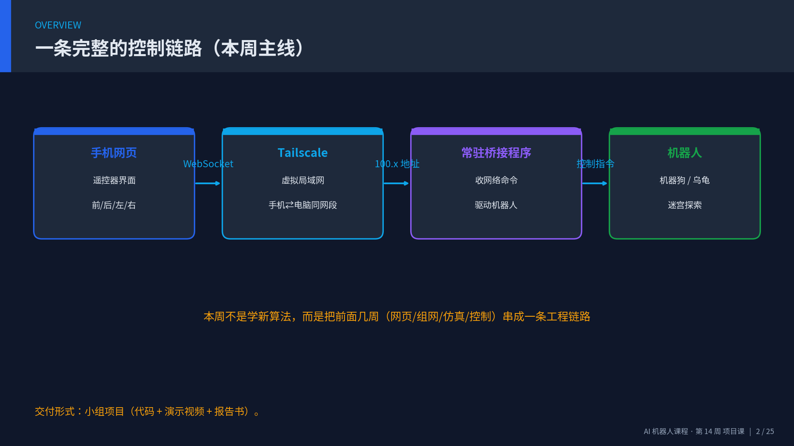
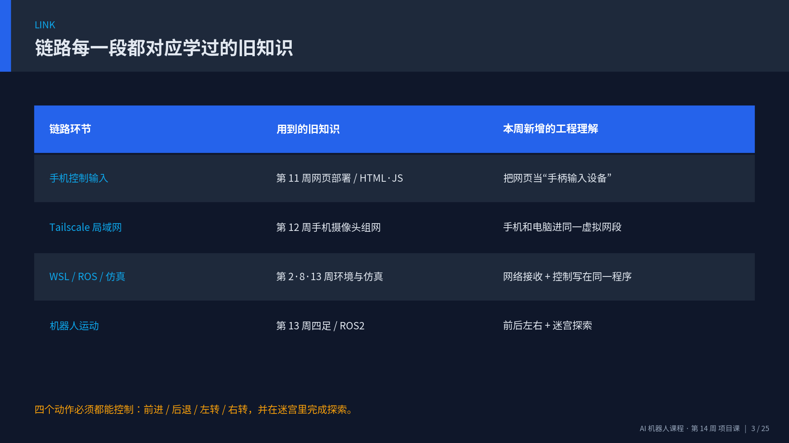
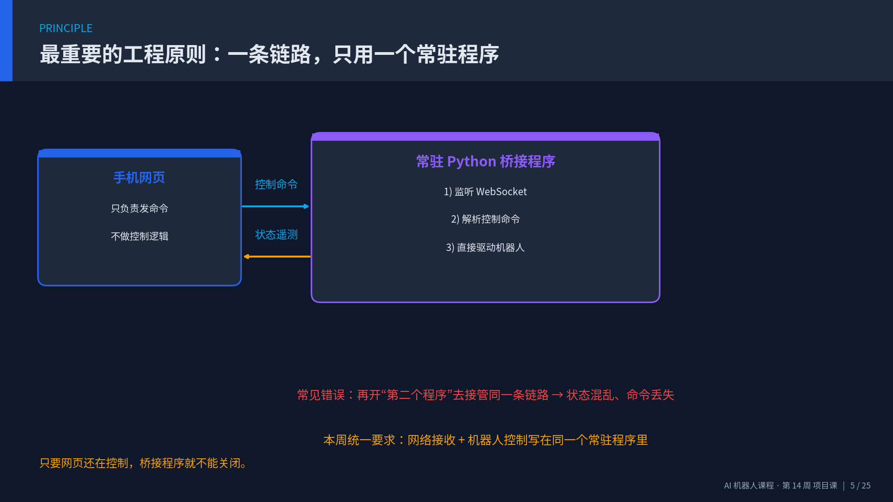
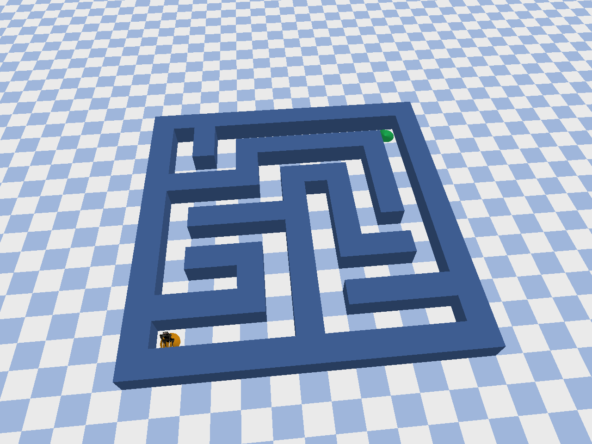
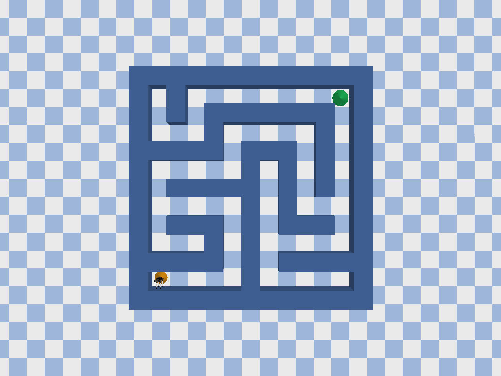
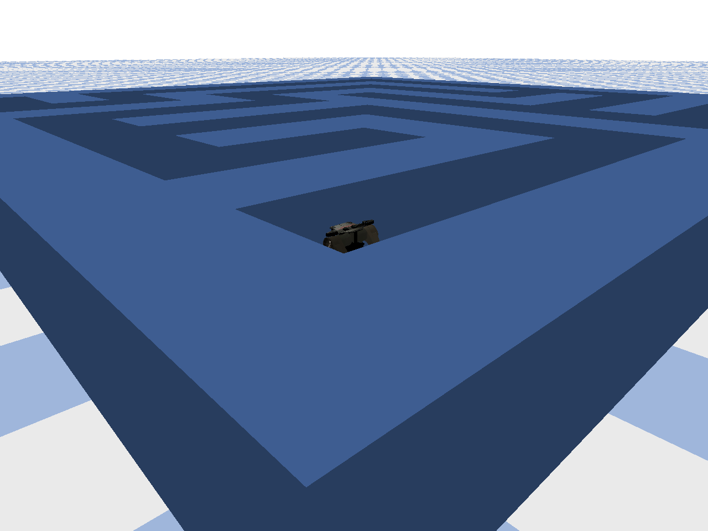
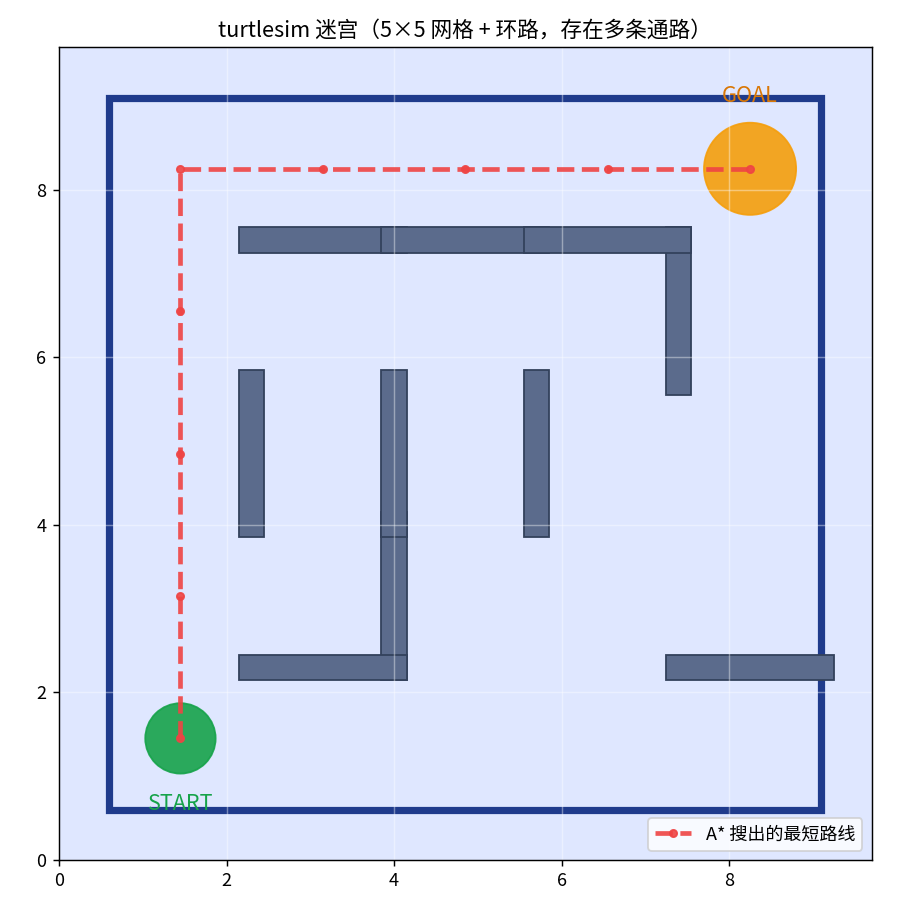
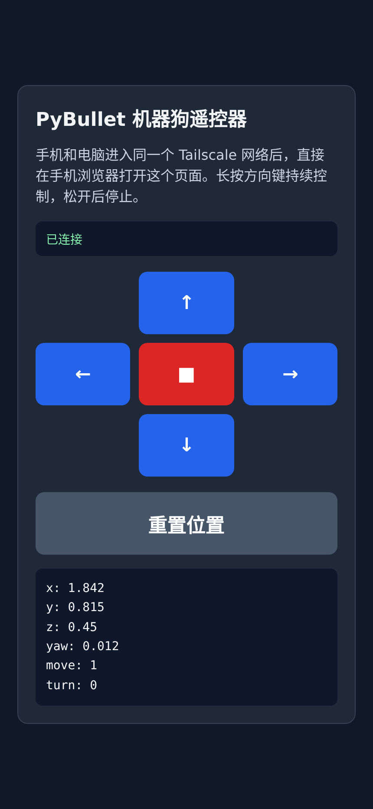
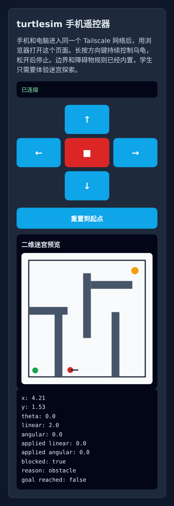

# 第 14 周：期末项目实施 — 手机遥控 + 迷宫探索（小组项目）

**课时**：3 小时（一次课，配合课后小组完成）

---

## 🎯 本周一句话目标

> 用你自己写的**手机网页**，通过 **Tailscale 局域网**，把控制指令送进 **WSL 里的仿真程序**，让 **四足机器人或 turtlesim 乌龟** 在迷宫里走起来。

本周是课程的**期末项目实施周**：不是再学一个新算法，而是把第 2–13 周学到的东西**串成一条完整的工程链路**，以**小组项目**形式完成代码、演示视频与 PDF 报告书并提交。

---

## 14.0 配套资料：讲解视频与 PPT

本周项目讲义配套了一份讲解 PPT 和一段**带中文配音的讲解视频**，建议先用 3 分钟看完视频，对整个项目建立整体印象，再往下看细节。

<div style="text-align:center; margin: 20px 0;">
<video src="../week14_project/week14_briefing_video.mp4" controls
       style="max-width:100%; border-radius:10px; box-shadow:0 6px 20px rgba(0,0,0,0.18);">
你的浏览器不支持视频播放，请直接打开 <code>week14_project/week14_briefing_video.mp4</code>。
</video>
<p style="font-size:0.9em; color:#666; margin-top:8px;">
第 14 周项目讲解视频。配音使用开源项目
<a href="https://github.com/jamiepine/voicebox">voicebox</a> 的 Chatterbox 多语种引擎，由<strong>授课老师本人录音克隆</strong>生成。
</p>
</div>

> 本周讲义已升级：迷宫改为**更复杂、更逼真的真正迷宫**（机器狗方向用算法生成的完美迷宫并加入撞墙碰撞与终点判定），新增**一键 Docker 环境**让项目在自己电脑上就能跑，并补充了**如何动手改代码完成项目**与**小组报告书写法（人数/页数）**。

- 📊 讲解 PPT：`week14_project/week14_briefing_slides.pptx`（16:9）
- 🎬 讲解视频：`week14_project/week14_briefing_video.mp4`
- 📝 配音脚本：`week14_project/narration_script.md`

下面是 PPT 的前几页预览：

<div style="display:grid; grid-template-columns:repeat(auto-fit,minmax(300px,1fr)); gap:14px; margin:20px 0;">
  
  
  
  
</div>

---

## 14.1 项目总览

### 14.1.1 统一的控制链路

第 14 周的小组项目统一围绕下面这条链路展开：

```text
手机控制输入  ->  Tailscale 局域网  ->  WSL / ROS / 仿真程序  ->  机器人运动
```

这条链路里每一段都对应着本课程之前学过的内容：

| 链路环节 | 用到的旧知识 | 本周新增的工程理解 |
|----------|--------------|--------------------|
| 手机控制输入 | 第 11 周网页部署、HTML/JS | 把网页当作**手柄输入设备** |
| Tailscale 局域网 | 第 12 周手机摄像头组网 | 手机和电脑进入同一虚拟网段 |
| WSL / ROS / 仿真 | 第 2、8、13 周环境与仿真 | 网络接收 + 机器人控制写在同一个程序里 |
| 机器人运动 | 第 13 周四足机器人 / ROS2 | 前进 / 后退 / 左转 / 右转 + 迷宫探索 |

### 14.1.2 两个方向，二选一

每组从下面两个方向中**选择一个**完成。

| 方向 | 场景 | 控制对象 | 目标 | 起始代码 |
|------|------|----------|------|----------|
| **方向 A** | PyBullet 三维迷宫 | 四足机器人（机器狗） | 手机遥控完成迷宫探索 | `week14_starters/pybullet_dog/` |
| **方向 B** | turtlesim 二维平面 | ROS2 乌龟 | 手机遥控完成迷宫探索 | `week14_starters/turtlesim_remote/` |

> 方向 A 偏“三维 + 物理仿真”，画面更酷；方向 B 偏“ROS2 标准链路”，更贴近真实机器人软件栈。两条路线难度相当，按小组兴趣选择即可。

### 14.1.3 统一要求

不论选哪个方向，每组都必须做到：

1. **手机作为控制手柄输入**
2. **自己实现一个简单的遥控器网页**
3. **手机和电脑通过 Tailscale 进入同一个虚拟局域网**
4. 能够控制四足机器人 / turtlesim 乌龟完成：
   - 前进
   - 后退
   - 左转
   - 右转
5. **最终需要在迷宫环境中完成探索任务**

> ⭐ **自动探索要求（重点）**：
> - **方向 B（小乌龟）**：要求**让乌龟自动走出迷宫**（用算法如右手法则 / BFS/A\*，**或接入智能 Agent 如 OpenClaw**，见 14.8.5），不能只靠手动遥控。起始代码已给出可用的 `explorer.py` 巡墙器参考实现。
> - **方向 A（机器狗）**：手动遥控即可达标；但**当小组为 4 人及以上时，要求实现自动探索迷宫**（写算法或接入智能 Agent 均可）。

### 14.1.4 人数与选题建议

请按小组人数选择方向，并据此安排分工：

| 小组人数 | 建议方向 | 自动探索 | 理由与分工 |
|----------|----------|----------|------------|
| **3 人** | **方向 A：机器狗（PyBullet）** | 加分项 | 分工：①网络/网页 ②迷宫与碰撞 ③可视化/报告 |
| **4 人及以上** | **方向 A：机器狗（PyBullet）** | **必做** | 分工：①网络/网页 ②迷宫与碰撞 ③**自动探索算法** ④报告与测试 |
| **2 人** | **方向 B：小乌龟（turtlesim）** | **必做** | 一人主攻桥接程序、一人主攻网页与自动探索算法 |
| **1 人（可单人）** | **方向 B：小乌龟（turtlesim）** | **必做** | 桥接已内置碰撞，集中精力打通链路 + 写自动探索算法 |

> 简单说：**人多做机器狗、人少做小乌龟、单人也欢迎**。其中**小乌龟必须做自动探索**（用算法自动走出迷宫），**机器狗满 4 人也必须做自动探索**。方向 A 偏“三维 + 物理仿真”，画面更酷；方向 B 偏“ROS2 标准链路”，更贴近真实机器人软件栈。

---

## 14.2 关键设计原则：一条控制链路，只用一个常驻程序

这是本周最重要、也是最容易做错的工程概念，请务必理解。

两套起始代码都遵循同一个组织原则：

- **桥接程序在实验期间需要持续运行**
- **手机网页只负责发送控制指令**
- **网络接收与机器人控制逻辑放在同一个 Python 程序中**
- **不再额外启动第二个程序去重复接管同一条控制链路**

用一张图来理解：

```text
┌──────────────┐     WebSocket 控制命令      ┌────────────────────────────┐
│   手机网页    │  ───────────────────────▶  │   常驻 Python 桥接程序        │
│ (遥控器界面)  │                            │  ┌──────────────────────┐  │
│  前/后/左/右  │  ◀───────────────────────  │  │ 1) 监听网络/WebSocket  │  │
└──────────────┘     机器人状态回传(遥测)     │  │ 2) 解析控制命令         │  │
                                            │  │ 3) 直接驱动机器人       │  │
                                            │  └──────────────────────┘  │
                                            │      PyBullet / ROS2        │
                                            └────────────────────────────┘
```

> ⚠️ 常见错误：有的同学会写“一个程序收网络命令，再开第二个程序去读命令、再控制机器人”。这会让同一条控制链路被两个程序抢着接管，状态混乱、命令丢失。**本周统一要求：接收网络 + 控制机器人写在同一个常驻程序里。**

**只要网页还在控制，桥接程序就不能关闭。**

---

## 14.3 通用环境准备：Tailscale 局域网

这一步两个方向完全一样，和第 12 周“手机摄像头接入 WSL”用的是同一套方法。

### 14.3.1 为什么必须用 Tailscale

在校园网 / 机房环境中，手机直接访问 WSL 几乎一定失败，原因有两个：

1. **校园网 AP 隔离**：手机和电脑虽然连同一个 Wi-Fi，但设备之间被禁止互访。
2. **WSL2 NAT 隔离**：WSL2 是 Windows 内部的一个独立子网，手机很难直接访问它的内部地址。

Tailscale 给**手机**和**WSL**都分配一个同网段的虚拟地址（通常是 `100.x.y.z`），从而绕过上面两个限制。

### 14.3.2 推荐：一人一网（Tailnet）

- 每位同学用自己的 GitHub / Google 账号注册 Tailscale
- 手机端和 WSL 端登录**同一个账号**
- 每个学生的虚拟网络里只有自己的电脑和手机，互不干扰

### 14.3.3 WSL 端安装与启动

```bash
curl -fsSL https://tailscale.com/install.sh | sh
sudo service tailscaled start
sudo tailscale up
```

按提示登录后，查询 WSL 在 Tailnet 中的地址：

```bash
tailscale ip -4
```

记下这个 `100.x.y.z` 地址，后面手机浏览器要用它来打开遥控器网页。

### 14.3.4 推荐：用 Docker 一键准备运行环境

考虑到大家要在**自己的电脑**上跑，本周提供了一套 Docker 环境，**复用第 10/11 周配置过的 ROS2 桌面镜像** `ghcr.io/tiryoh/ros2-desktop-vnc:humble`。它自带一个**浏览器里的 Linux 桌面（noVNC）**，所以 turtlesim 和 PyBullet 的图形窗口都能在浏览器里看到，不用在 Windows 上单独装 ROS2。

```bash
cd week14_starters/docker
docker compose up -d
# 浏览器打开桌面（默认密码 ubuntu）
#   http://localhost:6080
# 在桌面终端里安装依赖（只需一次）
cd ~/week14_starters/docker && bash setup.sh
```

端口已经映射好：

| 端口 | 用途 |
|------|------|
| `6080` | 浏览器 noVNC 桌面（看仿真画面） |
| `8765` | 方向 A（机器狗）网页控制器 |
| `8080` | 方向 B（小乌龟）网页控制器 |

> 手机怎么连：容器把 `8765 / 8080` **映射到了宿主机**，所以 **Tailscale 仍然装在宿主机上**（见 14.3.3），手机访问 `http://<宿主机Tailscale_IP>:8765`（或 `:8080`）即可，不必在容器里再装 Tailscale。代码挂载在 `~/week14_starters`，你在宿主机改代码、容器里直接重跑。详见 `week14_starters/docker/README.md`。

---

## 14.4 方向 A：手机遥控 PyBullet 机器狗迷宫

### 14.4.1 起始代码结构

```text
week14_starters/pybullet_dog/
├── server.py          # 常驻程序：PyBullet 仿真 + WebSocket 服务 + 碰撞/终点判定
├── maze.py            # 迷宫生成与配置（算法生成的“完美迷宫”，含起点/终点/墙体）
├── explorer.py        # 自动探索（右手法则巡墙器；3人加分、4人及以上必做）
├── index.html         # 手机遥控器网页（带实时俯视图：墙体/终点/轨迹）
└── requirements.txt   # aiohttp + pybullet
```

> 起始代码已经做了**职责拆分**：`maze.py` 管“地图长什么样”，`server.py` 管“仿真和网络怎么跑”，`explorer.py` 管“自动怎么走”。这正是后面 14.7 节要讲的——**改代码时你主要动哪个文件，一目了然**。

### 14.4.2 安装与启动

```bash
cd week14_starters/pybullet_dog
pip install -r requirements.txt
python3 server.py
```

启动后默认监听：

```text
http://0.0.0.0:8765
```

手机和电脑进入同一个 Tailscale 网络后，在手机浏览器打开：

```text
http://<WSL的Tailscale_IP>:8765
```

### 14.4.3 项目初始环境：三维迷宫长什么样

`server.py` 启动后会调用 `maze.py` 用**递归回溯算法生成一个“完美迷宫”**（任意两点之间有且只有一条通路，天然带很多死路），用蓝色墙体搭起来，并在左下角放一只四足机器人（laikago）、左下角放橙色起点盘、右上角放绿色终点盘。机器狗**撞墙会被真正挡住**，走进绿色终点圈即判定“到达终点”。下面是直接运行起始代码渲染出来的初始画面：

<div style="text-align:center; margin: 20px 0;">

<p style="font-size:0.9em; color:#666; margin-top:8px;">
方向 A 初始环境总览：算法生成的 13m×13m 完美迷宫（橙色起点、绿色终点），机器狗从左下角出发，目标是走到右上角绿色终点。
</p>
</div>

<div style="display:grid; grid-template-columns:repeat(auto-fit,minmax(260px,1fr)); gap:14px; margin:20px 0;">
  <figure style="margin:0;">
    
    <figcaption style="font-size:0.85em; color:#666; margin-top:6px;">俯视图：清楚看到迷宫的走廊与死路，橙色为起点、绿色为终点</figcaption>
  </figure>
  <figure style="margin:0;">
    
    <figcaption style="font-size:0.85em; color:#666; margin-top:6px;">起点近景：四足机器人 laikago 站在左下角出发位置</figcaption>
  </figure>
</div>

### 14.4.4 server.py 的关键设计

起始代码把“仿真 + 迷宫 + 机器人 + 网络”都放在一个程序里，核心逻辑如下：

- **搭建世界** `_build_world()`：加载地面、从 `maze.py` 取墙体用 `createMultiBody` 拼迷宫、放起点/终点圆盘、加载四足机器人。
- **接收命令** `set_command(move, turn)`：`move` 表示前进/后退，`turn` 表示左转/右转。
- **撞墙检测** `_hits_wall(x, y)`：把机器狗当成一个半径 `DOG_RADIUS` 的圆，检测它和任何墙体包围盒是否相交。
- **运动更新** `step(dt)`：先更新朝向（转向永远允许），再尝试前进；**如果下一步会撞墙就原地不动**并标记 `blocked`；走进终点圈则标记 `goal_reached` 并停车。
- **WebSocket** `/ws`：接收手机 `command / stop / reset`，把状态（位置、朝向、blocked、goal_reached、迷宫数据）回传给网页画俯视图。
- **仿真循环** `simulation_loop`：固定频率推进仿真，向所有网页广播状态。

```python
def step(self, dt):
    position, orientation = p.getBasePositionAndOrientation(self.robot_id)
    yaw = p.getEulerFromQuaternion(orientation)[2]
    if self.goal_reached:           # 到终点后锁定
        p.stepSimulation(); return

    yaw += self.command["turn"] * TURN_SPEED * dt          # 先转向
    nx = position[0] + self.command["move"] * MOVE_SPEED * math.cos(yaw) * dt
    ny = position[1] + self.command["move"] * MOVE_SPEED * math.sin(yaw) * dt

    if self.command["move"] != 0.0 and self._hits_wall(nx, ny):
        self.blocked = True
        nx, ny = position[0], position[1]   # 撞墙：保持原位
    else:
        self.blocked = False
    # ... 更新位姿、判断是否进入终点圈 ...
```

---

## 14.5 方向 B：手机遥控 turtlesim 乌龟迷宫

### 14.5.1 起始代码结构

```text
week14_starters/turtlesim_remote/
├── turtlesim_web_bridge.py   # 常驻程序：ROS2 节点 + 迷宫规则 + 碰撞 + WebSocket 服务
├── explorer.py               # 自动探索（按格右手法则巡墙器，可走通完美迷宫，必做）
├── index.html                # 手机遥控器网页（含二维迷宫预览）
└── requirements.txt          # aiohttp
```

> 方向 B 默认你已经有可用的 **ROS2 Humble + turtlesim**（第 2 周已配置）。

### 14.5.2 启动方式（注意顺序）

**第 1 步：启动 turtlesim**

```bash
source /opt/ros/humble/setup.bash
ros2 run turtlesim turtlesim_node
```

**第 2 步：另开一个终端，启动网页桥接程序**

```bash
source /opt/ros/humble/setup.bash
cd week14_starters/turtlesim_remote
pip install -r requirements.txt
python3 turtlesim_web_bridge.py
```

默认监听：

```text
http://0.0.0.0:8080
```

**第 3 步：手机打开遥控器**

```text
http://<WSL的Tailscale_IP>:8080
```

> 运行顺序固定：`turtlesim_node` 先开 → `turtlesim_web_bridge.py` 常驻 → 手机连接。桥接程序一旦关闭，就没有程序把命令发布到 ROS2 了。

### 14.5.3 项目初始环境：二维迷宫长什么样

和方向 A 不同，方向 B 的迷宫**边界、障碍物、碰撞规则、起点和终点都已经内置在桥接程序里**。本周迷宫升级为一个 **4×4 单元的“完美迷宫”**（用递归回溯算法生成，已用 BFS **验证从起点到终点一定有解**，走廊约 2.2 宽、天然带死路与分叉），非常适合用“沿墙走 / 自动探索”算法求解。迷宫定义（与 `turtlesim_web_bridge.py` 的 `OBSTACLES` 完全一致）渲染如下（红色虚线是其中一条可行通关路线）：

<div style="text-align:center; margin: 20px 0;">

<p style="font-size:0.9em; color:#666; margin-top:8px;">
方向 B 初始环境：4×4 完美迷宫（已验证有解），绿色为起点（START），橙色为终点（GOAL），灰色矩形为障碍墙，红色虚线为一条可行通关路线。
</p>
</div>

### 14.5.4 桥接程序已内置的迷宫规则

`turtlesim_web_bridge.py` 比方向 A 多做了不少“安全”工作：

| 功能 | 说明 |
|------|------|
| 发布 `/turtle1/cmd_vel` | 把手机命令转成 ROS2 速度指令 |
| 订阅 `/turtle1/pose` | 实时获取乌龟位置 |
| 边界检测 `would_hit_boundary` | 预测下一步是否越界 |
| 障碍物检测 `would_hit_obstacle` | 预测下一步是否撞墙（带半径膨胀） |
| 碰撞阻挡 `compute_safe_motion` | 会撞就把前进速度设为 0，并返回 `reason` |
| 终点判定 `is_inside_goal` | 进入终点圆形区域即 `goal_reached` |
| 复位 `reset_to_start` | 用 `teleport_absolute` 把乌龟送回起点 |

这意味着学生用手机一直按“前进”撞到墙时，乌龟会被自动挡住，遥测里会显示 `blocked: true, reason: obstacle`。

---

## 14.6 自己实现遥控器网页

“自己实现一个简单的遥控器网页”是统一要求之一。起始代码已经给了一个可用的 `index.html`，你可以直接用它，也可以在它的基础上改造美化。两套遥控器跑通后的实际界面如下：

<div style="display:grid; grid-template-columns:repeat(auto-fit,minmax(220px,1fr)); gap:18px; margin:20px 0; align-items:start;">
  <figure style="margin:0;">
    
    <figcaption style="font-size:0.85em; color:#666; margin-top:6px;">方向 A 遥控器：上下左右方向键、停止键、重置键，下方实时显示机器人位置遥测。</figcaption>
  </figure>
  <figure style="margin:0;">
    
    <figcaption style="font-size:0.85em; color:#666; margin-top:6px;">方向 B 遥控器：方向键之外，还内嵌了二维迷宫预览，能看到乌龟、起点、终点和障碍物。</figcaption>
  </figure>
</div>

### 14.6.1 遥控器网页的三个要点

1. **方向键长按持续控制，松开即停**
   用 `touchstart / touchend`（以及鼠标的 `mousedown / mouseup`）来发命令，松手立刻发 `stop`，避免乌龟/机器狗“一直跑停不下来”。

   ```javascript
   button.addEventListener("touchstart", () => sendCommand(move, turn), { passive: false });
   button.addEventListener("touchend",   () => stopRobot(), { passive: false });
   ```

2. **用 WebSocket 发送结构化命令**
   命令统一是一个 JSON：

   ```javascript
   socket.send(JSON.stringify({ type: "command", move: 1, turn: 0 })); // 方向 A
   socket.send(JSON.stringify({ type: "command", linear: 2.0, angular: 0.0 })); // 方向 B
   ```

3. **显示回传遥测**
   网页订阅桥接程序回传的状态，实时显示位置、朝向、是否被障碍物挡住，方便调试。

---

## 14.7 动手改代码：完成项目要写 / 改哪几个文件

本周项目**不是从零写**，而是在起始代码上“填空 + 扩展”。下面按文件告诉你**改哪里、加什么**，照着做就能从“跑通”一路做到“拿高分”。

### 14.7.1 一张表看清要动哪些文件

**方向 A（机器狗）**

| 文件 | 必做（跑通项目） | 进阶（加分） |
|------|------------------|--------------|
| `maze.py` | 不改也能跑（已生成完美迷宫） | 改 `COLS/ROWS/SEED` 换更大更难的迷宫；或自定义墙体布局 |
| `index.html` | 不改也能用（已有方向键 + 俯视图） | 美化界面、加“自动/手动”切换按钮、显示用时/碰撞次数 |
| `explorer.py` | 3 人加分项 / **4 人及以上必做** | 完善右手法则，或改左手法则 / 记录走过的格子 |
| `server.py` | 不改也能跑（4 人需接入自动模式） | 接入 `explorer.py`：加一个“自动模式”，自动模式下用 `explorer.decide()` 算命令 |

**方向 B（小乌龟）**

| 文件 | 必做（跑通项目） | 进阶（加分） |
|------|------------------|--------------|
| `turtlesim_web_bridge.py` | 跑通默认迷宫；**接入 `explorer.py` 加“自动模式”** | 改 `OBSTACLES` 设计自己的迷宫 |
| `explorer.py` | **必做：自动探索算法**（已给右手法则巡墙器参考实现，理解并接好） | 改左手法则 / 用 BFS·A\* 求最短路 / 统计用时 |
| `index.html` | 不改也能用 | 加“自动/手动”按钮、迷宫预览加轨迹 |

> ⭐ 方向 B 的核心要求就是**让乌龟用算法自动走出迷宫**。`explorer.py` 里已给出一个按格推进的右手法则巡墙器（对完美迷宫一定能到终点，实测约 13 秒通关），你需要理解它并接到桥接程序的“自动模式”里，再做改进。

### 14.7.2 第一步：先把链路跑通（不写一行代码也能做到）

1. 按 14.3 装好 Tailscale（或用 14.3.4 的 Docker）。
2. 启动起始程序（方向 A 跑 `server.py`；方向 B 跑 `turtlesim_node` + `turtlesim_web_bridge.py`）。
3. 手机打开遥控器，确认**前进 / 后退 / 左转 / 右转**四个键都能用、撞墙会被挡住。

> 这一步通过，就已经拿到“链路打通”的基础分了。

### 14.7.3 第二步：改地图（动 1 个文件）

- 方向 A：打开 `maze.py`，把顶部的 `COLS = 6 / ROWS = 6` 调大（如 `8`），或换一个 `SEED`，迷宫立刻变大变难；想手工设计也可以把 `_carve_grid` 换成你自己的墙体列表。
- 方向 B：打开 `turtlesim_web_bridge.py`，在 `OBSTACLES` 里增删矩形（`x,y` 是左下角，`w,h` 是宽高），设计你自己的迷宫。

> 改完重启程序即可看到新迷宫——这一步就是把“迷宫设计”这一评分项做出来。

### 14.7.4 第三步：写自动探索（动 explorer.py）

> 这一步对**小乌龟是必做**，对**机器狗满 4 人也是必做**；其余情况是加分项。

`explorer.py` 已经给出**可用的右手法则巡墙器参考实现**（方向 A、方向 B 各一份，对完美迷宫都能自动走到终点），你的任务是**理解它、接到主程序里，并做改进**：

1. 读懂 `explorer.py` 里的 `decide()`（按格推进的右手法则）；在此基础上改进：改左手法则做对比、用比例控制让转弯更平滑、或干脆用 BFS/A\* 直接算最短路径。
2. 在主程序里接入它，加一个“自动模式”。以方向 A 为例，只要在仿真循环里这样几行：

   ```python
   from explorer import WallFollower
   self.explorer = WallFollower()
   # 仿真循环里，若处于自动模式：
   move, turn = self.explorer.decide(self.get_state())
   self.set_command(move, turn)
   ```

3. 在 `index.html` 加一个按钮，向后端发 `{"type": "auto"}` 切换自动 / 手动（后端收到后置一个 `self.auto = not self.auto` 标志）。

### 14.7.5 第四步：结果展示（动 index.html / 录屏）

- 把走过的轨迹画在网页俯视图上（方向 A 的 `index.html` 已经画了轨迹，可继续加“用时 / 碰撞次数”统计）。
- 录一段从起点自动 / 手动走到终点的完整视频，作为成果。

> **小结**：必做 = 跑通链路 + 改地图（动 1 个文件）；加分 = 写好 `explorer.py` 并接入主程序。整个项目你真正要写的代码量不大，重点是**理解每个文件的职责**。

---

## 14.8 项目进阶任务

完成上面四步后，可以继续打磨下面几类内容（评分会更高）：

### 14.8.1 更难的迷宫地图

- 方向 A：调大 `maze.py` 的 `COLS/ROWS`，或换 `SEED` 生成不同迷宫；挑战手工设计带回路的迷宫。
- 方向 B：在 `OBSTACLES` 里设计更曲折、带更多死路的布局。

### 14.8.2 更聪明的自动探索

- “沿墙走”（右手法则 / 左手法则）
- 撞墙后自动后退一点再转向
- 记录走过的格子，避免重复绕圈

### 14.8.3 碰撞处理

- 方向 B 已内置碰撞预测，可进一步：撞墙时自动选择新的方向。
- 方向 A 的撞墙检测已内置（`_hits_wall`），可在此基础上做“撞墙自动避让”。

### 14.8.4 路径记录或结果展示

- 把走过的轨迹画在网页上 / 保存成图片
- 统计到达终点用时、碰撞次数
- 录一段完整探索过程的视频作为成果展示

### 14.8.5 用智能 Agent 代替人工遥控（OpenClaw 等，认可的完成方式）

除了“人手按方向键”和“自己写算法（右手法则 / BFS）”，**也可以接入一个智能体（Agent）来开机器人**——例如 OpenClaw 这类大模型 / Agent 框架，让 AI 自己看状态、做决策、发指令。这条路同样算作“自动探索达标”（满足小乌龟必做 / 机器狗满 4 人必做的要求）。提示要点：

1. **接口不变，Agent 当“新大脑”**：把 Agent 接到**和网页一样的命令接口**（WebSocket 发 JSON，或直接在常驻程序里调用 `decide()`）。**单一常驻程序原则照样适用**——不要为 Agent 另开一条链路。
2. **感知 → 决策 → 执行 闭环（sense–think–act）**：每个控制周期，把机器人状态整理成结构化文本喂给 Agent：位置 `pose`、朝向、是否撞墙 `blocked`、是否到终点 `goal_reached`、迷宫地图 / 障碍、可选的俯视图或摄像头画面。
3. **把动作空间限制死**：只给 Agent 一个很小的合法动作集合（`forward / back / left / right / stop`，或线速度+角速度的范围），并在程序里做**安全校验**（撞墙就忽略前进），防止“幻觉指令”乱跑。
4. **System Prompt 要点**：说明身份（迷宫探索机器人）、目标（到达终点坐标）、可用动作、各状态字段含义、**严格的输出格式**（如只输出 `{"action":"forward"}` 的 JSON，不要解释）。
5. **决策频率与成本**：大模型推理慢、有延迟和费用。建议**降低决策频率**（如每 0.5–1 秒决策一次，期间沿用上一个动作），或采用**分层**：Agent 做高层规划（给出要走的格子序列），本地 `explorer` / PID 做低层执行。
6. **记忆 + 防打转**：把“走过的格子 / 最近动作历史”一并放进上下文，提示它避免来回打转；可让它输出简短 reasoning 便于调试，但最终动作仍走 JSON。
7. **失败兜底**：网络超时、JSON 解析失败时，**回退到本地算法（右手法则）或停止**，保证安全；记录日志方便写报告。
8. **报告里写清**：用了哪个 Agent / 模型、Prompt 怎么设计、动作空间、决策频率、效果（成功率 / 用时 / 调用次数），以及与“硬编码算法”的对比和取舍。

> 一句话：Agent 只是换了“发命令的大脑”，**桥接 / 常驻程序、碰撞规则、终点判定都不用动**；把它当成一个会自己按方向键的“自动遥控器”即可。

---

## 14.9 小组报告书怎么写（人数 / 页数）

每组提交**一份 PDF 报告书（A4）**，篇幅按人数来，平均每人约 2 页：

| 小组人数 | 报告书页数（A4，不含封面） | 备注 |
|----------|----------------------------|------|
| 1 人 | 2–3 页 | 单人项目，重点写清链路与一点自动探索 |
| 2 人 | 4–5 页 | 两人分工要写清楚 |
| 3 人 | 6 页左右 | 机器狗项目，三块分工分别成节 |
| 4 人及以上 | 8 页左右 | 每多 1 人约 +2 页 |

**报告书建议结构（按节写）：**

1. **封面**（不计入页数）：题目、方向（A/B）、组员姓名学号、分工一句话
2. **项目概述**（约 0.5 页）：做了什么、选了哪个方向、为什么
3. **系统链路**（约 1 页）：手机 → Tailscale → 桥接程序 → 机器人 的图与说明
4. **迷宫设计**（约 1 页）：迷宫长什么样、改了 `maze.py` / `OBSTACLES` 的哪些参数，配截图
5. **代码改动说明**（约 1–2 页）：你们改 / 写了哪几个文件、关键函数贴一小段代码并解释
6. **自动探索策略**（约 1 页，进阶）：用了什么算法、效果如何
7. **问题与解决**（约 0.5–1 页）：踩过的坑、怎么解决的
8. **成果与分工**（约 0.5 页）：到达终点截图 / 视频链接 + **每位组员具体负责了什么**

> 三人及以上的机器狗组，建议在“分工”里明确：①网络与网页 ②迷宫与碰撞 ③自动探索算法（人多再加④报告与测试），并在第 5 节里各写各自负责的代码。

---

## 14.10 项目交付与评分

### 14.10.1 交付物

每组提交：

1. **代码**：改造后的 `server.py` / `turtlesim_web_bridge.py`、`maze.py`、`explorer.py` + 你的 `index.html`
2. **演示视频**：手机遥控机器人/乌龟从起点探索到终点的完整过程（建议 1–2 分钟）
3. **报告书**：按 14.9 节的人数 / 页数与结构撰写（A4 PDF）
4. **分工说明**：每位组员负责了哪一部分（也写进报告书第 8 节）

### 14.10.2 评分维度（参考）

| 维度 | 占比 | 说明 |
|------|------|------|
| 链路打通 | 30% | 手机 → Tailscale → 桥接程序 → 机器人，四个动作都能控制 |
| 迷宫探索 | 25% | 能在迷宫中完成基本探索 / 到达终点 |
| 进阶功能 | 25% | 自动探索、碰撞处理、路径记录等 |
| 工程规范 | 10% | 单一常驻程序结构清晰、网页可用 |
| 报告与展示 | 10% | 视频清晰、分工明确、问题分析到位 |

---

## 14.11 常见问题（FAQ）

| 现象 | 可能原因 | 处理 |
|------|----------|------|
| 手机打不开网页 | 没在同一个 Tailnet / IP 用错 | `tailscale ip -4` 确认地址，手机也要登录同一账号 |
| 网页显示“连接断开” | 桥接程序没运行 / 关掉了 | 重新运行 `server.py` 或 `turtlesim_web_bridge.py` 并保持常驻 |
| 乌龟一直走停不下来 | 松手没有发 `stop` | 检查 `touchend` 是否绑定了停止命令 |
| 方向 B 乌龟不动 | turtlesim_node 没开 / 没 source ROS2 | 先开 `turtlesim_node`，每个终端都要 `source /opt/ros/humble/setup.bash` |
| 方向 A 机器狗加载失败 | pybullet_data 里没有 laikago | 更新 `pybullet`，确认 `requirements.txt` 已安装 |

---

## 14.12 本周小结

- 本周把“网页 + 局域网 + 仿真 + 机器人”串成一条**完整的手机遥控链路**。
- 核心工程原则：**接收网络 + 控制机器人写在同一个常驻程序里**，手机网页只发命令。
- 方向 A（PyBullet 机器狗）和方向 B（turtlesim 乌龟）任选其一，统一要求是手机能控制前进/后退/左转/右转，并在迷宫中完成探索。
- 起始代码已经准备好，跑通之后重点放在：**迷宫地图、自动探索、碰撞处理、路径记录与展示**。

> 把它当成一个“最小可玩的机器人远程操控系统”：当你能用自己的手机在迷宫里把机器人开起来，你就已经把这门课的网络、环境、仿真、控制全部打通了。
