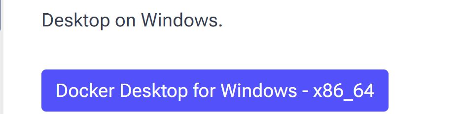
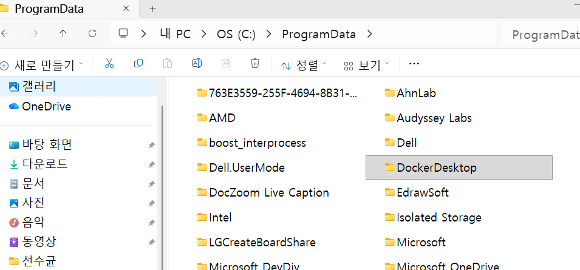
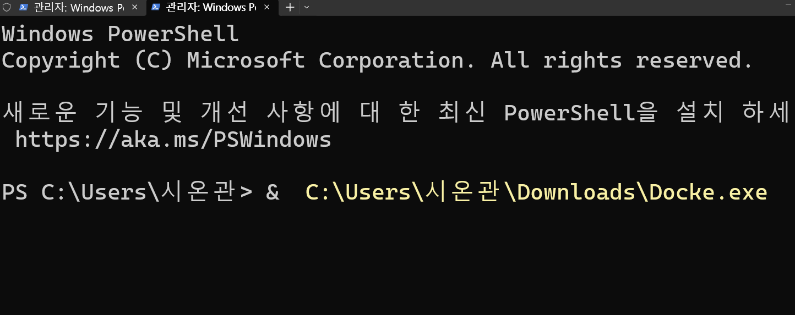
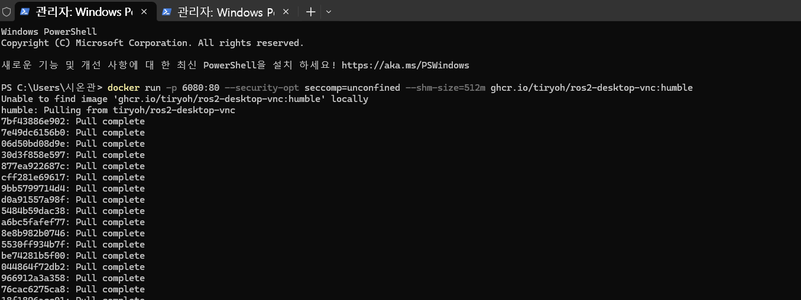
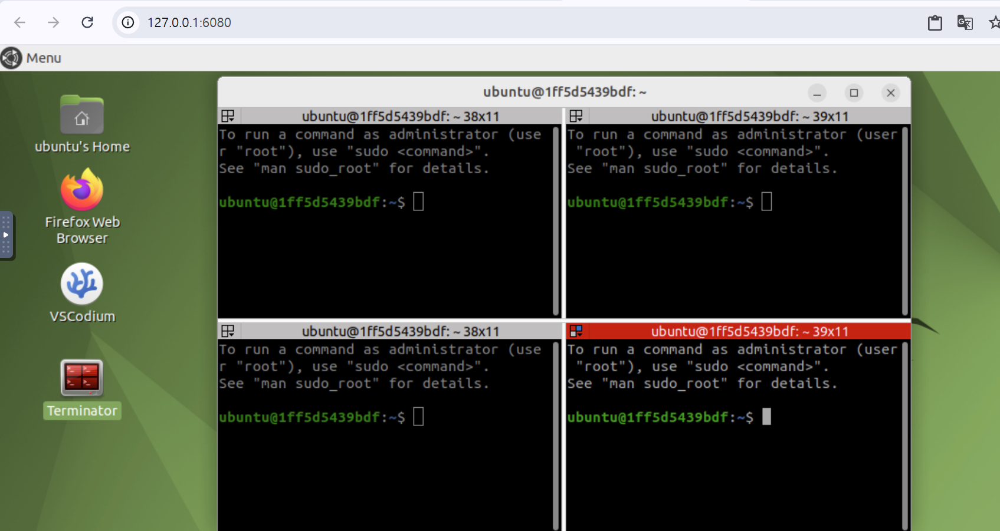

# Week 8：Docker 安装与 ROS2 桌面容器

本周使用 Docker 运行 ROS2 桌面环境。目标是减少本机环境差异，让大家可以通过浏览器访问带图形界面的 ROS2 环境。

## 课堂内容

1. Windows 安装 Docker。
2. Mac 安装 Docker。
3. 使用 Docker 运行 ROS2。

## Windows 安装 Docker

下载安装包：

```text
https://docs.docker.com/desktop/setup/install/windows-install/
```

课堂提醒：

- 下载后可以把安装包重命名为没有空格的文件名。
- 如果安装异常，可以显示隐藏文件，找到 `ProgramData` 目录，删除 `DockerDesktop` 文件夹后重试。





用管理员权限打开 PowerShell，命令行中输入 `&`，然后复制粘贴安装包路径执行。

示意：

```powershell
& C:\path\to\DockerDesktopInstaller.exe
```



## Mac 安装 Docker

如果已经安装 Homebrew：

```bash
brew install --cask docker
```

如果没有 Homebrew，可以先安装 Homebrew：

```bash
/bin/bash -c "$(curl -fsSL https://raw.githubusercontent.com/Homebrew/install/HEAD/install.sh)"
```

## Docker 运行 ROS2 桌面

课堂使用参考项目：

```text
https://github.com/Tiryoh/docker-ros2-desktop-vnc
```

打开项目页面，复制 Quick Start 下的第一行命令运行。



运行成功后，在浏览器中打开：

```text
http://127.0.0.1:6080/
```

这个页面会显示 Docker 容器中的 ROS2 图形桌面环境。



## 运行 turtlesim

在 Docker 镜像中 ROS2 已经安装好，可以继续运行小乌龟节点：

```bash
ros2 run turtlesim turtlesim_node
```

另开终端启动键盘控制：

```bash
ros2 run turtlesim turtle_teleop_key
```

## 为什么使用 Docker

Docker 可以把复杂环境封装到容器里：

- 减少不同电脑、不同系统带来的安装差异。
- 避免本机环境被反复修改。
- 便于复现课堂实验。
- 适合 ROS2、仿真、服务器部署等场景。

## 常见问题

- Windows 上 Docker Desktop 通常依赖 WSL2，请先确认 WSL 可以正常使用。
- 第一次运行镜像需要下载大量文件，速度取决于网络。
- 浏览器地址是本机回环地址 `127.0.0.1`，只代表访问自己电脑上的服务。
