# 第9周：机器人与机器视觉数学基础（网课）

**课时**: 3小时（线上录播课程）

> 💡 **说明**: 本周为网课，着重讲解机器人学和机器视觉的数学基础知识，为后续实战课程打下理论基础。

---

## 📋 本周课程大纲

| 模块 | 时长 | 主题 | 内容 |
|------|------|------|------|
| 模块1 | 90分钟 | 线性代数基础 + **具身智能数学基石** | 向量、矩阵、坐标变换、**李群 SO(3)/SE(3)、李代数 so(3)/se(3)、四元数** |
| 模块2 | 30分钟 | 机器人运动学数学 | 正逆运动学、雅可比矩阵 |
| 模块3 | 30分钟 | 计算机视觉数学 | 图像表示、卷积、特征提取 |
| 模块4 | 30分钟 | **路径规划算法** | BFS / Dijkstra / A* / RRT / DWA |
| 作业 | 30分钟 | 习题练习 | 数学推导与编程验证 |

> ⏱️ 模块 1 是本周的**核心重点**，因为李群/李代数是后续 SLAM、运动规划、强化学习、VLA 大模型动作微调的共同数学基础。建议反复观看。

---

## 模块1：线性代数基础（50分钟）

### 1.1 为什么机器人需要数学？

```
机器人的本质是数学模型：

物理世界              数学世界              控制指令
  ↓                    ↓                    ↓
┌────────┐          ┌────────┐          ┌────────┐
│ 机械臂 │  建模→   │ 数学方程│  求解→   │ 电机角度│
│ 位置   │          │ 矩阵运算│          │ 速度   │
└────────┘          └────────┘          └────────┘
```

**核心数学工具**：
- **线性代数**：描述位置、姿态、变换
- **微积分**：描述速度、加速度、优化
- **概率统计**：处理传感器噪声、不确定性

---

### 1.2 向量与坐标系

#### 1.2.1 向量表示

```
三维空间中的点可以用向量表示：

       z
       ↑
       |    • P(x, y, z)
       |   /
       |  /
       | /
       |/________→ y
      /
     /
    ↓
   x

向量表示：p = [x]
              [y]
              [z]

Python实现：
```

```python
import numpy as np

# 定义三维空间中的点
p = np.array([1.0, 2.0, 3.0])
print(f"点P: {p}")

# 向量的长度（模）
length = np.linalg.norm(p)
print(f"向量长度: {length:.2f}")  # √(1²+2²+3²) = √14 ≈ 3.74

# 单位向量（方向）
unit_vector = p / length
print(f"单位向量: {unit_vector}")
```

#### 1.2.2 向量运算

| 运算 | 数学表示 | 物理意义 | Python |
|------|---------|---------|--------|
| 加法 | a + b | 位移叠加 | `a + b` |
| 减法 | a - b | 相对位置 | `a - b` |
| 点积 | a·b | 投影、夹角 | `np.dot(a, b)` |
| 叉积 | a×b | 法向量、力矩 | `np.cross(a, b)` |

<div style="text-align:center; margin: 20px 0;">
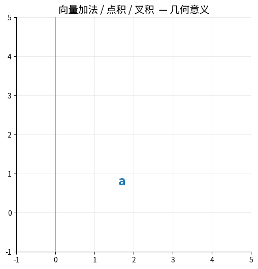
<p style="font-size:0.9em; color:#666; margin-top:8px;">
向量加法的平行四边形法则 &amp; 点积的投影几何意义
</p>
</div>

```python
# 向量运算示例
a = np.array([1, 0, 0])  # x轴方向
b = np.array([0, 1, 0])  # y轴方向

# 点积：a·b = |a||b|cosθ
dot_product = np.dot(a, b)
print(f"点积: {dot_product}")  # 0 (垂直)

# 叉积：a×b，结果垂直于a和b
cross_product = np.cross(a, b)
print(f"叉积: {cross_product}")  # [0, 0, 1] (z轴方向)
```

---

### 1.3 矩阵与坐标变换

#### 1.3.1 旋转矩阵

```
二维旋转：

      y                y'
      ↑               ↗
      |              /
      |  θ          /
      |___→ x      /____→ x'
    
绕z轴旋转θ角：

R(θ) = [cos(θ)  -sin(θ)]
       [sin(θ)   cos(θ)]
```

<div style="text-align:center; margin: 20px 0;">
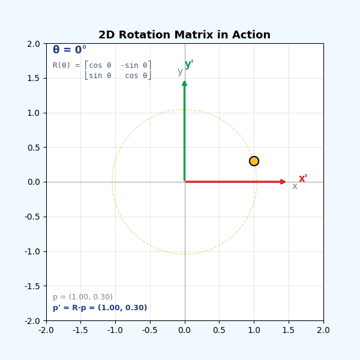
<p style="font-size:0.9em; color:#666; margin-top:8px;">
2D 旋转矩阵 R(θ) 作用于一个 L 形物体：每个点都被 R 乘一次，整体绕原点旋转。<br>
右侧矩阵数值随 θ 实时更新——这就是李群 SO(2) 的"一个元素"。
</p>
</div>

```python
import numpy as np
import matplotlib.pyplot as plt

def rotation_matrix_2d(theta):
    """2D旋转矩阵"""
    return np.array([
        [np.cos(theta), -np.sin(theta)],
        [np.sin(theta),  np.cos(theta)]
    ])

# 旋转一个点
p = np.array([1, 0])  # x轴上的点
theta = np.pi / 4     # 旋转45度

R = rotation_matrix_2d(theta)
p_rotated = R @ p     # 矩阵乘法

print(f"原点: {p}")
print(f"旋转后: {p_rotated}")  # [0.707, 0.707]

# 可视化
plt.figure(figsize=(6, 6))
plt.arrow(0, 0, p[0], p[1], color='blue', width=0.02, label='原始')
plt.arrow(0, 0, p_rotated[0], p_rotated[1], color='red', width=0.02, label='旋转45°')
plt.xlim(-0.5, 1.5)
plt.ylim(-0.5, 1.5)
plt.grid(True)
plt.legend()
plt.axis('equal')
plt.title('2D旋转变换')
plt.show()
```

#### 1.3.2 齐次变换矩阵

> 同时表示旋转和平移

```
齐次变换矩阵（4×4）：

T = [R  t]    R: 3×3旋转矩阵
    [0  1]    t: 3×1平移向量

应用：p' = T * p
```

<div style="text-align:center; margin: 20px 0;">
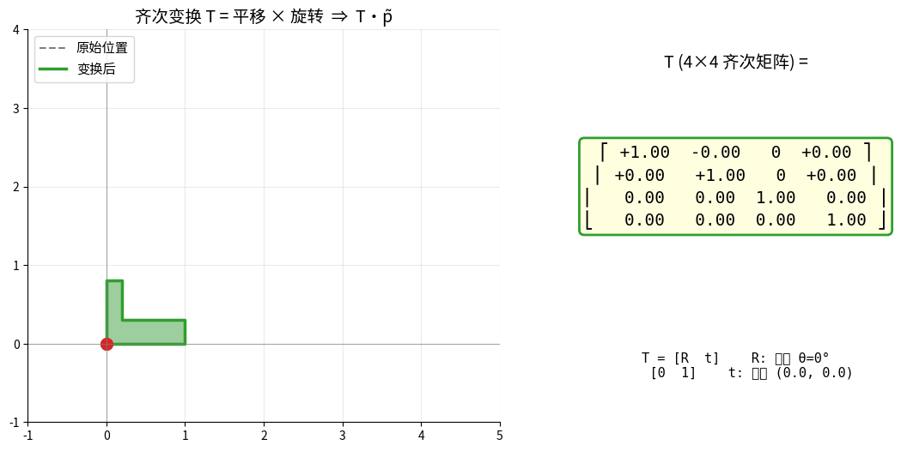
<p style="font-size:0.9em; color:#666; margin-top:8px;">
齐次变换 T 把"旋转 + 平移"压成一个 4×4 矩阵：<br>
变换的合成 = 矩阵的乘法，T<sub>AB</sub>·T<sub>BC</sub> = T<sub>AC</sub>。
</p>
</div>

```python
def homogeneous_transform(rotation, translation):
    """
    构建齐次变换矩阵
    rotation: 3x3旋转矩阵
    translation: 3x1平移向量
    """
    T = np.eye(4)
    T[:3, :3] = rotation
    T[:3, 3] = translation
    return T

# 示例：旋转90度并平移(1,2,3)
R = np.array([
    [0, -1, 0],
    [1,  0, 0],
    [0,  0, 1]
])
t = np.array([1, 2, 3])

T = homogeneous_transform(R, t)
print("齐次变换矩阵:")
print(T)

# 应用变换
p = np.array([1, 0, 0, 1])  # 齐次坐标
p_transformed = T @ p
print(f"变换后: {p_transformed[:3]}")  # [1, 3, 3]
```

---

### 1.4 进阶：李群、李代数与四元数（具身智能基础）

> 📖 **本节主要参考**：[彻底搞懂具身智能必备知识：李群、李代数、四元数](https://mp.weixin.qq.com/s/JviRH2LW-fkCHA5gY7Qflw)（深蓝具身智能专栏）
>
> 🎯 **学习目标**：理解为什么 SLAM、运动规划、强化学习、模型预测控制（MPC）、人形机器人全身控制（WBC）都离不开**李群/李代数/四元数**这套数学体系；能在 Python 中完成三者的相互转换，并知道在工程里何时该用哪一个。
>
> ⏱️ **建议学习时长**：90 分钟（本节内容较多，可分两次学习）

#### 1.4.0 前言：为什么具身智能要"重温这些老派的东西"

十年前我们学机器人时，旋转变换可以用欧拉角顶一顶，实在不行上旋转矩阵；SLAM 里用四元数做状态变量，微分时小心翼翼加个扰动——用各种 hack 和补丁，一切似乎都过得去。

后来，业内开始将**深度学习与物理运动深度耦合**，问题就集中爆发了：

```
传统 SLAM / 轨迹优化时代：
  几何操作藏在优化器内部 → 工程师不用直接面对旋转空间结构

深度学习 + 具身智能时代：
  几何操作暴露到网络的前向/反向传播中
        ↓
  必须保证：
    1. 网络输出的动作  →  在物理上合法（不能出现"扭曲旋转"）
    2. 大范围姿态优化  →  可微、无奇异点
    3. 生成的运动轨迹  →  严格物理可行
        ↓
  绕路走不通了，必须直面旋转空间的真正结构 = 李群
```

> 💡 **第一性原理**：旋转**不构成向量空间**（不能直接相加），但构成一个**光滑流形 + 群**——这就是李群。要在上面做"梯度下降"，必须借助它的切空间（李代数）。

---

#### 1.4.1 欧拉角的致命缺陷：万向锁

##### A. 三种姿态表示方法对比

```
传统姿态表示的三种方式：

欧拉角 (roll, pitch, yaw)  →  直观，但有万向锁 ❌、不便插值
旋转矩阵 R (3×3)            →  精确，但 9 个数冗余、6 个约束
四元数 q (4 个数)           →  紧凑、无万向锁、插值顺滑 ✅
轴角 (axis-angle)           →  几何意义清晰，等价于 so(3) 向量
```

##### B. 万向锁（Gimbal Lock）的本质

**误区**：很多人以为欧拉角的三个轴始终两两正交，其实**不是**。

```
欧拉角 ZYX 顺序（航空惯例 yaw-pitch-roll）：

  先绕 Z 轴转 ψ（偏航 yaw）       → 此时新的 Y 轴变了
  再绕新的 Y 轴转 θ（俯仰 pitch）  → 此时新的 X 轴又变了
  最后绕新的 X 轴转 φ（滚转 roll）

每一步的旋转轴都依赖前一步的姿态，并不固定！
```

**当 θ = ±90° 时发生什么？**

```
若 pitch θ = 90°：
  第一次旋转把原 X 轴转到了 -Z 方向
  此时 yaw（绕 Z）和 roll（绕新 X）的旋转轴重合
        ↓
  失去 1 个自由度（3 DOF 退化为 2 DOF）

物理表现：
  • 相机/机器人头部"卡住"，某些朝向无法到达
  • 控制系统从一个解跳到另一个解，姿态突变
  • 自动驾驶车避让障碍物时，车头方向无法平滑调整
```

##### C. 万向锁的几何直观

<div style="text-align:center; margin: 20px 0;">
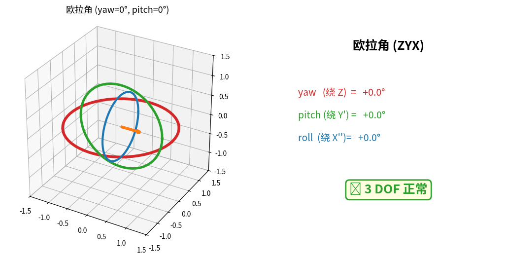
<p style="font-size:0.9em; color:#666; margin-top:8px;">
<strong>万向锁实时演示</strong>：三个旋转环（红=外环 Z，绿=中环 Y'，蓝=内环 X''）随欧拉角变化。<br>
当 pitch 转到 90° 时，红绿环旋转轴对齐 → <strong>丢失 1 个自由度</strong>（右侧状态卡变红）。
</p>
</div>

> 📌 **工程结论**：欧拉角**只用于显示和人机交互**（用户友好），**绝不用于状态变量和优化**。所有内部计算用四元数 + 李代数。

---

#### 1.4.2 李群 SO(3)：纯旋转的集合

##### A. 数学定义

**SO(3)**（Special Orthogonal Group 3）= 三维空间中所有"合法纯旋转"的集合：

```
SO(3) = { R ∈ ℝ^(3×3)  |  RᵀR = I  且  det(R) = +1 }
```

这两个约束分别对应"形状保持"和"右手旋转"两个物理要求。

##### B. 约束公式的完整推导

**(1) 正交性约束 RᵀR = I 的推导**：

```
出发点：旋转是线性变换，对任意向量 v ∈ ℝ³，旋转后 v' = R · v

物理要求：旋转不改变向量长度
  → |v'|² = |v|²

把模长展开：
  |v'|² = (Rv)ᵀ(Rv) = vᵀRᵀRv
  |v|²  = vᵀv

二者相等对任意 v 成立：
  vᵀ(RᵀR - I)v = 0  ∀v
        ↓
  RᵀR = I       ✅ 正交性约束
```

**(2) 行列式约束 det(R) = +1 的推导**：

```
对正交矩阵 RᵀR = I 两边取行列式：
  det(RᵀR) = det(I)
  det(R)·det(Rᵀ) = 1
  det(R)² = 1
  → det(R) = ±1

物理排除：
  det(R) = -1  →  对应镜像反射（如把右手变成左手）
                  这不是真实物理世界的旋转
  det(R) = +1  →  右手旋转，符合"右手定则"  ✅
```

##### C. SO(3) 的群结构

SO(3) 之所以叫"群"，是因为它满足以下运算性质：

| 性质 | 数学表达 | 物理意义 |
|------|---------|---------|
| **封闭性** | R₁ · R₂ ∈ SO(3) | 两次旋转合成还是旋转 |
| **结合律** | (R₁R₂)R₃ = R₁(R₂R₃) | 旋转可分组进行 |
| **单位元** | I · R = R · I = R | "不转" 也是一个旋转 |
| **逆元** | R · Rᵀ = I → R⁻¹ = Rᵀ | 任何旋转都可逆 |

**重要工程公式**：旋转矩阵的逆等于其转置——这是 SLAM 里频繁使用的性质，避免了昂贵的矩阵求逆。

##### D. 姿态叠加（坐标变换链）

```
A 相对于 C 的旋转 = A 相对于 B 的旋转 × B 相对于 C 的旋转
        R_AC      =        R_AB        ×        R_BC
```

例如：相机相对于世界的姿态 = 相机相对于机器人 × 机器人相对于世界。

##### E. SO(3) 的"维度"

虽然旋转矩阵有 9 个元素，但实际**只有 3 个自由度**：
- 9 个元素 - 6 个约束（RᵀR=I 给出 6 个独立方程，因为对称矩阵）= 3 个自由度
- 这与"绕一个轴转一个角度"的轴角表示自由度一致

> 🧠 **关键认知**：SO(3) 是 9 维空间 ℝ⁹ 中的一个 3 维**光滑流形（manifold）**。它不是平的，更不是一个普通的向量空间——这就是为什么不能直接对旋转做加法/梯度下降。

---

#### 1.4.3 李群 SE(3)：刚体运动（旋转 + 平移）

##### A. 数学定义

**SE(3)**（Special Euclidean Group 3）= 三维空间中所有刚体运动的集合：

```
SE(3) = { T = [R  t]  |  R ∈ SO(3),  t ∈ ℝ³ }
              [0  1]
```

T 是 4×4 的**齐次变换矩阵**（就是 §1.3.2 的 T）。

##### B. 齐次变换矩阵的完整推导

**(1) 原始关系式（非齐次）**：

```
空间中点 p ∈ ℝ³，经旋转 R + 平移 t 后：
  p' = R · p + t
```

**问题**：这不是矩阵乘法，无法直接叠加多个变换！

**(2) 齐次化改造**：

引入齐次坐标，把 3 维向量 `p = [x,y,z]ᵀ` 扩展为 4 维 `p̃ = [x,y,z,1]ᵀ`：

```
p̃' = T · p̃

[ x' ]   [ R   t ] [ x ]   [ Rp + t ]
[ y' ] = [       ] [ y ] = [        ]
[ z' ]   [ 0   1 ] [ z ]   [   1    ]
[ 1  ]             [ 1 ]
```

✅ 与原始 `p' = Rp + t` 等价，且现在是纯粹的矩阵乘法。

**(3) 变换的合成（齐次形式的好处）**：

```
T_AB · T_BC = [R_AB  t_AB] [R_BC  t_BC]
              [ 0    1   ] [ 0    1   ]
            = [R_AB·R_BC   R_AB·t_BC + t_AB]
              [   0                 1      ]
            = T_AC          ✅
```

##### C. SE(3) 的逆

```
T = [R  t]   →   T⁻¹ = [Rᵀ  -Rᵀt]
    [0  1]              [0     1 ]
```

**推导**：

```
要求 T · T⁻¹ = I，设 T⁻¹ = [A  b]：
[R  t][A  b]   [RA   Rb+t]   [I  0]
[0  1][0  1] = [0    1   ] = [0  1]

由 RA = I → A = R⁻¹ = Rᵀ
由 Rb + t = 0 → b = -Rᵀ·t  ✅
```

##### D. SE(3) 的"维度"

- 6 自由度：3 个旋转 + 3 个平移
- 是 16 维空间 ℝ^(4×4) 中的一个 6 维光滑流形

##### E. 工程中 SE(3) 的应用

| 场景 | SE(3) 表示 |
|------|-----------|
| 机械臂末端位姿 | 末端相对于基座的 T |
| 相机外参（SLAM） | 相机相对于世界的 T_wc |
| 无人机状态 | 机体相对于地面的 T |
| 关键帧位姿图 | 每个关键帧一个 T 节点 |
| 物体抓取目标 | 物体相对于相机的 T_co |

---

#### 1.4.4 李代数 so(3)：旋转的切空间

##### A. 直观比喻：球面与地图

```
李群 SO(3)/SE(3)   ≈   弯曲的球面（地球表面）
                      • 不能直接相加：北京坐标 + 纽约坐标 = ???
                      • 不能直接求导：维度沿球面变化

李代数 so(3)/se(3) ≈   平面地图（局部展开）
                      • 可以加减：地图上两点矢量加法
                      • 可以求导：梯度有意义
                      • 通过"映射"和球面建立对应
```

##### B. so(3) 的数学定义

**so(3)** = SO(3) 在单位元 `I` 处的**切空间**，是 3 维向量空间。

具体来说，是所有 3×3 反对称矩阵的集合（与 3 维向量 ω 一一对应）：

```
so(3) = { [ω]× ∈ ℝ^(3×3)  |  [ω]×ᵀ = -[ω]× }

向量 ω = (ωₓ, ωᵧ, ωᵤ)ᵀ 的"反对称化"（hat 算子）：

           [  0   -ωᵤ   ωᵧ ]
[ω]× = ω∧ = [ ωᵤ    0   -ωₓ ]
           [-ωᵧ   ωₓ    0  ]
```

##### C. so(3) 定义的推导（从 SO(3) 怎么"切"出来的？）

```
出发点：旋转矩阵 R(t) 是时间的函数（旋转在运动）
约束：  R(t)·R(t)ᵀ = I  对所有 t 成立

两边对 t 求导：
  Ṙ(t)·R(t)ᵀ + R(t)·Ṙ(t)ᵀ = 0
                  ↓
  Ṙ·Rᵀ = -(Ṙ·Rᵀ)ᵀ      ← 反对称！
                  ↓
  令  S = Ṙ·Rᵀ
  S 是反对称矩阵 → 可写成 [ω]× 形式
                  ↓
  Ṙ = S · R = [ω]× · R

物理含义：
  ω = (ωₓ, ωᵧ, ωᵤ) 是"瞬时角速度"
  在单位元处（R = I）：Ṙ = [ω]×
```

✅ 所以 so(3) 描述的就是**单位元处的"旋转速度方向"**，即旋转的"微小增量"。

##### D. 反对称矩阵的重要性质

```
1. [ω]× · v = ω × v   （叉乘的矩阵形式！）

2. [ω]×ᵀ = -[ω]×       （反对称）

3. [ω]ײ = ωωᵀ - |ω|²·I  （三角恒等式）

4. [ω]׳ = -|ω|² · [ω]×   （递推关系：循环！）
```

性质 4 非常关键——它让指数映射的泰勒级数能"收敛成闭式解"（Rodrigues 公式）。

##### E. 指数映射 exp: so(3) → SO(3)（Rodrigues 公式推导）

**目标**：把 so(3) 向量 ω 转换为 SO(3) 旋转矩阵 R。

**起点：矩阵指数的定义**

```
exp([ω]×) = I + [ω]× + [ω]ײ/2! + [ω]׳/3! + [ω]×⁴/4! + ...
```

**关键技巧：利用反对称矩阵的循环幂**

设 θ = |ω|（旋转角度），k = ω/θ（单位旋转轴），则 `K = [k]×` 满足：

```
K² = kkᵀ - I
K³ = -K
K⁴ = -K² 
K⁵ = K
...
```

代入泰勒级数并分类：

```
exp(θK) = I + θK + (θK)²/2! + (θK)³/3! + (θK)⁴/4! + ...

奇数项（含 K, -K, K, -K, ...）：
  = K·(θ - θ³/3! + θ⁵/5! - ...) = sin(θ) · K

偶数项（含 K², -K², K², ...）：
  = K²·(θ²/2! - θ⁴/4! + ...) = (1 - cos(θ)) · K²

加上常数 I：
```

最终得到 **Rodrigues 公式**：

```
┌────────────────────────────────────────────────────┐
│  R = exp([ω]×) = I + sin(θ)·K + (1 - cos(θ))·K²    │
│                                                    │
│  其中 θ = |ω|, k = ω/θ, K = [k]×                   │
└────────────────────────────────────────────────────┘

或等价写法：

R = I + (sin θ / θ)·[ω]× + ((1 - cos θ) / θ²)·[ω]ײ
```

<div style="text-align:center; margin: 20px 0;">
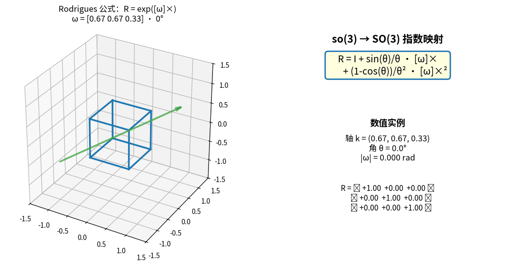
<p style="font-size:0.9em; color:#666; margin-top:8px;">
<strong>Rodrigues 公式实时演示</strong>：so(3) 向量 ω 绕固定轴增大角度 θ，<br>
左侧立方体被 R = exp([ω]×) 连续旋转，右侧实时显示 ω、θ 与旋转矩阵 R 的所有元素。
</p>
</div>

**特殊情形（θ → 0）的处理**（数值稳定性）：

```
当 θ ≈ 0 时，用泰勒展开避免除零：
  sin(θ)/θ      ≈ 1 - θ²/6 + θ⁴/120 - ...
  (1-cos θ)/θ²  ≈ 1/2 - θ²/24 + θ⁴/720 - ...

  → R ≈ I + [ω]× + [ω]ײ/2  （小角度近似）
```

##### F. 对数映射 log: SO(3) → so(3)

**目标**：从旋转矩阵 R 反求旋转向量 ω（"姿态差→可优化向量"）。

**步骤**：

```
1. 求旋转角度 θ：
   trace(R) = 1 + 2cos(θ)
   → θ = arccos((trace(R) - 1) / 2)

2. 求旋转轴 k：
   R - Rᵀ = 2 sin(θ) · [k]×
   → 从反对称矩阵 [k]× 中读出 k 向量：
     k = (1 / (2 sin θ)) · [R₃₂ - R₂₃, R₁₃ - R₃₁, R₂₁ - R₁₂]ᵀ

3. 合成：
   ω = θ · k

特殊情形：
   θ = 0   → ω = 0（无旋转）
   θ = π   → 需特别处理（k 通过 R + I 的对角线求出）
```

##### G. Python 完整实现与验证

```python
import numpy as np
from scipy.spatial.transform import Rotation

def skew(omega):
    """向量 → 反对称矩阵（hat 算子）"""
    wx, wy, wz = omega
    return np.array([
        [  0, -wz,  wy],
        [ wz,   0, -wx],
        [-wy,  wx,   0]
    ])

def vee(S):
    """反对称矩阵 → 向量（vee 算子，hat 的逆运算）"""
    return np.array([S[2, 1], S[0, 2], S[1, 0]])

def exp_so3(omega):
    """指数映射：so(3) → SO(3)，即 Rodrigues 公式"""
    theta = np.linalg.norm(omega)
    if theta < 1e-10:
        return np.eye(3) + skew(omega)  # 小角度近似
    K = skew(omega / theta)
    return np.eye(3) + np.sin(theta) * K + (1 - np.cos(theta)) * (K @ K)

def log_so3(R):
    """对数映射：SO(3) → so(3)"""
    cos_theta = (np.trace(R) - 1) / 2
    cos_theta = np.clip(cos_theta, -1.0, 1.0)
    theta = np.arccos(cos_theta)
    if theta < 1e-10:
        return vee(R - np.eye(3))  # 小角度
    return (theta / (2 * np.sin(theta))) * vee(R - R.T)

# ===== 测试：双向往返一致性 =====
omega = np.array([0.3, -0.5, 1.2])      # 任意旋转向量
R = exp_so3(omega)                       # so(3) → SO(3)
omega_back = log_so3(R)                  # SO(3) → so(3)

print("原始 ω:        ", omega.round(6))
print("往返后 ω:      ", omega_back.round(6))
print("一致性误差:    ", np.linalg.norm(omega - omega_back))
print("正交性 RᵀR-I:  ", np.linalg.norm(R.T @ R - np.eye(3)))
print("行列式 det(R): ", np.linalg.det(R).round(6))

# ===== 与 scipy 交叉验证 =====
R_scipy = Rotation.from_rotvec(omega).as_matrix()
print("与 scipy 一致: ", np.allclose(R, R_scipy))
```

---

#### 1.4.5 李代数 se(3)：刚体运动的切空间

##### A. se(3) 定义

**se(3)** = SE(3) 在单位元处的切空间，是 6 维向量空间：

```
se(3) 向量：ξ = [ρ; ω] ∈ ℝ⁶
   ρ ∈ ℝ³ —— 平移增量
   ω ∈ ℝ³ —— 旋转增量

广义反对称化：

         [ [ω]×   ρ ]      4×4 矩阵
ξ∧  =    [  0ᵀ   0 ]
```

##### B. se(3) 定义的推导

类比 so(3) 推导：

```
SE(3) 中 T(t) 满足 T·T⁻¹ = I
两边对 t 求导：
  Ṫ·T⁻¹ + T·(T⁻¹). = 0
  → Ṫ·T⁻¹ 是 4×4 广义反对称矩阵

形式上：

Ṫ·T⁻¹ = [Ṙ·Rᵀ      ṫ - Ṙ·Rᵀ·t]
        [  0              0    ]

第一块就是 [ω]×（so(3) 的形式）；
第二块定义为平移速度 ρ（其实是修正后的瞬时线速度）。

→ se(3) 自然分解为 (旋转, 平移) = (ω, ρ)
```

##### C. 指数映射 exp: se(3) → SE(3)

```
                ┌                                          ┐
exp(ξ∧)  =      │  exp([ω]×)    V·ρ                       │
                │      0         1                         │
                └                                          ┘

其中：
  exp([ω]×) = Rodrigues 公式（与 so(3) 相同）
  
  V 称为"左雅可比矩阵"（补偿旋转对平移的影响）：
  
  V = I + ((1 - cos θ) / θ²)·[ω]× + ((θ - sin θ) / θ³)·[ω]ײ
```

> 🧠 **理解 V 的物理意义**：如果直接令 t = ρ，则在旋转的同时做平移会"漂移"——V 矩阵正是补偿这个漂移，确保积分结果落在真正的 SE(3) 上。

##### D. Python 实现 SE(3) 指数映射

```python
def left_jacobian_so3(omega):
    """SE(3) 指数映射中的左雅可比矩阵 V"""
    theta = np.linalg.norm(omega)
    if theta < 1e-10:
        return np.eye(3) + 0.5 * skew(omega)
    K = skew(omega / theta)
    V = (np.eye(3)
         + ((1 - np.cos(theta)) / theta) * K
         + ((theta - np.sin(theta)) / theta) * (K @ K))
    return V

def exp_se3(xi):
    """指数映射：se(3) → SE(3)
    xi = [rho_x, rho_y, rho_z, w_x, w_y, w_z]  (前 3 平移，后 3 旋转)
    """
    rho = xi[:3]
    omega = xi[3:]
    R = exp_so3(omega)
    V = left_jacobian_so3(omega)
    t = V @ rho
    T = np.eye(4)
    T[:3, :3] = R
    T[:3,  3] = t
    return T

# 示例
xi = np.array([0.1, 0.2, 0.3, 0, 0, np.pi/4])  # 平移 + 绕 z 旋转 45°
T = exp_se3(xi)
print("SE(3) 矩阵:")
print(T.round(4))
```

---

#### 1.4.6 四元数：SO(3) 的紧凑表达

##### A. 四元数定义

**哈密尔顿四元数**：

```
q = w + xi + yj + zk
  = (w, x, y, z)
  = (w, v⃗)        ← w 是标量部分，v⃗=(x,y,z) 是矢量部分

虚部满足：
  i² = j² = k² = ijk = -1
  ij =  k,   ji = -k    （不可交换！）
  jk =  i,   kj = -i
  ki =  j,   ik = -j
```

**单位四元数约束**：

```
|q|² = w² + x² + y² + z² = 1
```

只有单位四元数才表示合法旋转。

##### B. 四元数乘法（用于姿态叠加）

```
q₁ ⊗ q₂ = (w₁w₂ - v⃗₁·v⃗₂,  w₁v⃗₂ + w₂v⃗₁ + v⃗₁ × v⃗₂)
```

物理含义：`q₂` 之后再 `q₁`，等价于姿态先后叠加。

##### C. 四元数与轴角的对应

**绕单位轴 k 转角度 θ**：

```
q = (cos(θ/2),  sin(θ/2)·k)
  = (cos(θ/2),  sin(θ/2)·kₓ,  sin(θ/2)·kᵧ,  sin(θ/2)·kᵤ)
```

> 📌 **注意 θ/2**：这是四元数的"双覆盖"特性——q 和 -q 表示同一个旋转。

##### D. 用四元数旋转向量

```
设向量 v⃗ ∈ ℝ³，纯虚四元数 p = (0, v⃗)
旋转后：p' = q ⊗ p ⊗ q*

  q* = (w, -x, -y, -z)   （共轭）
  对单位四元数：q* = q⁻¹

最终：v⃗' = 旋转后向量 = p' 的虚部
```

##### E. 四元数 ↔ 旋转矩阵的等价证明

把 `q = (w, x, y, z)` 展开计算 `q ⊗ p ⊗ q*`，整理可得：

```
R(q) = ┌                                                              ┐
       │  1-2(y²+z²)    2(xy - wz)    2(xz + wy)                    │
       │  2(xy + wz)    1-2(x²+z²)    2(yz - wx)                    │
       │  2(xz - wy)    2(yz + wx)    1-2(x²+y²)                    │
       └                                                              ┘
```

可以验证 `R(q)ᵀR(q) = I` 且 `det(R(q)) = 1`（利用 |q|²=1 约束），完美对应 SO(3)。

##### F. SLERP（球面线性插值）

两个姿态 q₀, q₁ 之间的平滑插值：

```
slerp(q₀, q₁, t) = sin((1-t)·Ω)/sin(Ω) · q₀  +  sin(t·Ω)/sin(Ω) · q₁

其中 Ω = arccos(q₀ · q₁)（两个四元数的"夹角"）
```

性质：
- 角速度恒定（不像欧拉角线性插值那样忽快忽慢）
- 路径最短（球面大圆弧）
- 适合相机切换、关键帧动画、姿态控制目标平滑

<div style="text-align:center; margin: 20px 0;">
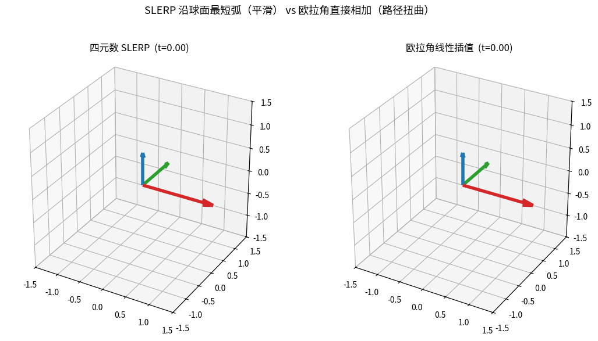
<p style="font-size:0.9em; color:#666; margin-top:8px;">
<strong>SLERP vs 欧拉角直接插值</strong>：相同起止姿态，左边四元数 SLERP 沿球面最短弧平滑过渡，<br>
右边欧拉角逐分量线性相加却出现路径扭曲——这就是相机/关键帧动画都用 SLERP 的原因。
</p>
</div>

##### G. 三者分工：工程实践的"标准链路"

```
┌──────────────┐  对数映射 log  ┌───────────────┐  梯度下降  ┌───────────────┐
│  当前姿态 q  │ ─────────────→ │  so(3) 向量 ω │ ────────→ │  优化后 ω+δω  │
│  (4 个数存储) │                │  (3 个数无约束) │            │  (网络反传可微) │
└──────────────┘                └───────────────┘            └───────────────┘
        ▲                                                            │
        │            指数映射 exp                                    │
        └────────────────────────────────────────────────────────────┘
                       (更新姿态 q' = q ⊗ exp(δω))

底层物理规则始终是 SO(3)（RᵀR = I, det R = 1），但工程师只在最外层接触它。
```

##### H. Python 实战：四元数运算与 SLERP

```python
from scipy.spatial.transform import Rotation, Slerp
import numpy as np

# ===== 1. 三种表示之间互相转换 =====
r = Rotation.from_euler('xyz', [30, 45, 60], degrees=True)

q     = r.as_quat()       # 四元数 [x, y, z, w]  注意 scipy 顺序！
R     = r.as_matrix()     # 旋转矩阵
omega = r.as_rotvec()     # so(3) 向量（轴角，长度为 θ）
euler = r.as_euler('xyz', degrees=True)

print(f"四元数:    {q.round(4)}")
print(f"so(3) 向量: {omega.round(4)}  （长度 = {np.linalg.norm(omega):.4f}）")
print(f"欧拉角:    {euler.round(2)}°")

# ===== 2. 四元数乘法（姿态叠加）=====
q1 = Rotation.from_euler('z', 30, degrees=True)
q2 = Rotation.from_euler('x', 45, degrees=True)
q12 = q1 * q2   # 注意：是组合，不是数值乘法
print(f"组合后欧拉角: {q12.as_euler('xyz', degrees=True).round(2)}°")

# ===== 3. SLERP 球面线性插值 =====
key_times = [0, 1]
key_rots = Rotation.concatenate([
    Rotation.from_euler('xyz', [0, 0, 0], degrees=True),
    Rotation.from_euler('xyz', [90, 60, 30], degrees=True),
])
slerp = Slerp(key_times, key_rots)

print("\nSLERP 插值轨迹（t 从 0 → 1）:")
for t in np.linspace(0, 1, 11):
    r_mid = slerp(t)
    angle = np.degrees(np.linalg.norm(r_mid.as_rotvec()))
    print(f"  t={t:.1f}  →  总旋转角 = {angle:.2f}°")

# ===== 4. 验证 q 和 -q 表示同一个旋转 =====
q_pos = r.as_quat()
q_neg = -q_pos
R1 = Rotation.from_quat(q_pos).as_matrix()
R2 = Rotation.from_quat(q_neg).as_matrix()
print(f"\nq 和 -q 表示同一旋转? {np.allclose(R1, R2)}")  # True
```

---

#### 1.4.7 为什么深度学习时代必须用李代数？

##### A. 三种表示的"可微性"对比

```
┌──────────────┬──────────┬──────────────┬──────────────┐
│  表示        │  参数个数 │  约束        │  可直接梯度下降?│
├──────────────┼──────────┼──────────────┼──────────────┤
│  旋转矩阵 R   │    9     │  RᵀR = I (6) │      ❌      │
│  四元数 q     │    4     │  |q| = 1     │      ❌      │
│  so(3) 向量 ω │    3     │  无          │      ✅      │
│  欧拉角       │    3     │  无          │  ⚠️ 万向锁  │
└──────────────┴──────────┴──────────────┴──────────────┘
```

**为什么有约束的表示不能直接做梯度下降？**

```
假设网络输出旋转矩阵 R̂：
  loss(R̂) ← 计算损失
  ∂loss/∂R̂ ← 反传到 R̂
  R̂ -= η · ∂loss/∂R̂   ← 普通梯度更新

问题：更新后的 R̂' 不再满足 R̂'ᵀR̂' = I！
      → 不是合法旋转 → 后续物理仿真崩溃
```

##### B. 李代数让"梯度下降在流形上正确进行"

```
正确做法（"流形上的梯度下降"）：

1. 网络输出 so(3) 增量 δω（3 个无约束的数）

2. 当前姿态 R 通过乘法更新：
     R' = R · exp(δω∧)
                ↑
         自动落在 SO(3) 上！

3. 损失函数对 δω 求导，反向传播
```

##### C. 经典应用：BA（Bundle Adjustment，捆绑调整）

```
SLAM 中典型问题：
  • N 个相机位姿 T_i ∈ SE(3)
  • M 个 3D 点 P_j ∈ ℝ³
  • 观测：点 j 投影到相机 i 上的像素 u_ij
  • 噪声：u_ij = π(T_i · P_j) + ε

目标：min  Σ ‖u_ij - π(T_i · P_j)‖²
      {T_i, P_j}

如果直接用旋转矩阵优化：
  • 每次迭代要重投影到 SO(3)（QR 分解）
  • 数值不稳定，迭代慢

用 se(3) 优化：
  • 每个 T_i 用 6 维向量 ξ_i 表示扰动
  • 用 GN/LM 算法在 se(3) 上线性化
  • 最后 T_i ← exp(ξ_i∧) · T_i
  → g2o / Ceres / GTSAM 都是这么做的
```

##### D. 五大具身智能应用场景

> （以下表格摘自[深蓝具身智能专栏](https://mp.weixin.qq.com/s/JviRH2LW-fkCHA5gY7Qflw)）

| 场景 | 关键问题 | 李群表示 | 李代数优化 |
|------|---------|---------|----------|
| **SLAM 后端优化** | 相邻关键帧之间的相对位姿误差 | SE(3) 位姿节点 | se(3) 切空间扰动，GN/LM 求解 |
| **运动规划** | B样条/贝塞尔曲线在姿态空间的轨迹 | SO(3) 姿态轨迹 | so(3) 控制点采样，保证光滑无奇异 |
| **全身控制 (WBC)** | 末端任务空间速度 → 关节速度 | SE(3) 任务坐标 | se(3) 速度通过雅可比映射 |
| **模型预测控制 (MPC)** | 短时窗内最优轨迹 | SE(3) 系统状态 | se(3) 切空间线性化 → QP 标准形式 |
| **大模型动作微调** | VLA 网络输出"动作残差" | SE(3) 动作 | se(3) 增量梯度下降 |

##### E. 一句话总结

> 💡 **第一性原理**：具身智能的本质是"在物理世界中生成和控制刚体运动"——
> - **运动必须在流形（李群）上合法** → 用 SO(3)/SE(3) 表示
> - **优化必须在切空间（李代数）上线性** → 用 so(3)/se(3) 计算梯度
> - **存储和传输用四元数最紧凑** → 工程系统的接口格式
>
> 这不是巧合，是数学结构决定的。

---

#### 1.4.8 综合实战：SLAM 风格的位姿优化（教学示例）

下面用 Python 实现一个**最小化版本**的 SLAM 位姿误差优化——用 se(3) 切空间扰动 + 高斯牛顿迭代：

```python
import numpy as np

# ===== 工具函数 =====
def skew(v):
    return np.array([[0,-v[2],v[1]],[v[2],0,-v[0]],[-v[1],v[0],0]])

def exp_so3(omega):
    theta = np.linalg.norm(omega)
    if theta < 1e-8: return np.eye(3) + skew(omega)
    K = skew(omega/theta)
    return np.eye(3) + np.sin(theta)*K + (1-np.cos(theta))*(K@K)

def exp_se3(xi):
    rho, omega = xi[:3], xi[3:]
    R = exp_so3(omega)
    theta = np.linalg.norm(omega)
    if theta < 1e-8:
        V = np.eye(3) + 0.5*skew(omega)
    else:
        K = skew(omega/theta)
        V = np.eye(3) + ((1-np.cos(theta))/theta)*K + ((theta-np.sin(theta))/theta)*(K@K)
    T = np.eye(4); T[:3,:3]=R; T[:3,3]=V@rho
    return T

# ===== 问题设置：观测到一组 3D 点，估计相机位姿 =====
np.random.seed(42)
T_true = np.eye(4)
T_true[:3,:3] = exp_so3(np.array([0.1, 0.2, -0.3]))
T_true[:3, 3] = np.array([0.5, -0.3, 1.0])

# 3D 点（世界坐标系）
N = 30
P_world = np.random.uniform(-1, 1, size=(N, 3))
# 真实观测（相机坐标系）+ 噪声
P_cam_true = (T_true[:3,:3] @ P_world.T + T_true[:3,3:4]).T
P_cam_obs = P_cam_true + 0.01 * np.random.randn(N, 3)

# ===== 初始猜测 =====
T_est = np.eye(4)

# ===== 高斯牛顿迭代（在 se(3) 上线性化）=====
print(f"{'iter':>4} | {'cost':>12} | {'|delta|':>10}")
for it in range(20):
    # 计算残差
    P_cam_pred = (T_est[:3,:3] @ P_world.T + T_est[:3,3:4]).T
    residual = (P_cam_pred - P_cam_obs).flatten()   # 3N 维

    # 计算雅可比（对 se(3) 扰动的偏导）
    # 对单个点 p 的雅可比： J = [I, -[Rp]×]   (3×6)
    J = np.zeros((3*N, 6))
    for i in range(N):
        Rp = T_est[:3,:3] @ P_world[i]
        J[3*i:3*i+3, :3] = np.eye(3)
        J[3*i:3*i+3, 3:] = -skew(Rp)

    # 解正规方程 (JᵀJ) Δξ = -Jᵀ r
    H = J.T @ J
    g = J.T @ residual
    delta = -np.linalg.solve(H + 1e-6*np.eye(6), g)

    # 在 se(3) 切空间上更新
    T_est = exp_se3(delta) @ T_est

    cost = 0.5 * residual @ residual
    print(f"{it:>4} | {cost:>12.6e} | {np.linalg.norm(delta):>10.6e}")

    if np.linalg.norm(delta) < 1e-8:
        break

print("\n真实位姿 R:\n", T_true[:3,:3].round(4))
print("估计位姿 R:\n", T_est[:3,:3].round(4))
print("\n真实平移 t: ", T_true[:3,3].round(4))
print("估计平移 t: ", T_est[:3,3].round(4))
```

**输出解读**：cost 单调下降，delta 范数趋于 0，最终估计姿态收敛到真值附近——这就是 g2o/Ceres/GTSAM 等 SLAM 后端的核心思想。

---

#### 1.4.9 常见误区与避坑指南

| 误区 | 正确做法 |
|------|---------|
| 直接对欧拉角做梯度下降 | 转 so(3) 向量再优化 |
| 把四元数当 4 维向量做加法 | 用 SLERP 或对数→加法→指数 |
| 旋转矩阵相加再"投影"回 SO(3) | 直接在 so(3) 上做加法 |
| 忘记四元数的双覆盖性 | 比较前先对齐符号（q·q' > 0） |
| 网络直接输出旋转矩阵 9 维 | 输出 so(3) 或 6D 表示 \[Zhou et al. 2019\] |
| 用 scipy 时混淆 quat 顺序 | scipy 用 `[x,y,z,w]`；Eigen/ROS 多用 `[w,x,y,z]` |
| 小角度时直接除以 sin(θ) | 用泰勒展开数值稳定版本 |
| SLAM 优化用 Euler 角参数化 | 必须用 se(3) 或 SE(3) on-manifold |

---

#### 1.4.10 本节小结

```
┌─────────────────────────────────────────────────────────────────────┐
│                                                                     │
│   ┌─────────────┐         ┌─────────────┐         ┌─────────────┐  │
│   │  欧拉角      │   ⚠️    │  旋转矩阵 R  │   ✅    │  四元数 q   │  │
│   │  (显示用)    │ ────→  │  (推导用)    │ ────→  │  (存储用)    │  │
│   │  万向锁      │         │  RᵀR=I       │         │  |q|=1       │  │
│   └─────────────┘         └─────────────┘         └─────────────┘  │
│                                  │                       │          │
│                            log ↑│↓ exp           log ↑│↓ exp     │
│                                  ↓                       ↓          │
│                          ┌───────────────────────────────────┐      │
│                          │     so(3) / se(3) 向量            │      │
│                          │   (3 维 / 6 维，无约束)            │      │
│                          │   ✅ 可微 ✅ 线性 ✅ 优化友好      │      │
│                          └───────────────────────────────────┘      │
│                                                                     │
│  应用：SLAM 后端、运动规划、WBC、MPC、RL 动作微调、VLA 模型 ...     │
│                                                                     │
└─────────────────────────────────────────────────────────────────────┘
```

##### 关键公式速查表

```
SO(3) 定义：     RᵀR = I,  det(R) = +1
SE(3) 定义：     T = [R t; 0 1],  R ∈ SO(3)

反对称化：       [ω]× v = ω × v
Rodrigues:      R = I + sin(θ)/θ · [ω]× + (1-cos θ)/θ² · [ω]ײ
对数映射：       θ = arccos((tr R - 1)/2)
                ω = θ/(2 sin θ) · vee(R - Rᵀ)

四元数：         q = (cos(θ/2), sin(θ/2)·k)
四元数乘法：     q₁⊗q₂ = (w₁w₂ - v⃗₁·v⃗₂, w₁v⃗₂ + w₂v⃗₁ + v⃗₁×v⃗₂)
四元数旋转：     v⃗' = q ⊗ (0,v⃗) ⊗ q*

SE(3) 指数：    exp(ξ∧) = [exp([ω]×)  V·ρ; 0 1]
                V = I + (1-cos θ)/θ · K + (θ-sin θ)/θ · K²
                ( K = [ω/θ]× )

流形扰动：       R ← R · exp(δω∧)        （右乘扰动）
                T ← T · exp(δξ∧)        （右乘扰动）
                T ← exp(δξ∧) · T        （左乘扰动）
```

##### 进阶资源（深入学习推荐）

| 类型 | 资源 |
|------|------|
| 入门博客 | [深蓝具身智能《具身智能基础》专栏](https://mp.weixin.qq.com/s/JviRH2LW-fkCHA5gY7Qflw) |
| 中文经典 | 《视觉 SLAM 十四讲》高翔 — 第 3、4 章 |
| 英文经典 | 《State Estimation for Robotics》Timothy Barfoot — 第 7 章 |
| 工程库 | [Sophus](https://github.com/strasdat/Sophus)（C++）、[liegroups](https://github.com/utiasSTARS/liegroups)（Python） |
| 论文 | "A micro Lie theory for state estimation in robotics" — Solà et al. 2018 |
| 论文 | "On the Continuity of Rotation Representations in Neural Networks" — Zhou et al. CVPR 2019（神经网络该输出什么？） |
| 视频 | 3Blue1Brown《四元数视觉化》中英字幕版 |

---

## 模块2：机器人运动学数学（50分钟）

### 2.1 正运动学（Forward Kinematics）

> **问题**：已知关节角度，求末端位置

<div style="text-align:center; margin: 20px 0;">
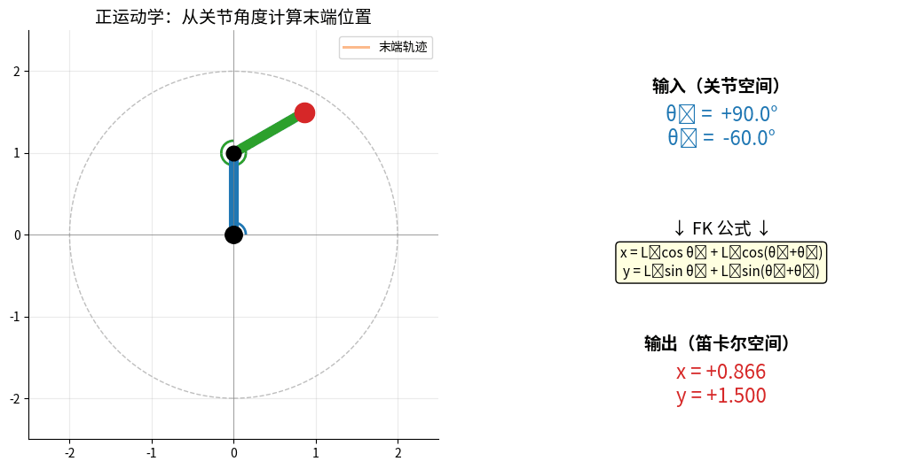
<p style="font-size:0.9em; color:#666; margin-top:8px;">
<strong>FK：输入关节角 (θ₁, θ₂) → 计算末端 (x, y)</strong>。<br>
两个关节角同时变化，末端在工作空间内画出连续轨迹（橙色尾巴）。
</p>
</div>

#### 2.1.1 DH参数法

**Denavit-Hartenberg参数**：描述连杆关系的标准方法

| 参数 | 含义 |
|------|------|
| a | 连杆长度 |
| α | 连杆扭转角 |
| d | 连杆偏距 |
| θ | 关节角 |

```python
def forward_kinematics_2dof(theta1, theta2, L1, L2):
    """
    2自由度机械臂正运动学
    theta1, theta2: 关节角度（弧度）
    L1, L2: 连杆长度
    """
    x = L1 * np.cos(theta1) + L2 * np.cos(theta1 + theta2)
    y = L1 * np.sin(theta1) + L2 * np.sin(theta1 + theta2)
    return x, y

# 示例
L1, L2 = 1.0, 1.0  # 两个连杆长度都是1
theta1 = np.pi / 4   # 45度
theta2 = np.pi / 4   # 45度

x, y = forward_kinematics_2dof(theta1, theta2, L1, L2)
print(f"末端位置: ({x:.2f}, {y:.2f})")
```

---

### 2.2 逆运动学（Inverse Kinematics）

> **问题**：已知末端位置，求关节角度（更难！）

<div style="text-align:center; margin: 20px 0;">
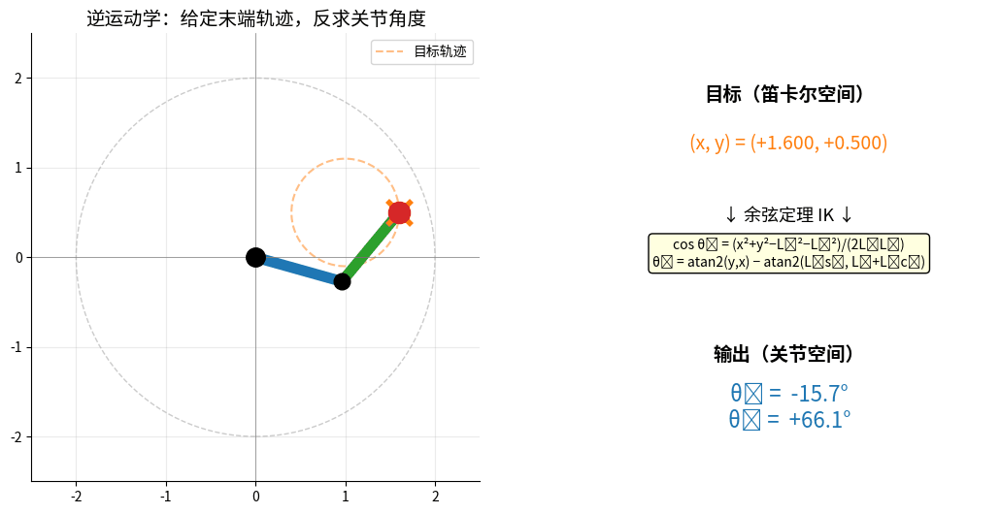
<p style="font-size:0.9em; color:#666; margin-top:8px;">
<strong>IK：给定末端目标圆形轨迹（橙色虚线），反求每一时刻的 (θ₁, θ₂)</strong>。<br>
机械臂末端跟随目标，红色实线 = 实际轨迹，右侧实时显示余弦定理求解结果。
</p>
</div>

```
逆运动学：[x, y] → [θ1, θ2]

特点：
• 可能有多个解（手肘向上/向下）
• 可能无解（超出工作空间）
• 可能有无穷多解（冗余机械臂）
```

#### 2.2.1 解析解法（简单机械臂）

```python
def inverse_kinematics_2dof(x, y, L1, L2):
    """
    2自由度机械臂逆运动学（解析解）
    """
    # 余弦定理求θ2
    D = (x**2 + y**2 - L1**2 - L2**2) / (2 * L1 * L2)
    
    # 检查是否有解
    if abs(D) > 1:
        raise ValueError("目标点超出工作空间")
    
    # 手肘向上的解
    theta2 = np.arccos(D)
    theta1 = np.arctan2(y, x) - np.arctan2(L2*np.sin(theta2), L1+L2*np.cos(theta2))
    
    return theta1, theta2

# 测试：先正运动学，再逆运动学
theta1_target = np.pi / 3
theta2_target = np.pi / 6

x, y = forward_kinematics_2dof(theta1_target, theta2_target, L1, L2)
print(f"正运动学: θ1={theta1_target:.2f}, θ2={theta2_target:.2f} → ({x:.2f}, {y:.2f})")

theta1_solved, theta2_solved = inverse_kinematics_2dof(x, y, L1, L2)
print(f"逆运动学: ({x:.2f}, {y:.2f}) → θ1={theta1_solved:.2f}, θ2={theta2_solved:.2f}")
print(f"误差: Δθ1={abs(theta1_target-theta1_solved):.4f}, Δθ2={abs(theta2_target-theta2_solved):.4f}")
```

#### 2.2.2 数值解法（复杂机械臂）

```python
from scipy.optimize import fsolve

def ik_numerical(target_pos, L1, L2, initial_guess=[0, 0]):
    """
    数值法求解逆运动学
    """
    def equations(theta):
        x, y = forward_kinematics_2dof(theta[0], theta[1], L1, L2)
        return [x - target_pos[0], y - target_pos[1]]
    
    solution = fsolve(equations, initial_guess)
    return solution

# 测试
target = [1.0, 1.0]
theta_solution = ik_numerical(target, L1, L2)
print(f"数值解: θ1={theta_solution[0]:.2f}, θ2={theta_solution[1]:.2f}")

# 验证
x_check, y_check = forward_kinematics_2dof(theta_solution[0], theta_solution[1], L1, L2)
print(f"验证: 目标({target[0]:.2f}, {target[1]:.2f}), 实际({x_check:.2f}, {y_check:.2f})")
```

---

### 2.3 雅可比矩阵（Jacobian Matrix）

> 描述关节速度与末端速度的关系

<div style="text-align:center; margin: 20px 0;">
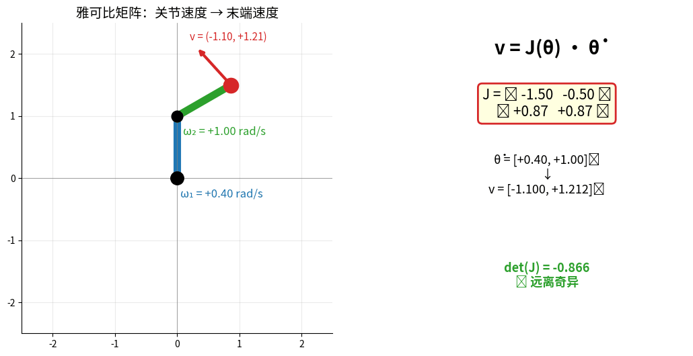
<p style="font-size:0.9em; color:#666; margin-top:8px;">
<strong>雅可比矩阵 v = J(θ)·θ̇ 实时演示</strong>：左图红色箭头 = 末端速度向量，<br>
右图实时显示 J 的所有元素与 det(J)。<strong>det(J) → 0 时进入奇异位形</strong>（状态变红）。
</p>
</div>

```
雅可比矩阵：

v = J(θ) * θ̇

v: 末端速度（笛卡尔空间）
θ̇: 关节速度（关节空间）
J: 雅可比矩阵
```

```python
def jacobian_2dof(theta1, theta2, L1, L2):
    """
    2自由度机械臂雅可比矩阵
    """
    J = np.array([
        [-L1*np.sin(theta1) - L2*np.sin(theta1+theta2), -L2*np.sin(theta1+theta2)],
        [ L1*np.cos(theta1) + L2*np.cos(theta1+theta2),  L2*np.cos(theta1+theta2)]
    ])
    return J

# 示例：给定关节速度，求末端速度
theta1, theta2 = np.pi/4, np.pi/4
joint_velocity = np.array([0.1, 0.1])  # 关节速度 (rad/s)

J = jacobian_2dof(theta1, theta2, L1, L2)
end_velocity = J @ joint_velocity

print(f"雅可比矩阵:\n{J}")
print(f"关节速度: {joint_velocity}")
print(f"末端速度: {end_velocity}")
```

**雅可比矩阵的应用**：
1. **速度映射**：关节速度 → 末端速度
2. **力映射**：末端力 → 关节力矩
3. **奇异性检测**：det(J)=0 时机械臂失去自由度
4. **速度级逆运动学**：v_target = J(θ) * Δθ → Δθ = J^(-1) * v_target

---

## 模块3：计算机视觉数学（50分钟）

### 3.1 图像的数学表示

#### 3.1.1 数字图像

```
图像 = 矩阵

灰度图像（单通道）：
I(x, y) ∈ [0, 255]

   x →
y  ┌──────────┐
↓  │ 255  200 │  明亮
   │ 100   50 │  较暗
   └──────────┘

彩色图像（三通道）：
R(x, y), G(x, y), B(x, y)
```

```python
import cv2
import numpy as np
import matplotlib.pyplot as plt

# 创建一个简单的灰度图像
img = np.array([
    [255, 200, 150],
    [200, 150, 100],
    [150, 100,  50]
], dtype=np.uint8)

print(f"图像形状: {img.shape}")
print(f"图像矩阵:\n{img}")
print(f"像素(0,0)的值: {img[0, 0]}")

# 显示图像
plt.imshow(img, cmap='gray')
plt.colorbar()
plt.title('数字图像矩阵')
plt.show()
```

---

### 3.2 卷积运算（Convolution）

> 卷积是计算机视觉和深度学习的核心运算

#### 3.2.1 什么是卷积？

<div style="text-align:center; margin: 20px 0;">
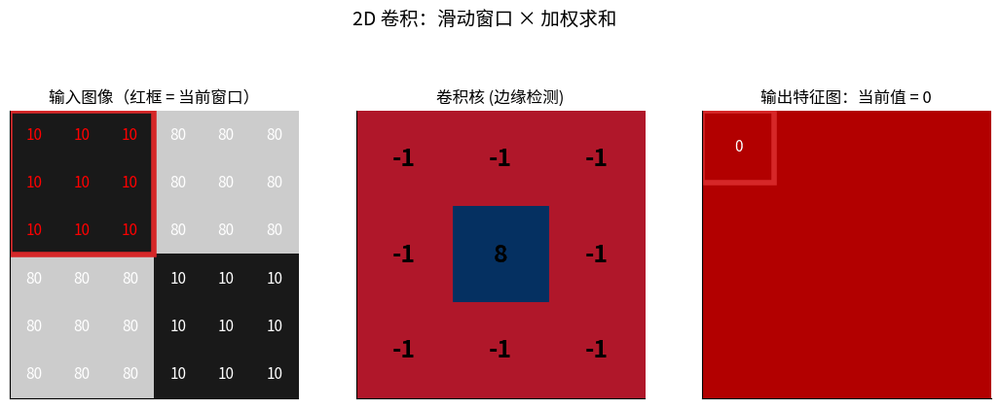
<p style="font-size:0.9em; color:#666; margin-top:8px;">
<strong>2D 卷积完整过程</strong>：左图红框 = 当前窗口，中间是卷积核（边缘检测算子），<br>
右图每一格就是「窗口 × 核」逐元素相乘后求和的结果——这就是 CNN 第一层在做的事。
</p>
</div>

```
卷积 = 滑动窗口 × 加权求和

原图像 I:           卷积核 K:
┌────────┐         ┌────┐
│1 2 3 4 │         │1  0│
│5 6 7 8 │    *    │0 -1│
│9 0 1 2 │         └────┘
└────────┘

过程：
1. 将卷积核放在图像左上角
2. 对应元素相乘并求和
3. 移动卷积核到下一位置
4. 重复直到遍历整个图像
```

```python
def convolve2d_manual(image, kernel):
    """
    手动实现2D卷积（教学用）
    """
    img_h, img_w = image.shape
    ker_h, ker_w = kernel.shape
    
    # 输出图像大小
    out_h = img_h - ker_h + 1
    out_w = img_w - ker_w + 1
    output = np.zeros((out_h, out_w))
    
    # 滑动窗口
    for i in range(out_h):
        for j in range(out_w):
            # 提取窗口
            window = image[i:i+ker_h, j:j+ker_w]
            # 卷积运算
            output[i, j] = np.sum(window * kernel)
    
    return output

# 示例图像
image = np.array([
    [1, 2, 3, 4],
    [5, 6, 7, 8],
    [9, 10, 11, 12]
], dtype=float)

# 边缘检测卷积核
kernel = np.array([
    [ 1,  0],
    [ 0, -1]
])

result = convolve2d_manual(image, kernel)
print("原图像:")
print(image)
print("\n卷积核:")
print(kernel)
print("\n卷积结果:")
print(result)
```

#### 3.2.2 常见卷积核及其作用

```python
# 1. 边缘检测（Sobel算子）
sobel_x = np.array([
    [-1, 0, 1],
    [-2, 0, 2],
    [-1, 0, 1]
])

sobel_y = np.array([
    [-1, -2, -1],
    [ 0,  0,  0],
    [ 1,  2,  1]
])

# 2. 模糊（均值滤波）
blur_kernel = np.ones((3, 3)) / 9

# 3. 锐化
sharpen = np.array([
    [ 0, -1,  0],
    [-1,  5, -1],
    [ 0, -1,  0]
])

# 使用OpenCV应用卷积
img = cv2.imread('test.jpg', cv2.IMREAD_GRAYSCALE)

edges_x = cv2.filter2D(img, -1, sobel_x)
edges_y = cv2.filter2D(img, -1, sobel_y)
blurred = cv2.filter2D(img, -1, blur_kernel)
sharpened = cv2.filter2D(img, -1, sharpen)

# 可视化
fig, axes = plt.subplots(2, 3, figsize=(12, 8))
axes[0, 0].imshow(img, cmap='gray')
axes[0, 0].set_title('原图')
axes[0, 1].imshow(edges_x, cmap='gray')
axes[0, 1].set_title('X方向边缘')
axes[0, 2].imshow(edges_y, cmap='gray')
axes[0, 2].set_title('Y方向边缘')
axes[1, 0].imshow(blurred, cmap='gray')
axes[1, 0].set_title('模糊')
axes[1, 1].imshow(sharpened, cmap='gray')
axes[1, 1].set_title('锐化')
plt.tight_layout()
plt.show()
```

---

### 3.3 特征提取数学

#### 3.3.1 梯度与边缘

```
图像梯度：

∇I = [∂I/∂x]
     [∂I/∂y]

梯度幅值：|∇I| = √((∂I/∂x)² + (∂I/∂y)²)
梯度方向：θ = arctan(∂I/∂y / ∂I/∂x)
```

<div style="text-align:center; margin: 20px 0;">
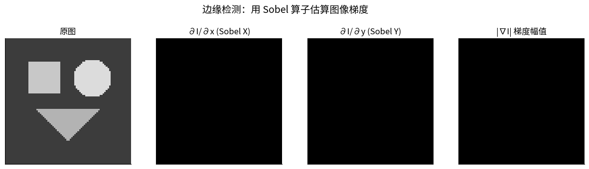
<p style="font-size:0.9em; color:#666; margin-top:8px;">
<strong>Sobel 边缘检测的四个阶段</strong>：原图 → ∂I/∂x（垂直边缘）→ ∂I/∂y（水平边缘）→ |∇I|（梯度幅值）。<br>
方块、圆、三角形的边缘被自动提取——这就是经典视觉、SLAM 特征点的起点。
</p>
</div>

```python
def compute_gradient(image):
    """计算图像梯度"""
    # 使用Sobel算子
    grad_x = cv2.Sobel(image, cv2.CV_64F, 1, 0, ksize=3)
    grad_y = cv2.Sobel(image, cv2.CV_64F, 0, 1, ksize=3)
    
    # 梯度幅值
    magnitude = np.sqrt(grad_x**2 + grad_y**2)
    
    # 梯度方向
    direction = np.arctan2(grad_y, grad_x)
    
    return magnitude, direction, grad_x, grad_y

# 测试
img = cv2.imread('test.jpg', cv2.IMREAD_GRAYSCALE)
mag, dire, gx, gy = compute_gradient(img)

fig, axes = plt.subplots(2, 2, figsize=(10, 10))
axes[0, 0].imshow(gx, cmap='gray')
axes[0, 0].set_title('X梯度')
axes[0, 1].imshow(gy, cmap='gray')
axes[0, 1].set_title('Y梯度')
axes[1, 0].imshow(mag, cmap='gray')
axes[1, 0].set_title('梯度幅值（边缘强度）')
axes[1, 1].imshow(dire, cmap='hsv')
axes[1, 1].set_title('梯度方向')
plt.tight_layout()
plt.show()
```

#### 3.3.2 Harris角点检测

> 角点 = 两个方向梯度都很大的点

```
Harris矩阵：

M = [Σ(Ix²)    Σ(IxIy)]
    [Σ(IxIy)   Σ(Iy²) ]

角点响应：
R = det(M) - k * trace(M)²

R > threshold → 角点
```

```python
def harris_corner_detection(image, k=0.04, threshold=0.01):
    """Harris角点检测"""
    # 计算梯度
    Ix = cv2.Sobel(image, cv2.CV_64F, 1, 0, ksize=3)
    Iy = cv2.Sobel(image, cv2.CV_64F, 0, 1, ksize=3)
    
    # Harris矩阵的元素
    Ixx = Ix * Ix
    Iyy = Iy * Iy
    Ixy = Ix * Iy
    
    # 高斯窗口平滑
    Ixx = cv2.GaussianBlur(Ixx, (5, 5), 1)
    Iyy = cv2.GaussianBlur(Iyy, (5, 5), 1)
    Ixy = cv2.GaussianBlur(Ixy, (5, 5), 1)
    
    # 计算角点响应
    det = Ixx * Iyy - Ixy * Ixy
    trace = Ixx + Iyy
    R = det - k * trace * trace
    
    # 阈值化
    corners = R > threshold * R.max()
    
    return R, corners

# 测试
img = cv2.imread('test.jpg', cv2.IMREAD_GRAYSCALE)
R, corners = harris_corner_detection(img)

# 可视化
img_color = cv2.cvtColor(img, cv2.COLOR_GRAY2BGR)
img_color[corners] = [0, 0, 255]  # 红色标记角点

plt.figure(figsize=(12, 6))
plt.subplot(1, 2, 1)
plt.imshow(img, cmap='gray')
plt.title('原图')
plt.subplot(1, 2, 2)
plt.imshow(cv2.cvtColor(img_color, cv2.COLOR_BGR2RGB))
plt.title('角点检测结果')
plt.show()
```

---

### 3.4 相机成像模型

#### 3.4.1 针孔相机模型

```
三维世界点 → 二维图像点

         世界坐标系 (Xw, Yw, Zw)
              ↓
         相机坐标系 (Xc, Yc, Zc)
              ↓
         图像平面 (u, v)

投影方程：
u = fx * (Xc/Zc) + cx
v = fy * (Yc/Zc) + cy

其中：
(fx, fy): 焦距
(cx, cy): 主点
```

```python
def project_3d_to_2d(point_3d, camera_matrix):
    """
    3D点投影到2D图像
    point_3d: [X, Y, Z]
    camera_matrix: 3x3相机内参矩阵
    """
    X, Y, Z = point_3d
    fx, fy = camera_matrix[0, 0], camera_matrix[1, 1]
    cx, cy = camera_matrix[0, 2], camera_matrix[1, 2]
    
    # 投影
    u = fx * (X / Z) + cx
    v = fy * (Y / Z) + cy
    
    return np.array([u, v])

# 相机内参矩阵
K = np.array([
    [800,   0, 320],  # fx, 0, cx
    [  0, 800, 240],  # 0, fy, cy
    [  0,   0,   1]
])

# 三维点
point_3d = np.array([1.0, 0.5, 2.0])  # 距离相机2米

# 投影
point_2d = project_3d_to_2d(point_3d, K)
print(f"3D点: {point_3d}")
print(f"投影到图像: ({point_2d[0]:.1f}, {point_2d[1]:.1f})")
```

---

## 模块4：路径规划算法（40分钟）

> 💡 路径规划是机器人导航的核心：**从 A 点到 B 点，怎么走？**

### 4.1 路径规划问题概述

```
机器人路径规划三要素：

┌────────────────────────────────────────────────────────────┐
│                                                            │
│   起点 (Start)    →    目标 (Goal)                         │
│                                                            │
│   约束条件：                                                │
│   • 避开障碍物                                              │
│   • 满足运动学（机器人物理限制）                            │
│   • 路径尽可能短/平滑/安全                                  │
│                                                            │
└────────────────────────────────────────────────────────────┘
```

**两大类规划方法**：

| 类别 | 代表算法 | 适用场景 | 特点 |
|------|---------|---------|------|
| **图搜索** | BFS / Dijkstra / A* | 栅格地图 | 离散、最优 |
| **采样型** | RRT / PRM | 高维空间 | 连续、概率完备 |
| **局部规划** | DWA / TEB | 实时避障 | 速度空间搜索 |

---

### 4.2 BFS（广度优先搜索）

> 最基础的图搜索算法，所有路径规划的起点

**核心思想**：从起点出发，**像水波纹一样**向外扩散，先到达的就是最短路径（按步数）。

```
BFS 扩展过程：

地图（S=起点，G=目标，■=障碍）：

  0 1 2 3 4
0 S · · · ·
1 · ■ ■ · ·
2 · ■ G ■ ·
3 · · · · ·

BFS 扩展层次：

层 1：扩展起点的邻居
  ┌─┬─┬─┬─┬─┐
  │S│1│ │ │ │
  │1│■│■│ │ │
  └─┴─┴─┴─┴─┘

层 2：扩展第 1 层的邻居
  ┌─┬─┬─┬─┬─┐
  │S│1│2│ │ │
  │1│■│■│ │ │
  │2│■│G│■│ │
  └─┴─┴─┴─┴─┘

…直到找到 G
```

**算法步骤**：

```
1. 把起点放入队列
2. 重复直到队列为空：
   a. 从队头取出一个节点
   b. 如果是目标 → 返回路径
   c. 否则把所有未访问的邻居加入队尾
3. 没找到 → 失败
```

**优缺点**：

- ✅ 简单、保证找到最短路径（按步数）
- ❌ 每条边权重当作 1，无法处理"地形成本"
- ❌ 大地图慢，搜索空间大

---

### 4.3 Dijkstra 算法

> BFS 的升级版：考虑**边的权重（cost）**

**核心思想**：每次扩展**当前累计代价最小**的节点（而不是按层数）。

```
Dijkstra 数据结构：

  优先队列（按累计代价排序）
  ┌───────────┐
  │ 节点 | 代价 │  ← 每次取代价最小的
  ├───────────┤
  │  A   | 0  │
  │  B   | 3  │
  │  C   | 5  │
  └───────────┘
```

**算法步骤**：

```
1. 起点代价 = 0，其他节点 = ∞
2. 把起点放入优先队列
3. 重复：
   a. 取出代价最小的节点 u
   b. 对每个邻居 v：
      新代价 = u 的代价 + 边 (u, v) 的权重
      如果新代价 < v 的当前代价：
        更新 v 的代价
        把 v 放入优先队列
4. 直到目标被取出
```

**举例**：草地走 1，沙地走 3，水走 5

```
  ┌─┬─┬─┬─┐
  │S│1│1│1│   ← 草地路径成本 1+1+1+1+1 = 5
  │1│1│3│3│   ← 沙地拐弯成本 1+1+3+3+5 = 13
  │1│1│G│5│
  └─┴─┴─┴─┘
  
Dijkstra 会选择上方草地路径 ✅
```

**优缺点**：

- ✅ 找到**最短代价路径**
- ✅ 适合带权重地图（地形成本）
- ❌ 没有方向感，向所有方向均匀扩展，慢

---

### 4.4 A* 算法（最常用）

> 💎 Dijkstra + **启发式（Heuristic）** = 又快又最优

<div style="text-align:center; margin: 20px 0;">
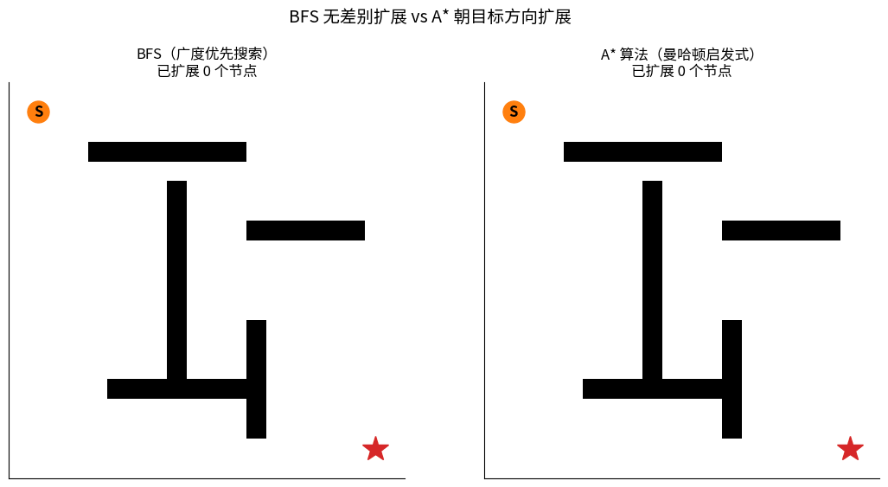
<p style="font-size:0.9em; color:#666; margin-top:8px;">
<strong>BFS vs A* 同一张地图扩展过程对比</strong>：<br>
左边 BFS 像水波一样无差别向外扩展（蓝色方块），最终扩展节点数很多；<br>
右边 A* 借助曼哈顿启发式直奔目标，扩展节点数显著更少。两者都能找到最优路径（红色实线）。
</p>
</div>

**核心思想**：在 Dijkstra 的基础上，**估计当前节点到目标的距离 h(n)**，朝着目标方向优先扩展。

```
A* 评价函数：

f(n) = g(n) + h(n)

g(n)：从起点到 n 的实际代价（Dijkstra 部分）
h(n)：从 n 到目标的启发式估计（指引方向）
f(n)：总代价估计，优先队列按 f(n) 排序

常见 h(n)：
• 曼哈顿距离  |Δx| + |Δy|     （只能走横竖）
• 欧几里得距离 √(Δx² + Δy²)   （可以斜着走）
• 切比雪夫距离 max(|Δx|, |Δy|) （8 邻居网格）
```

**对比 Dijkstra vs A***：

```
Dijkstra：均匀向外扩展        A*：朝目标方向扩展

  ┌─┬─┬─┬─┬─┐                ┌─┬─┬─┬─┬─┐
  │■│■│■│■│■│                │ │ │■│ │■│
  │■│■│S│■│■│                │ │■│S│■│ │
  │■│■│■│■│■│  →  G          │ │ │ │↘│ │  →  G
  │■│■│■│■│■│                │ │ │ │ │↘│
  │■│■│■│■│■│                │ │ │ │ │ │
  
  扩展了 ~50% 节点               只扩展了 ~20% 节点
```

**启发式的要求**：

| 性质 | 要求 | 影响 |
|------|------|------|
| **可采纳性** (Admissible) | h(n) ≤ 实际代价 | 保证最优 |
| **一致性** (Consistent) | h(n) ≤ cost(n,m) + h(m) | 不需要重复扩展 |

**优缺点**：

- ✅ **又快又最优**（如果启发式可采纳）
- ✅ 当今导航的标准算法（路由器、游戏、ROS Nav 等）
- ❌ 启发式设计不好的话退化为 Dijkstra
- ❌ 内存占用较大（要存所有节点）

---

### 4.5 RRT（快速扩展随机树）

> 🌳 高维空间规划的利器（如机械臂 7 维关节空间）

<div style="text-align:center; margin: 20px 0;">
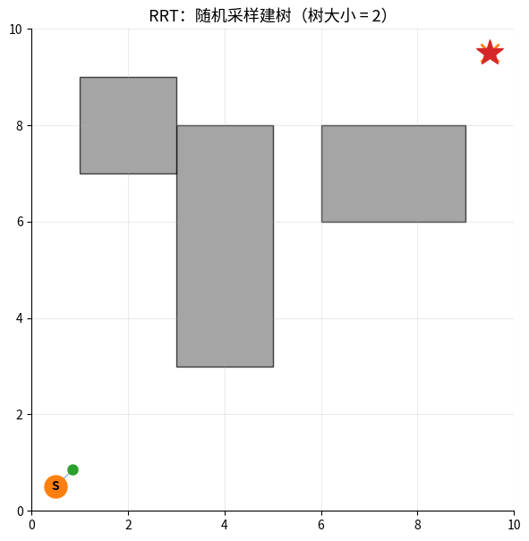
<p style="font-size:0.9em; color:#666; margin-top:8px;">
<strong>RRT 生长过程</strong>：橙色 × = 随机采样点，绿色 ● = 新加入的树节点。<br>
树从起点 S 出发，每一步朝随机方向延伸一小段，最终在障碍间生长出能到达目标 ★ 的路径（红线）。
</p>
</div>

**为什么需要 RRT？**

```
A* / Dijkstra 在高维空间问题：

2D 地图：100×100 = 10,000 格子      → 还能搜
3D 地图：100×100×100 = 1,000,000 格 → 较慢
7D 关节空间：100⁷ = 10^14 个状态     → 完全爆炸 ❌

→ 不能枚举所有状态，必须用随机采样
```

**核心思想**：从起点开始**长出一棵树**，每次：
1. 随机采样一个点
2. 找到树中最近的节点
3. 朝采样点方向延伸一小步
4. 如果合法（没撞障碍）→ 加入树

```
RRT 扩展过程：

Step 1: 仅有起点          Step 2: 随机采样
  S                         S          ↑
                                      ●(随机点)
                                       
Step 3: 找最近节点         Step 4: 延伸一小步
  S──→●                     S─→●
                                ↑(沿方向)
                                ↗
                            
…重复直到接近目标
```

**算法伪代码**：

```
function RRT(start, goal, max_iter):
    tree = {start}
    for i in 1..max_iter:
        q_rand = random_sample()  # 随机采样
        q_near = nearest(tree, q_rand)  # 找最近
        q_new = steer(q_near, q_rand)  # 延伸一步
        if collision_free(q_near, q_new):
            tree.add(q_new)
            if distance(q_new, goal) < threshold:
                return path_from(start, q_new)
    return None  # 失败
```

**RRT 变体**：

| 算法 | 改进点 |
|------|-------|
| **RRT*** | 找到的路径会持续优化（渐近最优）|
| **Informed-RRT*** | 限制采样范围在椭圆内（更快收敛）|
| **BiRRT** | 起点和目标同时长树，相向相遇 |
| **Kinodynamic-RRT** | 考虑动力学约束（车辆、机器人）|

**优缺点**：

- ✅ 高维空间也能跑
- ✅ 概率完备（迭代足够多次必能找到解）
- ❌ 不保证最优（RRT*可以）
- ❌ 路径不平滑，需要后处理

---

### 4.6 DWA（动态窗口法）— 局部规划

> 🎯 实时避障常用，ROS Nav 默认局部规划器之一

<div style="text-align:center; margin: 20px 0;">
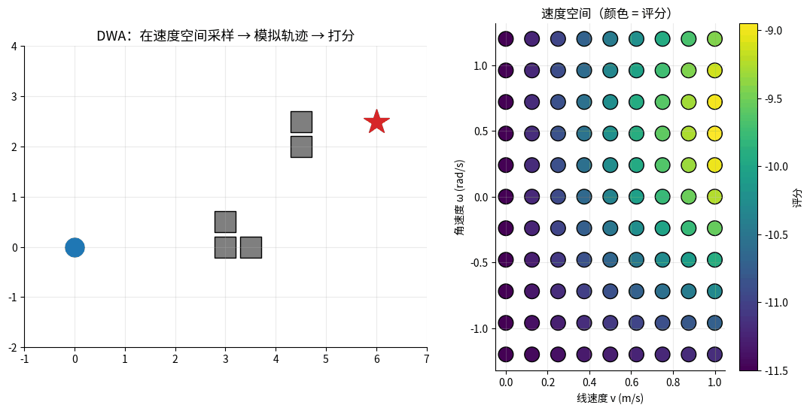
<p style="font-size:0.9em; color:#666; margin-top:8px;">
<strong>DWA 在速度空间采样并模拟未来轨迹</strong>：左图是世界坐标中的所有候选轨迹（颜色 = 评分），<br>
右图是 (v, ω) 速度窗口里的采样点（颜色 = 评分）。<strong>红色星标 = 最高分轨迹</strong>，机器人就执行它。
</p>
</div>

**全局规划 vs 局部规划**：

```
全局规划：在已知地图上规划一条路径（A* / Dijkstra）
        ↓
局部规划：实时跟踪全局路径 + 避开突然出现的障碍（DWA）
```

**核心思想**：在机器人当前的**速度空间**中采样，模拟未来一段时间，选最好的速度组合。

```
DWA 速度采样：

       v (线速度)
        ↑
        │  ★最优速度
        │     ↓
        │  ▢▢▢▢▢▢   ← 动态窗口：在物理约束内的可行速度
        │  ▢▢▢▢▢▢
  ──────┼──────→ ω (角速度)
        │
```

**评价函数**：

```
score(v, ω) = α · heading(v, ω)    # 朝目标的程度
            + β · dist(v, ω)       # 离障碍的距离
            + γ · velocity(v, ω)   # 速度大小（鼓励前进）
```

**算法步骤**：

```
1. 计算动态窗口（机器人物理约束 + 安全约束）
2. 在窗口内采样 N×M 个 (v, ω) 组合
3. 对每个 (v, ω)：
   a. 模拟未来 T 秒的轨迹
   b. 计算评分
4. 选评分最高的 (v, ω) 执行
5. 重复（典型频率 10-20 Hz）
```

**优缺点**：

- ✅ 实时性强（毫秒级响应）
- ✅ 直接输出速度命令（差速 / 全向轮）
- ❌ 容易陷入局部最优（被障碍包围会卡住）
- ❌ 不能"思考"长期目标（需要配合全局规划）

---

### 4.7 算法对比与选型

| 算法 | 时间复杂度 | 空间 | 最优性 | 适用场景 |
|------|-----------|------|--------|---------|
| **BFS** | O(V+E) | 高 | 步数最短 | 教学、简单网格 |
| **Dijkstra** | O((V+E)logV) | 高 | 代价最优 | 静态带权地图 |
| **A*** | O((V+E)logV) | 高 | 代价最优 | 已知地图导航（最常用）|
| **RRT** | 概率收敛 | 中 | 不保证 | 机械臂、无人机 |
| **RRT*** | 概率收敛 | 中 | 渐近最优 | 高质量路径需求 |
| **DWA** | O(N²) | 低 | 局部最优 | 实时避障 |

**实战选择指南**：

```
你的场景            →  推荐算法
────────────────────────────────
✓ 室内移动机器人导航  →  A* （全局）+ DWA / TEB（局部）
✓ 自动驾驶决策规划   →  Hybrid A* / RRT*
✓ 机械臂运动规划     →  RRT* / PRM
✓ 无人机三维路径    →  Informed RRT*
✓ 游戏 AI 寻路       →  A* / Jump Point Search
✓ 教学演示           →  Dijkstra / A*
```

### 4.8 进一步学习

本周只讲了原理，**Python 实现 + ROS2 集成会在后续课程中实战**：

- **Week 10-11**：感知（让机器人知道哪里有障碍）
- **Week 13**：四足机器人控制（步态规划）
- **期末项目（选题 5）**：多传感器融合导航 = A* + DWA + 实战

📚 **推荐阅读**：
- 《Planning Algorithms》Steven LaValle（路径规划经典）
- [PythonRobotics GitHub](https://github.com/AtsushiSakai/PythonRobotics) - 包含所有经典算法 Python 实现
- 深蓝学院《机器人运动规划》课程（强烈推荐）

---

## 本周作业

### ✅ 必做题

#### 1. 线性代数练习

```python
# TODO: 完成以下练习
# 1. 实现3D旋转矩阵（绕x/y/z轴）
# 2. 验证旋转矩阵性质：R * R^T = I
# 3. 组合两个旋转变换
```

#### 2. 运动学练习

```python
# TODO: 3自由度机械臂
# 1. 实现正运动学函数
# 2. 实现逆运动学函数
# 3. 绘制工作空间
```

#### 3. 卷积练习

```python
# TODO: 图像处理
# 1. 手动实现3x3卷积
# 2. 应用不同卷积核观察效果
# 3. 比较手动实现与OpenCV的结果
```

#### 4. 路径规划思考题

> 不需要写代码，只需画图或文字说明

1. 给定一个 10×10 的网格地图，起点 (0,0)，目标 (9,9)，中间有几个障碍
   - 画出 BFS 的扩展过程（标出第 1、2、3 层的节点）
   - 画出 A*（用曼哈顿距离）的扩展过程
   - 对比两者扩展的节点数量
2. 解释为什么 A* 在不可采纳启发式（h 大于真实代价）下会**找不到最优解**
3. 思考：什么样的场景适合 RRT 而不是 A*？反过来呢？
4. **李群思考题**（参考[深蓝具身智能专栏](https://mp.weixin.qq.com/s/JviRH2LW-fkCHA5gY7Qflw)）：
   - 解释为什么欧拉角在 pitch=90° 时会出现万向锁
   - 说明四元数、旋转矩阵、so(3) 向量各适合什么场景（存储/显示/优化）
   - 用一句话描述"李群→李代数→李群"优化链路的意义

### 🌟 选做题（加分）

1. **推导雅可比矩阵**：手推3自由度机械臂的雅可比矩阵
2. **相机标定**：使用棋盘格标定相机内参
3. **特征匹配**：实现SIFT/ORB特征点匹配
4. **实现 A***：用 Python + numpy 实现 A* 算法（参考 PythonRobotics 仓库）
5. **四元数实践**：用 `scipy.spatial.transform.Rotation` 实现两个姿态之间的 SLERP 插值，并可视化

---

## 📚 参考资料

### 教材

1. **《机器人学导论》** - John J. Craig
2. **《计算机视觉：算法与应用》** - Richard Szeliski
3. **《深度学习》** - Ian Goodfellow

### 在线资源

- [3Blue1Brown 线性代数系列](https://www.3blue1brown.com/topics/linear-algebra) - 直观数学动画
- [彻底搞懂具身智能必备知识：李群、李代数、四元数](https://mp.weixin.qq.com/s/JviRH2LW-fkCHA5gY7Qflw) - 深蓝具身智能专栏
- [机器人学公开课](https://www.youtube.com/user/StanfordCS223A) - Stanford CS223A
- [OpenCV教程](https://docs.opencv.org/4.x/d9/df8/tutorial_root.html)

### Python库

```bash
# 科学计算
pip install numpy scipy matplotlib

# 计算机视觉
pip install opencv-python opencv-contrib-python

# 机器人工具
pip install roboticstoolbox-python
```

---

## 📊 知识点总结

```
第9周知识图谱：

┌──────────────────────────────────────────────────────────────────┐
│                      数学基础 + 路径规划                          │
├──────────────────────────────────────────────────────────────────┤
│                                                                  │
│  线性代数           运动学数学         视觉数学      路径规划      │
│  ├── 向量          ├── 正运动学       ├── 图像矩阵   ├── BFS      │
│  ├── 矩阵          ├── 逆运动学       ├── 卷积运算   ├── Dijkstra │
│  ├── 旋转矩阵      ├── 雅可比矩阵     ├── 特征提取   ├── A*       │
│  ├── 齐次变换      └── 奇异性分析     └── 相机模型   ├── RRT/RRT* │
│  ├── SO(3)/SE(3)                                     └── DWA      │
│  ├── so(3)/se(3)                                                 │
│  └── 四元数                                                      │
│                                                                  │
│  应用场景：                                                       │
│  • 机械臂轨迹规划   • 机器人导航     • 视觉感知                  │
│  • 自主避障         • 路径搜索       • 多传感器融合              │
│                                                                  │
└──────────────────────────────────────────────────────────────────┘
```

### 🎬 本章动画索引

> 本周所有动画都由 [`scripts/gen_week9_animations.py`](https://github.com/ai-robot-class/ai-robot-class.github.io/blob/main/scripts/gen_week9_animations.py) 一个脚本生成。
> 学生可以 clone 后修改参数（旋转轴、机械臂长度、卷积核、起点终点等）来"做自己的版本"。

| # | 章节 | 动画 | 解释什么 |
|---|------|------|---------|
| 1 | §1.2.2 | `vector_ops.gif` | 向量加法（平行四边形法则）+ 点积（投影） |
| 2 | §1.3.1 | `rotation_2d.gif` | 2D 旋转矩阵 R(θ) 作用于物体 |
| 3 | §1.3.2 | `homogeneous_transform.gif` | 齐次变换 = 旋转 + 平移 |
| 4 | §1.4.1 | `gimbal_lock.gif` | 欧拉角万向锁的几何过程 |
| 5 | §1.4.4 | `rodrigues_axis_angle.gif` | Rodrigues 公式 so(3)→SO(3) |
| 6 | §1.4.6 | `quaternion_slerp.gif` | SLERP vs 欧拉角线性插值对比 |
| 7 | §2.1 | `forward_kinematics.gif` | 2-DOF 机械臂正运动学 |
| 8 | §2.2 | `inverse_kinematics.gif` | 2-DOF 机械臂逆运动学（跟随圆轨迹） |
| 9 | §2.3 | `jacobian.gif` | 雅可比矩阵 + 奇异位形 |
| 10 | §3.2.1 | `convolution.gif` | 2D 卷积滑动窗口 |
| 11 | §3.3.1 | `edge_detection.gif` | Sobel 边缘检测四阶段 |
| 12 | §4.4 | `bfs_vs_astar.gif` | BFS vs A* 扩展过程对比 |
| 13 | §4.5 | `rrt_planning.gif` | RRT 随机采样建树 |
| 14 | §4.6 | `dwa_planning.gif` | DWA 速度空间采样 + 评分 |

> 💡 **🌟 选做题加分项**：clone 仓库 → 修改 `gen_week9_animations.py` 里某个动画的参数（例如把机械臂改成 3-DOF，或把 RRT 障碍物换一种布局）→ 生成你自己的 GIF → 在 PR 里附上。

---

## 下周预告

> **第10周：物体检测与识别（已完成）**
> **第11周：目标追踪（已完成）**
> **第12周：手机摄像头、ArUco 识别与距离测量**
> - 使用 Tailscale 将手机摄像头接入 WSL
> - 完成 ArUco 识别与相机标定
> - 利用标定数据计算 ArUco 距离

---

*第9周网课结束！数学基础打好，后面实战更轻松！*
